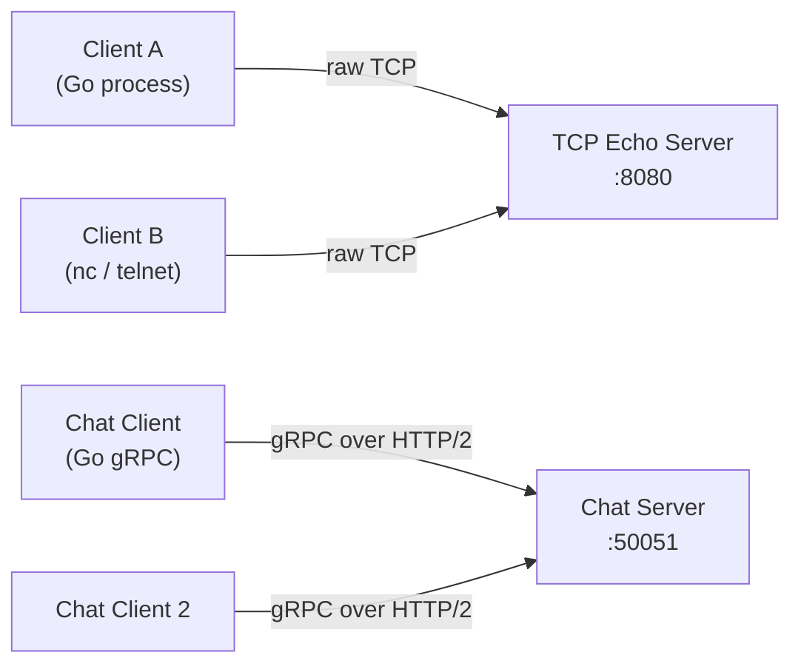
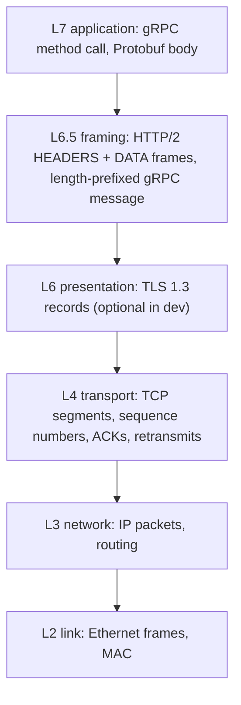
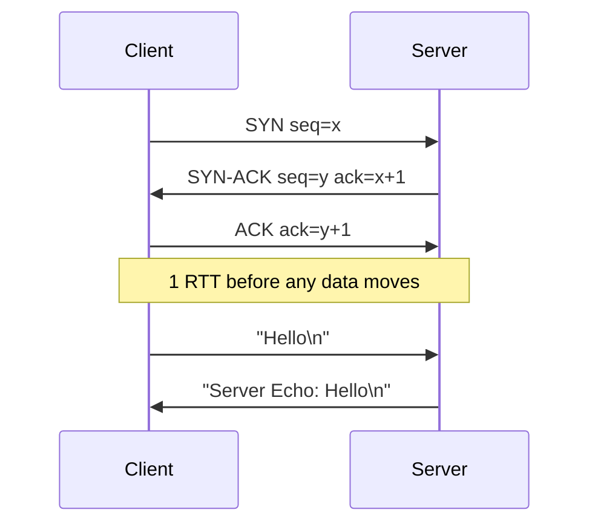
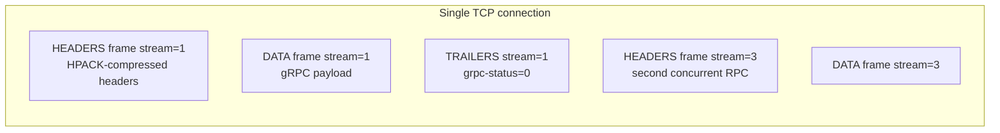
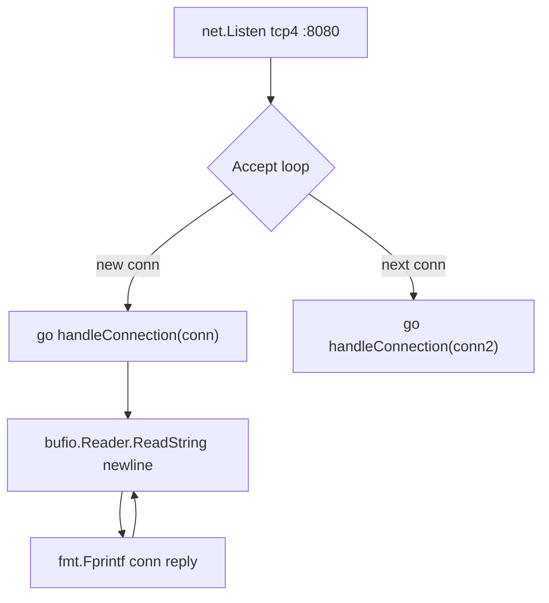
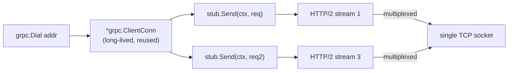
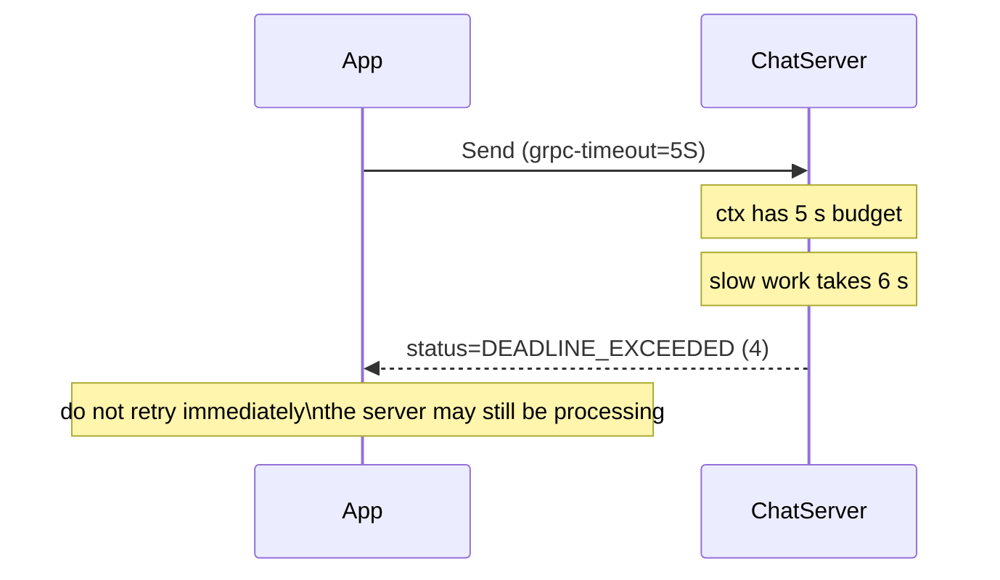

# Week 1 — Foundations & Networking, Deep Intro

[Back to top README](../../README.md)

## TL;DR

- **What you learn:** how computers talk to each other over a network — from raw TCP sockets to structured gRPC calls with Protobuf, and why each layer exists.
- **Tools:** Go `net`, `net/http`, `google.golang.org/grpc`, `protoc`.
- **Mental model:** every network call is unreliable, ordered, and expensive compared to local memory access. Design around that truth from day one.

---

## Architecture at a glance



Week 1 moves up the stack: raw TCP (Day 2) → HTTP server (Day 1 demo) → gRPC over HTTP/2 (Day 3+). Each layer solves a problem introduced by the layer below.

---

## Layer-by-layer view of one call



A 50-byte Protobuf payload becomes ~500 bytes on the wire after gRPC framing, HTTP/2 headers, TCP, IP, and Ethernet. This is fixed overhead per call — chatty microservices with tiny payloads pay it constantly.

---

## Protocol and byte level

### TCP 3-way handshake



- **SYN flood:** an attacker can exhaust connection slots by sending SYN but never ACK. Mitigated with SYN cookies.
- **Head-of-line (HoL) blocking:** TCP delivers bytes in order. If packet 3 is lost, packets 4-100 sit in the kernel buffer waiting. This is why HTTP/2 streams (which add their own sequencing) still suffer from TCP HoL blocking under packet loss — HTTP/3 / QUIC solves this.
- **Keep-alive:** a TCP connection left idle for too long gets silently dropped by NAT/firewalls. Your gRPC client needs `keepalive.ClientParameters` to send periodic pings.

### TCP vs UDP decision matrix

| Property | TCP | UDP |
|----------|-----|-----|
| Delivery guarantee | yes — retransmit lost packets | no — fire and forget |
| Ordering | yes — in-order byte stream | no — packets may arrive out of order |
| Connection setup cost | 1 RTT (3-way handshake) | 0 RTT |
| Head-of-line blocking | yes | no |
| Use in distributed systems | databases, gRPC, REST, Kafka | heartbeat signals, DNS, video streaming, QUIC |

### HTTP/1.1 vs HTTP/2 framing

HTTP/1.1 is text: one outstanding request per connection, blocking the next request until the response arrives.

```text
POST /chat.ChatService/Send HTTP/1.1\r\n
Host: localhost:50051\r\n
Content-Type: application/grpc+proto\r\n
\r\n
<body>
```

HTTP/2 is binary frames multiplexed by stream ID on a single TCP connection:



Frame layout: `length(24b) | type(8b) | flags(8b) | R(1b) | streamID(31b) | payload`.

Stream IDs are odd for client-initiated, even for server-initiated. A new RPC = a new stream ID. Streams are independent so a slow stream does not block others.

### gRPC on top of HTTP/2

A gRPC call is an HTTP/2 POST with a strict shape:

```text
:method  = POST
:path    = /chat.ChatService/Send
:scheme  = http
content-type = application/grpc+proto
te           = trailers
grpc-timeout = 5S
```

Body is a length-prefixed binary message:

```text
| 1 byte: compressed flag (0x00 = uncompressed) |
| 4 bytes: big-endian payload length             |
| N bytes: Protobuf-encoded payload              |
```

Response ends with HTTP/2 trailers:

```text
grpc-status: 0          (OK)
grpc-message: 
```

Non-zero `grpc-status` values: `1` Canceled, `4` DeadlineExceeded, `14` Unavailable.

### Protobuf wire format

Field tag on wire = `(field_number << 3) | wire_type`.

| wire_type | encoding | Go types |
|-----------|----------|----------|
| 0 | varint (variable-length) | int32, int64, bool, enum |
| 1 | 64-bit fixed | fixed64, double |
| 2 | length-delimited | string, bytes, nested message |
| 5 | 32-bit fixed | fixed32, float |

A message `{ string body = 1; string from = 2; }` with `body="hi", from="kha"` encodes to:

```text
0A 02 68 69      // field 1 (body), len=2, "hi"
12 03 6B 68 61   // field 2 (from), len=3, "kha"
```

12 bytes total. Equivalent JSON `{"body":"hi","from":"kha"}` is 24 bytes — 2x larger, plus parsing overhead.

---

## System internals

### Go `net` TCP server loop



The `go` keyword is critical. Without it, `handleConnection` blocks the `Accept` loop — only one client can connect at a time. With it, each connection gets its own goroutine (a few KB of stack, not an OS thread) so the server handles thousands of clients concurrently.

### Goroutines vs OS threads

| | OS thread | Go goroutine |
|--|-----------|-------------|
| Stack size at start | ~8 MB | ~2 KB |
| Scheduled by | OS kernel | Go runtime (cooperative + preemptive) |
| Context switch cost | ~1–10 µs (syscall) | ~100 ns |
| Typical limit | ~thousands | ~millions |

This is why Go dominates distributed systems backends — you can spawn one goroutine per connection, per RPC, or per shard without running out of memory.

### gRPC-go client connection lifecycle



A `*grpc.ClientConn` is safe for concurrent use and multiplexes thousands of RPCs over one socket. Do not create one per request — create one at startup and share it.

---

## Mental models

### Fallacies as failure modes you will hit

| Fallacy | How it bites you in code |
|---------|-------------------------|
| Network is reliable | `http.Get` with no timeout hangs forever when server is slow |
| Latency is zero | calling a remote API in a for loop of 1000 items takes 10+ seconds |
| Bandwidth is infinite | sending JSON blobs with large nested objects on every heartbeat |
| Topology doesn't change | hardcoding `localhost:8080` — breaks when containerized |

### RPC semantics triangle

- **At-most-once:** call failed, definitely not executed on server (no retry). Impossible to guarantee over a network without ACK.
- **At-least-once:** retry on failure — server may have already executed it. Safe only if the operation is idempotent.
- **Exactly-once:** requires idempotency key + deduplication logic on the server.

gRPC gives you at-most-once by default. You add at-least-once with retries. You add exactly-once with an idempotency key header.

### Context and deadline propagation



Always pass `ctx` from the incoming request to every outbound call. When the client cancels (closes the connection, timeout fires), the `ctx` is canceled, and your in-progress DB queries and downstream gRPC calls stop automatically via `ctx.Done()`.

---

## Failure modes

- **Connection refused** — server not started. Check the port, the `net.Listen` address, and firewall rules.
- **EOF on read** — client disconnected. `bufio.ReadString` returns `io.EOF`. Handle with a graceful close, not a panic.
- **Goroutine leak** — `handleConnection` blocks on a read, client disconnects silently, goroutine waits forever. Fix with a read deadline: `conn.SetDeadline(time.Now().Add(30 * time.Second))`.
- **gRPC `UNAVAILABLE` (14)** — transient, safe to retry with exponential backoff.
- **gRPC `DEADLINE_EXCEEDED` (4)** — your budget ran out; do not retry on the same path — the server is likely overloaded.
- **Missing `go` keyword in Accept loop** — second client blocks until first disconnects. Classic bug in first TCP server.

---

## Day-by-day links

- [Day 1 — What is a Distributed System? The 8 Fallacies](day1_concept.md)
- [Day 2 — TCP vs. UDP; raw Concurrent TCP Echo Server](day2_networking.md)
- [Day 3 — RPC & gRPC; Protobuf contract definition](day3_rpc-and-grpc.md)
- [Day 4 — Serialization: JSON vs. Protobuf size and speed](day4_serialization.md)
- [Day 5 — Weekend Project: gRPC Chat Server with multiple clients](day5_weekend-chat-app.md)
