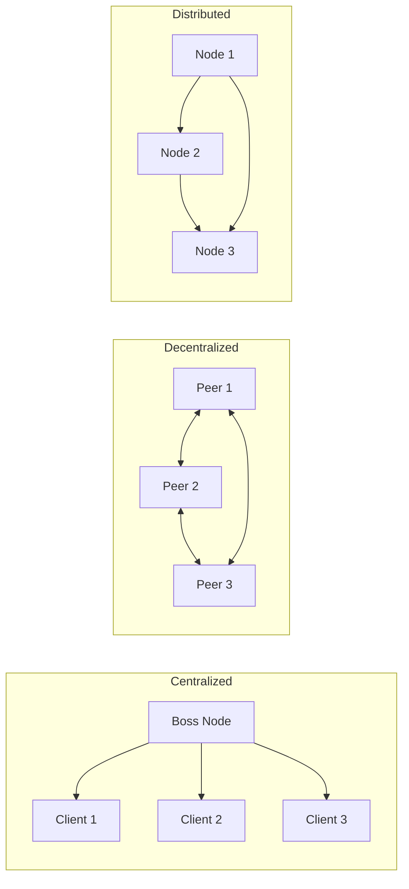

# Day 1: The Landscape & The Lies We Believe

## 1. What is a Distributed System?

A distributed system is a collection of independent computers that appears to its users as a **single coherent system**.

Think of a Google Search. You type a query, and you get a result. To you, it looks like one massive computer did the work. In reality, your request probably touched thousands of servers, hit a cache (Redis), queried an index (database), and aggregated results — all in milliseconds.

### The Three Architectures



- **Centralized:** One boss node does everything. Easy to manage, but a Single Point of Failure (SPOF).
- **Decentralized:** No single boss; nodes make local decisions (e.g., Bitcoin).
- **Distributed:** Nodes work together towards a common goal, often with some hierarchy.

---

## 2. The 8 Fallacies of Distributed Computing

This is the most important theory you will learn this week. In 1994, Peter Deutsch at Sun Microsystems listed 8 assumptions that programmers make when moving from a single computer to a network. **All 8 are false**.

If you build your system assuming these are true, it _will_ fail in production.

### 1. The network is reliable.

- _Reality:_ Cables get cut, routers crash, and switches drop packets. Your code must handle retries and timeouts.

### 2. Latency is zero.

- _Reality:_ An in-memory function call takes nanoseconds. A network call takes milliseconds (millions of times slower). You cannot treat a remote API call like a local function.

### 3. Bandwidth is infinite.

- _Reality:_ If you send massive JSON blobs constantly, you will clog the pipe.

### 4. The network is secure.

- _Reality:_ Packets can be intercepted. You need encryption (TLS/HTTPS).

### 5. Topology doesn't change.

- _Reality:_ In Docker/Kubernetes, containers die and restart with new IPs constantly.

### 6. There is one administrator.

- _Reality:_ You might interact with APIs (Stripe, Twilio) that you don't control.

### 7. Transport cost is zero.

- _Reality:_ Marshaling data (JSON → Binary) and sending it costs CPU and money.

### 8. The network is homogeneous.

- _Reality:_ You will have mobile clients, fast servers, slow IoT devices, etc.

---

## Hands-on Assignment (Go)

We are going to prove Fallacy #1 and #2 (Reliability and Latency). We will write a "Fragile Client" that expects the network to be perfect, and then we will break it.

### Step 1: Create your workspace

```bash
mkdir dist-sys-day1
cd dist-sys-day1
go mod init day1
```

### Step 2: Create `server.go`

This server simulates a "flaky" network. It randomly sleeps (latency) or returns an error (reliability issues).

```go
package main

import (
	"fmt"
	"math/rand"
	"net/http"
	"time"
)

func handler(w http.ResponseWriter, r *http.Request) {
	delay := time.Duration(rand.Intn(2000)) * time.Millisecond
	time.Sleep(delay)

	if rand.Float32() < 0.2 {
		http.Error(w, "Service Unavailable", http.StatusServiceUnavailable)
		fmt.Println("❌ Failed request (simulated)")
		return
	}

	fmt.Printf("✅ Processed request after %v\n", delay)
	fmt.Fprintf(w, "Hello from the Distributed World!")
}

func main() {
	http.HandleFunc("/", handler)
	fmt.Println("Server listening on :8080...")
	http.ListenAndServe(":8080", nil)
}
```

### Step 3: Create `client.go`

This client assumes the network is perfect. It has no timeout and no retry logic.

```go
package main

import (
	"fmt"
	"io"
	"net/http"
	"time"
)

func main() {
	start := time.Now()

	resp, err := http.Get("http://localhost:8080")
	if err != nil {
		panic(err)
	}
	defer resp.Body.Close()

	body, _ := io.ReadAll(resp.Body)
	duration := time.Since(start)

	if resp.StatusCode != 200 {
		fmt.Printf("Error: Server returned %d\n", resp.StatusCode)
	} else {
		fmt.Printf("Response: %s\n", body)
	}

	fmt.Printf("Time taken: %v\n", duration)
}
```

### Step 4: Run it

1. Open Terminal 1: `go run server.go`
2. Open Terminal 2: run `go run client.go` multiple times.

**Observation:**

- Sometimes it finishes in 200ms.
- Sometimes it hangs for 2 seconds (Latency is not zero!).
- Sometimes it prints "Error: Server returned 503" (The network is not reliable!).

---

## Review

Look at the `client.go` code. If `http.Get` hangs for 30 seconds because the server is slow, what happens to your application goroutine?

_Hint: This is why timeouts are critical. Tomorrow we look at TCP directly so you understand exactly what happens on the wire when a call hangs._
