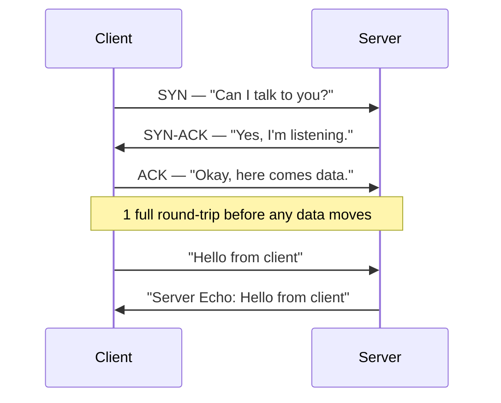

# Day 2: Networking Refresher (TCP vs UDP)

In distributed systems, 90% of your problems will be at the **Transport Layer**. You generally have two choices: **TCP** and **UDP**.

## 1. The Theory

### TCP (Transmission Control Protocol) — _The Reliable One_

- **Guarantees:** Delivery, Order, and Error Checking. If I send packets A, B, C, they arrive as A, B, C.
- **Cost:** Requires a handshake to start. Slower because if a packet is lost, it stops and waits to re-send it (Head-of-Line blocking).
- **Use Case:** Databases, REST APIs, gRPC — anywhere data must be correct.

### UDP (User Datagram Protocol) — _The Fast One_

- **Guarantees:** None. Fire and forget. Packets might arrive out of order or not at all.
- **Cost:** Extremely low overhead.
- **Use Case:** Video streaming, DNS, gaming, heartbeat signals between servers.

### The 3-Way Handshake

Before sending data via TCP, your client does this:



_This means even sending 1 byte of data requires a full round-trip of latency before the data even moves. A cross-region call at 80ms RTT spends 80ms just on the handshake._

---

## Hands-on Assignment (Go)

We are abandoning `net/http` today. We will use Go's `net` package to build a raw **Concurrent TCP Echo Server**.

**Key Distributed Concept: Concurrency.** We need to handle multiple clients at the same time without blocking the main accept loop.

### Step 1: Create `tcp_server.go`

```go
package main

import (
	"bufio"
	"fmt"
	"net"
	"strings"
)

func handleConnection(c net.Conn) {
	fmt.Printf("Serving %s\n", c.RemoteAddr().String())
	defer c.Close()

	for {
		netData, err := bufio.NewReader(c).ReadString('\n')
		if err != nil {
			fmt.Println(err)
			return
		}

		temp := strings.TrimSpace(string(netData))
		if temp == "STOP" {
			break
		}

		fmt.Fprintf(c, "Server Echo: %s\n", temp)
	}
}

func main() {
	PORT := ":8080"
	l, err := net.Listen("tcp4", PORT)
	if err != nil {
		fmt.Println(err)
		return
	}
	defer l.Close()
	fmt.Println("TCP Server is listening on " + PORT)

	for {
		c, err := l.Accept()
		if err != nil {
			fmt.Println(err)
			return
		}
		go handleConnection(c)
	}
}
```

### Step 2: Test it without writing a client

You don't always need to write a Go client to test TCP. Use `nc` (netcat):

```bash
go run tcp_server.go
```

In a second terminal:

```bash
nc localhost 8080
```

_Type anything and hit enter. The server should echo it back._

### Step 3: The Challenge

Open **three** separate terminal windows and connect them all with `nc localhost 8080`.

1. Type in Window 1.
2. Type in Window 2.
3. Type in Window 3.

Does Window 1 block Window 2?

Look at the `go handleConnection(c)` line. If you removed the keyword `go`, what would happen to the second client?

---

## Your Next Step

Once you confirm that the `go` keyword is the magic sauce for concurrency here, we are ready for **Day 3**.

We will look at **RPC (Remote Procedure Calls)** and **gRPC**. We will stop sending raw text strings and start sending structured data, just like real microservices do.

_Answer: The `go` keyword spawns a goroutine — a lightweight thread managed by the Go runtime (~2 KB of stack vs ~8 MB for an OS thread). You can spawn thousands of them, which is why Go is so good for distributed systems._
