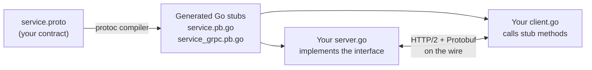

# Day 3: RPC & gRPC (Stopping the String Parsing Madness)

## 1. The Problem with Raw TCP

Yesterday, we sent `"Hello"`. But what if you want to send a user object: `{"id": 1, "name": "Kha", "role": "admin"}`?

If you use raw TCP, you have to:

1. Decide on a format (JSON? XML? custom binary?).
2. Parse the string manually on the server.
3. Handle errors if the string is malformed.
4. Repeat this for every new message type.

This is tedious. We want to just call a function like `server.Login(user)` and let the system handle the networking. This is **RPC (Remote Procedure Call)**.

## 2. Enter gRPC

**gRPC** (Google Remote Procedure Call) is the modern standard for service-to-service communication. Here is how it fits together:



It uses:

- **Protocol Buffers (Protobuf):** A binary format that is much smaller and faster than JSON.
- **HTTP/2:** Allows multiple requests over a single connection (no Head-of-Line blocking between streams).
- **Strict Contracts:** You define your API in a `.proto` file and the code is auto-generated for you.

---

## Hands-on Assignment (Go)

Today is about setup and definition. This is often the hardest part because of the tooling. Take your time here.

### Step 1: Install the Protocol Buffer Compiler

_If you are on Mac:_

```bash
brew install protobuf
go install google.golang.org/protobuf/cmd/protoc-gen-go@latest
go install google.golang.org/grpc/cmd/protoc-gen-go-grpc@latest
```

_If you are on Windows/Linux:_ Download the `protoc` binary from the [GitHub release page](https://github.com/protocolbuffers/protobuf/releases) and add it to your PATH. Then run the `go install` commands above.

### Step 2: Update your PATH

Make sure Go binaries are in your system path so your terminal can find `protoc-gen-go`.

```bash
export PATH="$PATH:$(go env GOPATH)/bin"
```

### Step 3: Create the project structure

```bash
mkdir -p grpc-demo/proto
cd grpc-demo
go mod init grpc-demo
```

### Step 4: Write the contract (`proto/service.proto`)

This file is our "Interface Definition Language" — the single source of truth for what the service can do.

```protobuf
syntax = "proto3";

package chat;

option go_package = "./proto";

service ChatService {
  rpc SendMessage (Message) returns (Ack);
}

message Message {
  string body = 1;
  string from = 2;
}

message Ack {
  string status = 1;
}
```

_Note: The numbers `1`, `2` are field tags. They are used in the binary encoding — not the field names. Once you assign a tag, never change it or reuse it._

### Step 5: Generate the Go code

Run this from the `grpc-demo` folder:

```bash
protoc --go_out=. --go_opt=paths=source_relative \
       --go-grpc_out=. --go-grpc_opt=paths=source_relative \
       proto/service.proto
```

You should now see two new files in `proto/`:

1. `service.pb.go` — the data structs: `Message`, `Ack`
2. `service_grpc.pb.go` — the client and server interface code

**Do not edit these files.** They are auto-generated.

---

## Review

Open `service.pb.go` and find the `Message` struct. Notice that gRPC has turned your simple `.proto` definition into a real Go struct with special methods for serialization — and you wrote zero lines of that code.

**If you got both files generated successfully, tell me "Generated".** Then we will write the actual server and client implementation on Day 4.
