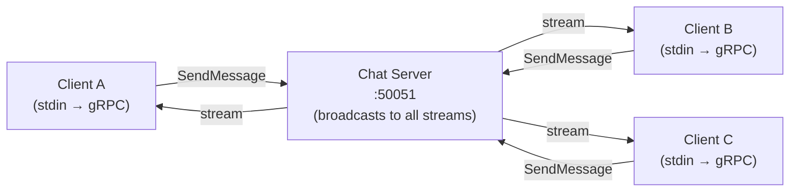

# Day 5: Weekend Project — gRPC Chat Server

## Goal

Build a chat application where multiple clients connect to a central server and exchange messages in real time, using the gRPC contract you defined on Day 3.

This project ties together everything from Week 1: TCP (under the hood), gRPC over HTTP/2, Protobuf serialization, and Go goroutines for concurrency.

## Architecture



The server holds an open **server-streaming RPC** per connected client. When any client sends a message, the server broadcasts it to all open streams.

---

## Hands-on Assignment (Go)

### Step 1: Update the proto contract

Edit `proto/service.proto` from Day 3 to add a streaming RPC:

```protobuf
syntax = "proto3";
package chat;
option go_package = "./proto";

service ChatService {
  rpc SendMessage (Message) returns (Ack);
  rpc Subscribe   (SubscribeRequest) returns (stream Message);
}

message Message {
  string body = 1;
  string from = 2;
}

message Ack {
  string status = 1;
}

message SubscribeRequest {
  string username = 1;
}
```

Regenerate:

```bash
protoc --go_out=. --go_opt=paths=source_relative \
       --go-grpc_out=. --go-grpc_opt=paths=source_relative \
       proto/service.proto
```

### Step 2: Add the gRPC dependency

```bash
go get google.golang.org/grpc
```

### Step 3: Create `server.go`

```go
package main

import (
	"fmt"
	"log"
	"net"
	"sync"

	"google.golang.org/grpc"
	pb "grpc-demo/proto"
)

type chatServer struct {
	pb.UnimplementedChatServiceServer
	mu      sync.Mutex
	streams []pb.ChatService_SubscribeServer
}

func (s *chatServer) SendMessage(_ interface{}, msg *pb.Message) (*pb.Ack, error) {
	s.mu.Lock()
	defer s.mu.Unlock()
	for _, stream := range s.streams {
		stream.Send(msg)
	}
	fmt.Printf("[%s]: %s\n", msg.From, msg.Body)
	return &pb.Ack{Status: "ok"}, nil
}

func (s *chatServer) Subscribe(req *pb.SubscribeRequest, stream pb.ChatService_SubscribeServer) error {
	s.mu.Lock()
	s.streams = append(s.streams, stream)
	s.mu.Unlock()

	fmt.Printf(">> %s joined\n", req.Username)
	<-stream.Context().Done()
	fmt.Printf("<< %s left\n", req.Username)

	s.mu.Lock()
	for i, st := range s.streams {
		if st == stream {
			s.streams = append(s.streams[:i], s.streams[i+1:]...)
			break
		}
	}
	s.mu.Unlock()
	return nil
}

func main() {
	lis, err := net.Listen("tcp", ":50051")
	if err != nil {
		log.Fatal(err)
	}
	s := grpc.NewServer()
	pb.RegisterChatServiceServer(s, &chatServer{})
	fmt.Println("Chat server listening on :50051")
	log.Fatal(s.Serve(lis))
}
```

### Step 4: Create `client.go`

```go
package main

import (
	"bufio"
	"context"
	"fmt"
	"io"
	"log"
	"os"

	"google.golang.org/grpc"
	"google.golang.org/grpc/credentials/insecure"
	pb "grpc-demo/proto"
)

func main() {
	if len(os.Args) < 2 {
		log.Fatal("Usage: go run client.go <username>")
	}
	username := os.Args[1]

	conn, err := grpc.NewClient("localhost:50051",
		grpc.WithTransportCredentials(insecure.NewCredentials()))
	if err != nil {
		log.Fatal(err)
	}
	defer conn.Close()

	client := pb.NewChatServiceClient(conn)

	// Subscribe to receive messages from the server
	stream, err := client.Subscribe(context.Background(), &pb.SubscribeRequest{Username: username})
	if err != nil {
		log.Fatal(err)
	}

	// Print incoming messages in the background
	go func() {
		for {
			msg, err := stream.Recv()
			if err == io.EOF {
				return
			}
			if err != nil {
				return
			}
			fmt.Printf("\r[%s]: %s\n> ", msg.From, msg.Body)
		}
	}()

	// Read stdin and send messages
	scanner := bufio.NewScanner(os.Stdin)
	fmt.Print("> ")
	for scanner.Scan() {
		text := scanner.Text()
		if text == "" {
			fmt.Print("> ")
			continue
		}
		client.SendMessage(context.Background(), &pb.Message{Body: text, From: username})
		fmt.Print("> ")
	}
}
```

### Step 5: Run the chat app

Open four terminal windows:

**Terminal 1** — start the server:
```bash
go run server.go
```

**Terminal 2, 3, 4** — each joins as a different user:
```bash
go run client.go Alice
go run client.go Bob
go run client.go Charlie
```

Type a message in any terminal. It should appear in all other terminals.

---

## Challenges

1. **Observe concurrency:** what happens if you send messages from all three clients simultaneously? Are any lost?
2. **Observe disconnection:** kill one client with `Ctrl+C`. Confirm the server prints the "left" message and the remaining clients are unaffected.
3. **Add a username list:** modify `Subscribe` to broadcast a `"X joined"` system message to all existing clients when a new user connects.

---

## Your Next Step

Next week we move into **Week 2: System Models & Impossibility**. You have built a working distributed chat app — now we are going to deliberately break it and understand _why_ it breaks. That is the only way to build systems that survive the real world.
