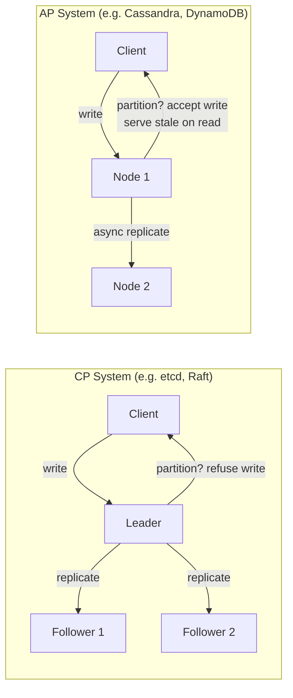
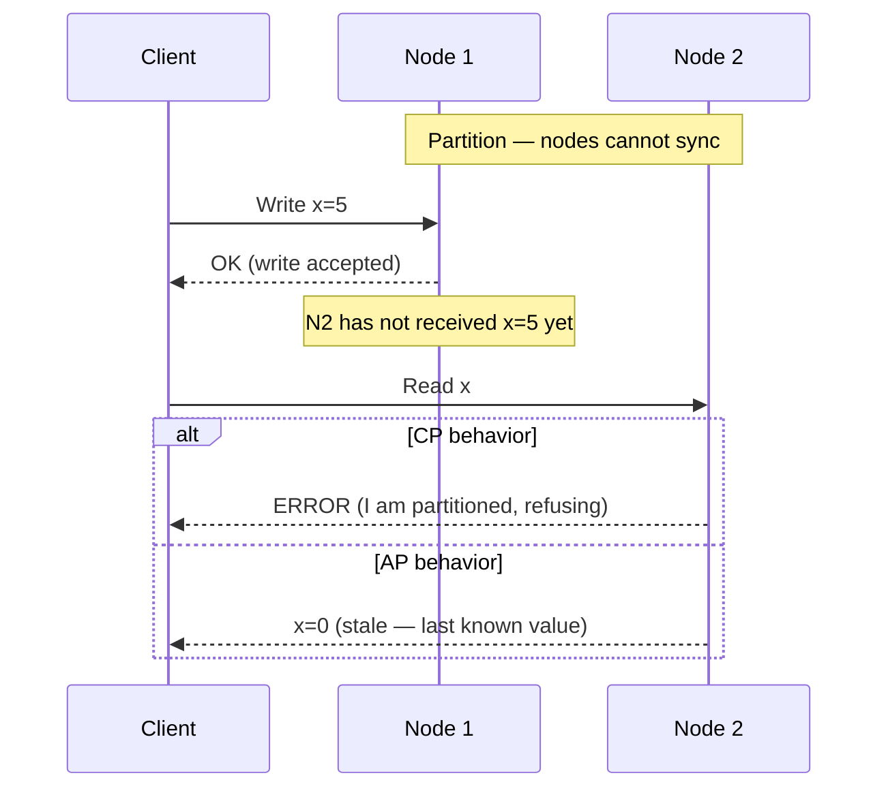
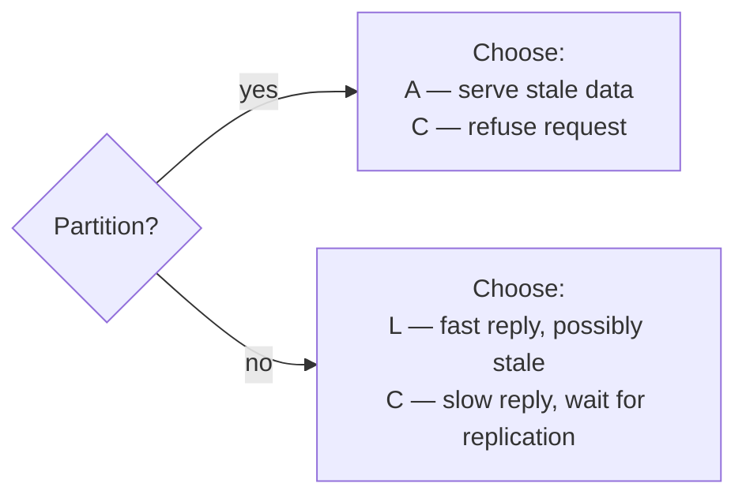
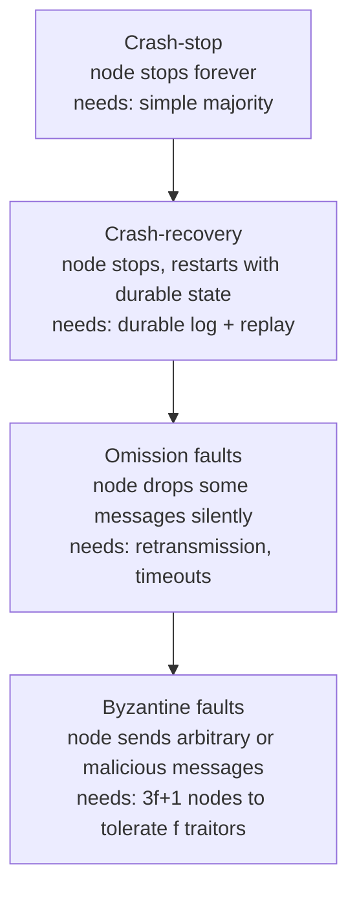

# Week 2 — System Models & Impossibility, Deep Intro

[Back to top README](../../README.md)

## TL;DR

- **What you learn:** how to name and classify the failures your system will face — and which problems are provably unsolvable. CAP and PACELC tell you which guarantees you must give up under a partition or under normal latency pressure.
- **Tools:** no new code libraries — this week is theory-heavy with a chaos engineering hands-on.
- **Mental model:** every distributed system is a bet. CAP forces you to declare which bet you are making before you write a line of code.

---

## Architecture at a glance

The fundamental trade-off: a CP system refuses requests to stay correct; an AP system accepts requests but risks serving stale data.

---

## CAP Theorem — in depth

Eric Brewer (2000), formally proven by Gilbert and Lynch (2002).

**Three properties:**

- **Consistency (C):** every read returns the most recent write, or an error. (This is linearizability, not ACID consistency.)
- **Availability (A):** every request receives a non-error response — though it may be stale.
- **Partition Tolerance (P):** the system continues operating even when network messages are lost or delayed between nodes.

**The key insight:** Partition Tolerance is not optional. Networks drop packets. Cables get cut. Datacenters lose connectivity. You cannot build a multi-node system that assumes P away. So the real choice is always **CP vs AP**.

### Why CA is impossible at scale

A CA system (Consistent + Available, no Partition Tolerance) would require that the network never partitions. For a system running inside a single datacenter on a single switch, this is nearly true. Across a WAN — across regions, across availability zones, even across racks — it is not. The moment you deploy two nodes that communicate over a network, you must plan for P.

### Real system positions on CAP

| System | CAP choice | Notes |
|--------|-----------|-------|
| etcd / Zookeeper / Consul | CP | refuses reads/writes without leader quorum |
| HBase | CP | HDFS requires majority before write |
| Cassandra | AP (tunable) | default eventual consistency; tunable to CP with QUORUM |
| DynamoDB | AP (default) | strongly consistent reads available at extra cost |
| CouchDB | AP | MVCC + eventual consistency |
| Single-node PostgreSQL | CA | not distributed — no partition possible |

---

## PACELC Theorem

Daniel Abadi (2012) — an extension that covers the non-partition case.

> If there is a **P**artition, choose between **A**vailability and **C**onsistency.
> **E**lse (no partition), choose between **L**atency and **C**onsistency.

The EL/EC dimension is often more practically relevant day-to-day because partitions are rare but latency pressure is constant.

| System | Partition behavior | Else behavior | Label |
|--------|--------------------|--------------|-------|
| DynamoDB (default) | AP | EL | PA/EL |
| etcd / Raft | CP | EC | PC/EC |
| Cassandra (W=QUORUM) | CP | EC | PC/EC |
| Cassandra (W=ONE) | AP | EL | PA/EL |
| MySQL async replica | AP | EL | PA/EL |
| MySQL semi-sync replica | CP | EC | PC/EC |
| CockroachDB | CP | EC | PC/EC |

---

## Failure models

Not all failures are equal. The stronger the failure model you assume, the more expensive your algorithm.

### Crash-stop

The node fails and never returns. The rest of the cluster can safely assume it is gone. Most academic consensus papers assume crash-stop.

- **Algorithm cost:** simple majority quorum (N/2+1 votes needed).
- **Real world:** not quite true — a process can stop responding due to GC pause, network partition, or CPU overload, then recover.

### Crash-recovery

The node may crash but can restart, potentially reading durable state from disk. Raft assumes crash-recovery.

- **Algorithm cost:** must persist state to disk before responding. Raft's `AppendEntries` does not ACK until the log entry is fsynced.
- **Real world:** most production nodes — your Go server crashes, the container restarts, Kubernetes brings it back.

### Byzantine faults

A node may lie: send different values to different peers, replay old messages, or collude with other faulty nodes.

- **Algorithm cost:** requires `3f+1` total nodes to tolerate `f` Byzantine nodes (PBFT, Tendermint). Much more expensive than crash-stop.
- **Real world:** rare in internal clusters (you control the hardware). Relevant for blockchains, multi-party computation, or systems with untrusted nodes.

### Timing models

| Model | Clock assumption | Network assumption |
|-------|-----------------|-------------------|
| Synchronous | bounded clock drift | bounded message delay |
| Asynchronous | no clock assumption | unbounded delay |
| Partially synchronous | eventually bounded | eventually bounded |

Most real-world distributed algorithms assume partial synchrony — things are usually timely, but you cannot depend on exact bounds.

---

## FLP Impossibility

Fischer, Lynch, Paterson (1985). Arguably the most important theorem in distributed computing.

**Statement:** In a purely asynchronous distributed system (no timing assumptions), consensus is impossible if even one process may crash.

**What it means in practice:**
- You cannot build a perfectly safe, perfectly available consensus algorithm in an asynchronous model.
- Every practical consensus protocol (Raft, Paxos, PBFT) either assumes partial synchrony (timeouts, leases) or sacrifices liveness (may block indefinitely in adversarial conditions).
- **Raft's response to FLP:** uses election timeouts (a partial synchrony assumption). If the leader is silent for 150–300 ms, a follower starts an election. This is not safe in a fully asynchronous system — but real networks are partially synchronous.

---

## Mental models

### The partition is not under your control

You do not choose whether a partition happens. You choose how your system behaves when it does. Make that choice explicit in your design documentation.

### Consistency spectrum (weakest to strongest)

| Level | Guarantee | Used by |
|-------|-----------|---------|
| Eventual consistency | all nodes converge to the same value eventually | Cassandra default, DynamoDB default |
| Monotonic reads | once you read a value, you never see an older one | client-side sticky sessions |
| Read-your-writes | after you write, you always read your own write | session tokens, primary reads |
| Causal consistency | causally related writes appear in order to all nodes | vector clocks |
| Linearizability | reads see the most recent committed write globally | Raft, etcd, CRDT ops |
| Serializability | transactions appear to execute one at a time | single-node ACID DB |

### Failure detection is probabilistic, not certain

You cannot distinguish "node crashed" from "node is slow" from "network partitioned." Every failure detector is either:

- **Imperfect:** may falsely suspect a live node (Phi Accrual, heartbeat timeout).
- **Eventually perfect:** correct in stable periods, may be wrong during instability.

Raft treats silence for `electionTimeout` milliseconds as "leader crashed" — this may be wrong (leader is merely slow), causing a spurious election. This is acceptable because the safety property (at most one leader per term) is maintained by the term number check.

---

## Failure modes

- **Split-brain:** network partition causes two nodes to both believe they are the leader. Fix: require quorum before accepting writes; use fencing tokens.
- **False positive failure detection:** healthy node is evicted because heartbeats were delayed by GC pause. Fix: tunable timeouts, Phi Accrual detector.
- **Stale read after partition heals:** client read from a partition that missed writes during isolation. Fix: read from quorum, or use version vectors.
- **Cascading timeout storms:** when a partition heals and all nodes try to catch up simultaneously, overwhelming the leader. Fix: jitter in reconnect timers.

---

## Day-by-day links

- [Day 6 — CAP Theorem: C, A, P definitions and why you must choose](day6_cap-theorem.md)
- [Day 7 — Why Partition Tolerance is not optional over a WAN](day7_cap-deep-dive.md)
- [Day 8 — PACELC: Latency vs. Consistency when healthy](day8_pacelc.md)
- [Day 9 — Failure Models: crash-stop, crash-recovery, Byzantine faults](day9_failure-models.md)
- [Day 10 — Review + Chaos: inject latency and packet drops into the chat app](day10_review-and-chaos.md)
