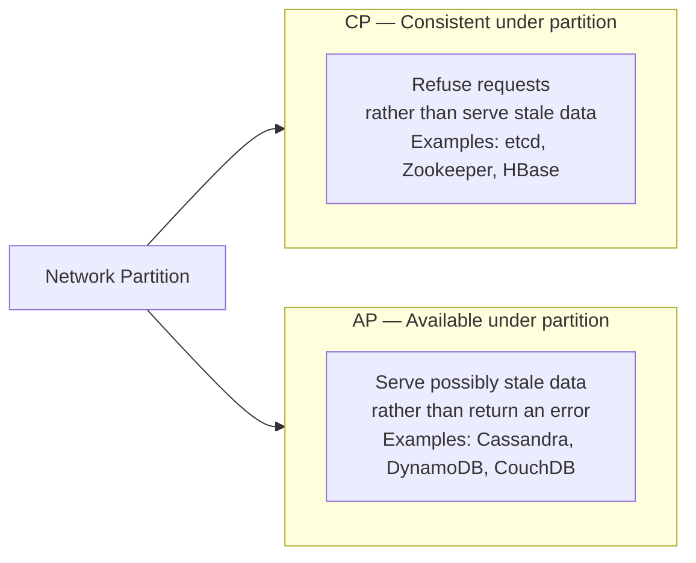

# Day 6: The CAP Theorem

## 1. The Three Properties

The CAP Theorem (Eric Brewer, 2000) states that a distributed system can provide at most two of the following three guarantees simultaneously:

- **Consistency (C):** Every read returns the most recent write, or an error. (This is **linearizability** — not ACID consistency.)
- **Availability (A):** Every request receives a non-error response — even if the data might be stale.
- **Partition Tolerance (P):** The system continues operating even when network messages are lost or delayed between nodes.

## 2. Why You Can Only Pick Two

Here is the key insight: **Partition Tolerance is not optional**. Networks partition. Cables get cut. Switches fail. Datacenters lose connectivity. The moment you have two nodes communicating over a network, you must design for P.

So the real choice is always **CP vs AP**:

### CP systems

Refuse writes (and optionally reads) when a quorum cannot be reached. The system is correct but unavailable until the partition heals.

_Example: etcd — if a Raft cluster loses its majority, it stops accepting writes._

### AP systems

Accept writes and serve reads from any available node, even if that node has not received recent updates. The system stays up but may return stale data.

_Example: Cassandra with consistency level ONE — always responds, even from a lagging replica._

### CA — Impossible at scale

A "CA" system (Consistent + Available, no partition tolerance) can only exist on a **single node**. Once you add a second node and a network between them, partitions become possible, and you are forced to choose C or A when they occur.

---

## Hands-on Assignment (Go)

No new code today — this is a classification exercise. Use what you have learned to fill in this table.

### Step 1: Classify these systems

For each system below, decide: **CP**, **AP**, or **CA (single-node only)**?

| System | Your Answer | Reasoning |
|--------|-------------|-----------|
| etcd | | |
| Apache Cassandra (default: consistency ONE) | | |
| Apache Cassandra (consistency: QUORUM) | | |
| Redis Cluster | | |
| PostgreSQL (single instance) | | |
| CouchDB | | |
| MongoDB (with write concern: majority) | | |

### Step 2: Justify your hardest call

Write 2–3 sentences for the system you found hardest to classify. What assumption about "partition behavior" drove your answer?

### Step 3: Research question

Look up how DynamoDB handles a partition in its default configuration. Is it CP or AP? Does it offer a way to flip the other way?

---

## Review

If a system is **AP**, what guarantee can you give a user who writes their profile name and then immediately reads it back? What engineering technique would you use to improve this?

_Hint: "Read-your-writes consistency" — we cover this in Week 6._
