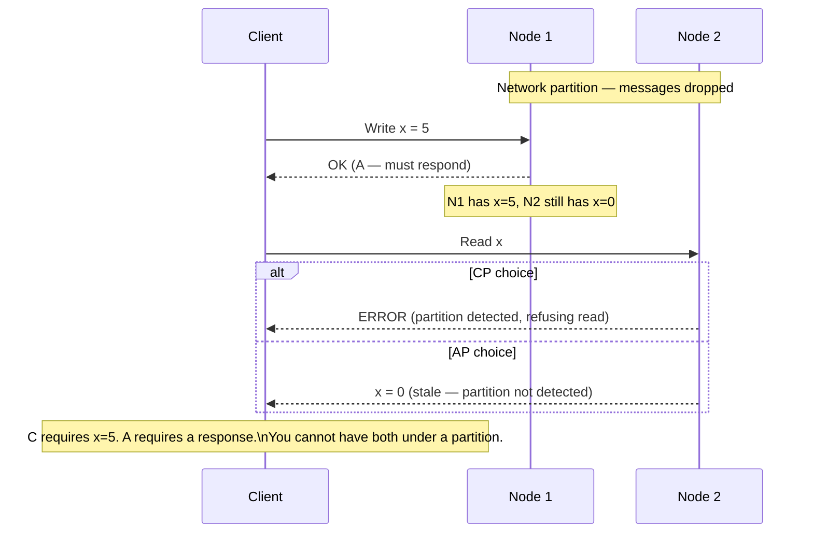

# Day 7: Why You Cannot Have CA in a Distributed System

## 1. The Partition Is Not Under Your Control

Yesterday we established that CA is impossible in a distributed system. Today we prove it from first principles and feel the pain in code.

A **network partition** is when nodes in a cluster cannot communicate with each other. You do not choose whether a partition happens — you only choose how your system behaves _when_ it does.

## 2. The CA Impossibility Sketch

Suppose you have two nodes, N1 and N2, and you want both C and A with no concern for P.



The proof:
- **If you choose C:** N2 must refuse the read (or block until it syncs with N1). That violates A.
- **If you choose A:** N2 returns `x=0` (stale). That violates C.
- There is no third option.

## 3. Split-brain

The most dangerous partition failure is **split-brain**: two nodes both believe they are the sole leader and accept writes independently. When the partition heals, they have diverging state and no way to automatically reconcile.

Real mitigations:
- **Quorum:** require `N/2 + 1` nodes to agree before accepting a write. If you have 3 nodes and 1 is partitioned, the majority of 2 still works. If 2 are partitioned, writes halt (CP).
- **Fencing tokens:** each leader is issued a monotonically increasing token. Any operation that arrives at a storage node with an old token is rejected — even if the old leader thinks it is still active.

---

## Hands-on Assignment (Go)

We will simulate a two-node system and observe what happens when the sync channel between them breaks.

### Step 1: Set up the project

```bash
mkdir dist-sys-day7
cd dist-sys-day7
go mod init day7
```

### Step 2: Create `main.go`

This simulates two nodes with a sync goroutine between them. We will kill the sync to create a partition.

```go
package main

import (
	"fmt"
	"net/http"
	"sync"
	"time"
)

type Node struct {
	mu   sync.RWMutex
	data map[string]string
	name string
}

func (n *Node) Set(key, value string) {
	n.mu.Lock()
	defer n.mu.Unlock()
	n.data[key] = value
}

func (n *Node) Get(key string) string {
	n.mu.RLock()
	defer n.mu.RUnlock()
	return n.data[key]
}

func main() {
	n1 := &Node{data: make(map[string]string), name: "N1"}
	n2 := &Node{data: make(map[string]string), name: "N2"}

	partitioned := make(chan struct{})

	// Sync goroutine: N1 replicates to N2 every 100ms
	go func() {
		for {
			select {
			case <-partitioned:
				fmt.Println("⚡ Partition! Sync stopped.")
				return
			case <-time.After(100 * time.Millisecond):
				n1.mu.RLock()
				for k, v := range n1.data {
					n2.Set(k, v)
				}
				n1.mu.RUnlock()
			}
		}
	}()

	// Primary handler — accepts writes
	http.HandleFunc("/write", func(w http.ResponseWriter, r *http.Request) {
		key := r.URL.Query().Get("key")
		val := r.URL.Query().Get("val")
		n1.Set(key, val)
		fmt.Fprintf(w, "N1 wrote %s=%s\n", key, val)
	})

	// Replica handler — serves reads (may be stale)
	http.HandleFunc("/read", func(w http.ResponseWriter, r *http.Request) {
		key := r.URL.Query().Get("key")
		fmt.Fprintf(w, "N2 read %s=%q\n", key, n2.Get(key))
	})

	// Partition trigger
	http.HandleFunc("/partition", func(w http.ResponseWriter, r *http.Request) {
		close(partitioned)
		fmt.Fprintf(w, "Partition triggered\n")
	})

	fmt.Println("Listening on :8080")
	http.ListenAndServe(":8080", nil)
}
```

### Step 3: Run the experiment

```bash
go run main.go
```

**Phase 1 — normal operation:**
```bash
curl "localhost:8080/write?key=user&val=Kha"
curl "localhost:8080/read?key=user"
# Should return: N2 read user="Kha"
```

**Phase 2 — trigger the partition:**
```bash
curl "localhost:8080/partition"
```

**Phase 3 — write to N1, read from N2:**
```bash
curl "localhost:8080/write?key=user&val=NewKha"
curl "localhost:8080/read?key=user"
# AP behavior: returns stale "Kha" — N2 missed the write
```

---

## Review

In Phase 3, you observed **AP behavior**: N2 returned a stale value. What would you need to change in the code to get **CP behavior** instead — i.e., have `/read` return an error when it knows it is partitioned?

_Hint: The node needs a way to know it is partitioned. What signal could it use?_
