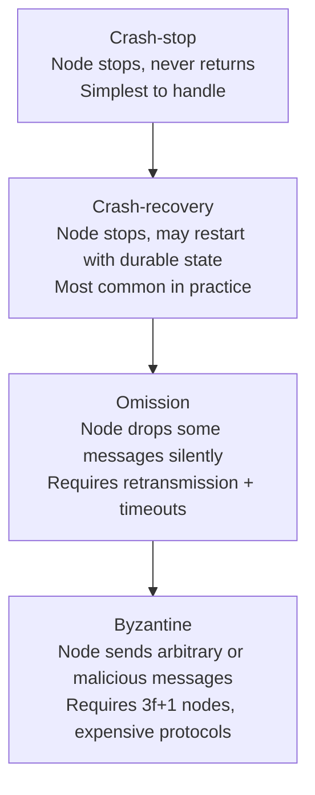

# Day 9: Failure Models

## 1. Not All Failures Are Equal

When we design distributed algorithms, we must state exactly what kind of failures we are protecting against. The stronger the failure model, the more expensive the algorithm.



## 2. Crash-Stop

The node fails and never returns. All other nodes can safely assume it is gone forever.

- **Algorithm cost:** simple majority quorum.
- **Reality check:** not quite true in production. A process paused by GC, a slow disk flush, or a network hiccup looks identical to a crash from the outside — until it comes back.

## 3. Crash-Recovery

The node may crash but can restart, potentially with durable state read back from disk.

- **Algorithm cost:** must persist state (e.g., Raft log) before acknowledging writes. `fsync` on every commit.
- **Reality check:** this is what almost every production node does. Your Go server crashes, the container restarts, Kubernetes brings it back up.

## 4. Byzantine Faults

A node may send incorrect, inconsistent, or malicious messages to different peers.

- **Algorithm cost:** requires `3f + 1` total nodes to tolerate `f` Byzantine nodes. With 1 traitor you need at least 4 nodes.
- **Reality check:** rare in internal clusters you control. Essential in blockchains, multi-party computation, or systems with untrusted third-party validators.

## 5. The FLP Impossibility

Fischer, Lynch, Paterson (1985): in a fully **asynchronous** system (no timing assumptions), **consensus is impossible** if even one process may crash.

What this means in practice:
- Every real consensus protocol (Raft, Paxos) assumes **partial synchrony** — things are usually timely, so timeouts work most of the time.
- If the network becomes completely asynchronous (huge delays), the algorithm may halt. This is acceptable — it resumes when timing stabilises.

---

## Hands-on Assignment (Go)

We will simulate crash-stop and crash-recovery detection using heartbeats.

### Step 1: Set up the project

```bash
mkdir dist-sys-day9
cd dist-sys-day9
go mod init day9
```

### Step 2: Create `main.go`

Three goroutines act as nodes. Node 1 is deliberately killed after 3 seconds. Nodes 2 and 3 detect the failure via missed heartbeats.

```go
package main

import (
	"fmt"
	"sync"
	"time"
)

type Node struct {
	id       int
	alive    bool
	mu       sync.Mutex
	lastBeat time.Time
}

func (n *Node) heartbeat() {
	n.mu.Lock()
	defer n.mu.Unlock()
	n.lastBeat = time.Now()
}

func (n *Node) isAlive(timeout time.Duration) bool {
	n.mu.Lock()
	defer n.mu.Unlock()
	return time.Since(n.lastBeat) < timeout
}

func main() {
	timeout := 500 * time.Millisecond
	nodes := []*Node{
		{id: 1, alive: true, lastBeat: time.Now()},
		{id: 2, alive: true, lastBeat: time.Now()},
		{id: 3, alive: true, lastBeat: time.Now()},
	}

	// Each node sends heartbeats every 200ms while alive
	for _, n := range nodes {
		node := n
		go func() {
			for {
				node.mu.Lock()
				alive := node.alive
				node.mu.Unlock()
				if !alive {
					return
				}
				node.heartbeat()
				time.Sleep(200 * time.Millisecond)
			}
		}()
	}

	// Kill node 1 after 3 seconds (crash-stop)
	go func() {
		time.Sleep(3 * time.Second)
		nodes[0].mu.Lock()
		nodes[0].alive = false
		nodes[0].mu.Unlock()
		fmt.Println("💥 Node 1 crashed (crash-stop)")
	}()

	// Failure detector: check all nodes every 300ms
	start := time.Now()
	for time.Since(start) < 6*time.Second {
		time.Sleep(300 * time.Millisecond)
		for _, n := range nodes {
			if !n.isAlive(timeout) {
				fmt.Printf("⚠️  Node %d detected as FAILED (missed heartbeat)\n", n.id)
			} else {
				fmt.Printf("✅ Node %d is alive\n", n.id)
			}
		}
		fmt.Println("---")
	}
}
```

### Step 3: Run and observe

```bash
go run main.go
```

Watch Node 1 go from `✅ alive` to `⚠️ FAILED` after the 3-second crash.

### Step 4: Simulate crash-recovery

Add a recovery after the crash — set `nodes[0].alive = true` again after 5 seconds. Does the failure detector correctly mark it as recovered?

```go
go func() {
    time.Sleep(5 * time.Second)
    nodes[0].mu.Lock()
    nodes[0].alive = true
    nodes[0].lastBeat = time.Now()
    nodes[0].mu.Unlock()
    fmt.Println("♻️  Node 1 recovered (crash-recovery)")
}()
```

---

## Review

1. In the code above, could Node 2's heartbeat detector falsely report Node 1 as failed even if Node 1 is still alive? When would this happen?

2. Why does Raft use a **randomized** election timeout rather than a fixed one? What failure scenario does randomization prevent?
