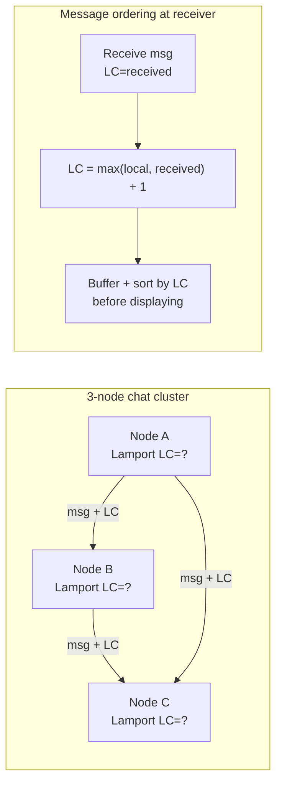
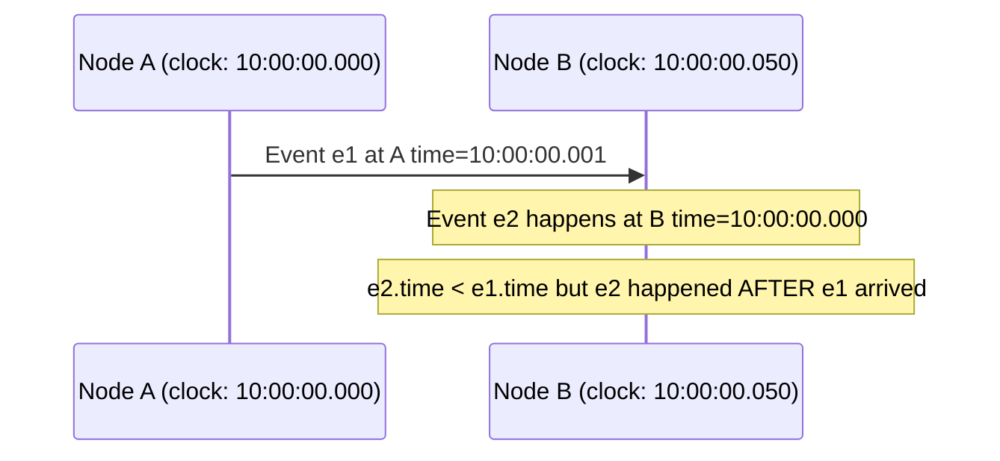
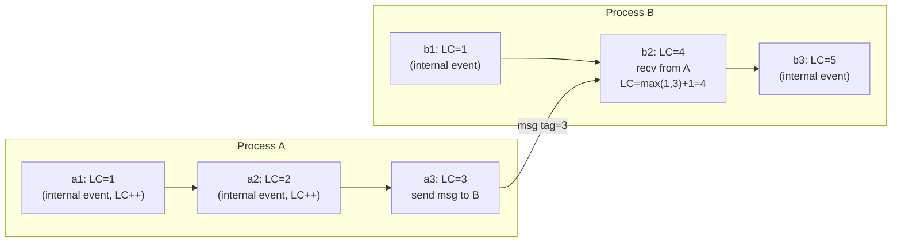
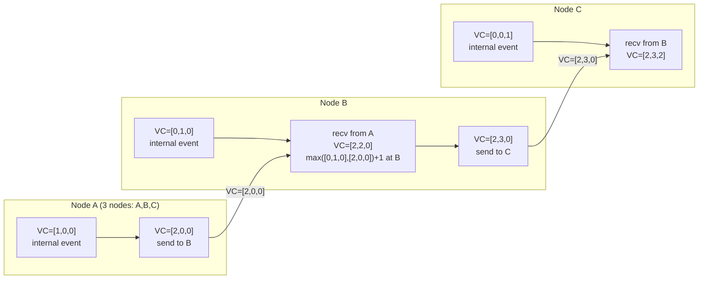
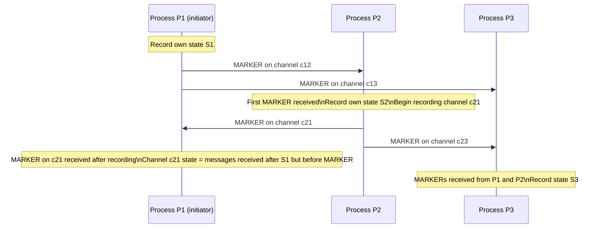

# Week 3 — Time and Order, Deep Intro

[Back to top README](../../README.md)

## TL;DR

- **What you learn:** how to order events in a system where nodes have no shared clock — from physical NTP clocks (unreliable) to Lamport timestamps (causal ordering) to vector clocks (full concurrency detection) to the Chandy-Lamport snapshot algorithm (global state without stopping the world).
- **Tools:** Go — implement a Lamport clock as a goroutine-safe integer counter; vector clocks as a `map[string]int`.
- **Mental model:** "happened-before" is the only safe ordering primitive in a distributed system. Wall-clock time is a hint, not a guarantee.

---

## Architecture at a glance



Without Lamport clocks, messages arrive out of order because of variable network latency. With them, every node can reconstruct a consistent causal order.

---

## Physical clocks — why you cannot trust them

### How clocks drift

Every computer has a quartz oscillator that vibrates at ~32 kHz. It drifts up to 200 ppm (200 µs per second, ~17 seconds per day). NTP corrects this by comparing to a stratum-0 reference (atomic clock / GPS). But NTP has:

- **Synchronization error:** ±1–50 ms over the internet; ±100 µs on a local network.
- **Leap seconds:** the IETF occasionally inserts or deletes a second in UTC. Some systems freeze the clock; others smear the second over a day (Google's approach). Either way, `time.Now()` may go backward.
- **VM clock skew:** virtualized environments steal CPU cycles; the guest clock can fall behind by hundreds of milliseconds.

### The ordering problem



You cannot use wall-clock timestamps to determine causal ordering. The event with a lower timestamp may have happened logically after the event with a higher timestamp.

**Where wall-clock time is safe to use:** business timestamps visible to users (e.g., "order placed at 3:45 PM"), log correlation (approximate), expiry/TTL (not precision-sensitive).

**Where wall-clock time is NOT safe:** determining which write wins in a conflict (Last Write Wins with physical clocks loses data), ordering distributed events causally, snapshot consistency.

---

## Lamport Clocks

Leslie Lamport (1978). The simplest logical clock.

### The happened-before relation (`→`)

- If `a` and `b` are events in the same process and `a` comes before `b`, then `a → b`.
- If `a` is the sending of a message and `b` is the receipt of that message, then `a → b`.
- If `a → b` and `b → c`, then `a → c` (transitivity).
- If neither `a → b` nor `b → a`, then `a` and `b` are **concurrent** (written `a ∥ b`).

### Lamport timestamp rules



**Rules:**
1. Before any event, increment your local clock: `LC++`.
2. On send: include `LC` in the message.
3. On receive: `LC = max(local_LC, msg_LC) + 1`.

**Guarantee:** if `a → b` then `LC(a) < LC(b)`. The converse is NOT true — a lower timestamp does not guarantee happened-before. Two events can have the same or close timestamps and be concurrent.

### Implementation in Go

```go
type LamportClock struct {
    mu    sync.Mutex
    value uint64
}

func (lc *LamportClock) Tick() uint64 {
    lc.mu.Lock()
    defer lc.mu.Unlock()
    lc.value++
    return lc.value
}

func (lc *LamportClock) Update(received uint64) uint64 {
    lc.mu.Lock()
    defer lc.mu.Unlock()
    if received > lc.value {
        lc.value = received
    }
    lc.value++
    return lc.value
}
```

---

## Vector Clocks

A vector clock is an array of integers — one counter per node. It captures the full causal history, not just a partial order.

### Update rules

Let `VC[i]` be node `i`'s view of node `i`'s local time.

1. On internal event at node `i`: `VC[i]++`.
2. On send from node `i`: include full `VC`; then `VC[i]++`.
3. On receive at node `j` of message with `VC_msg`: for each `k`, `VC[k] = max(VC[k], VC_msg[k])`; then `VC[j]++`.



### Comparing vector clocks

Given two vector clocks `VC_a` and `VC_b`:

- `VC_a < VC_b` (a happened before b): `VC_a[i] <= VC_b[i]` for all `i`, and strictly less for at least one.
- `VC_a > VC_b` (b happened before a): the reverse.
- `VC_a ∥ VC_b` (concurrent): neither dominates the other.

Concurrent events are the source of **write conflicts** in systems like DynamoDB and Riak. A conflict means two clients wrote to the same key without either seeing the other's write. The system must merge them.

### Cost: N integers per message

For a cluster of 100 nodes, every message carries 100 integers (~800 bytes of overhead). This is why vector clocks are used within a small number of replicas, not across a massive fleet. **Dotted version vectors** and **hybrid logical clocks (HLC)** are practical optimizations.

---

## Chandy-Lamport Snapshot Algorithm

K. Mani Chandy and Leslie Lamport (1985). Takes a consistent global snapshot without pausing the system.

### The problem

You want to capture the state of a distributed system at a single logical moment. But there is no global clock and messages are in-flight.

### The algorithm



**Rules:**
1. The initiator records its own state and sends a MARKER on every outgoing channel.
2. A process receiving a MARKER for the first time: records its own state, begins recording messages arriving on all channels that have not yet sent a MARKER.
3. A process receiving a MARKER on channel `c`: stops recording messages on `c`; the recorded messages are the state of channel `c`.
4. When all processes have recorded their state and all channels have received MARKERs, the snapshot is complete.

**Guarantee:** the resulting snapshot is consistent — it corresponds to a state the system could have been in (even if no process was ever in that exact state simultaneously).

**Use cases:** checkpointing for fault recovery, distributed debugging, detecting stable properties (deadlock detection, termination detection).

---

## Mental models

### Happened-before is a partial order

Not all events can be compared. Two events are either ordered (one happened before the other, causally) or concurrent (neither caused the other). This is fundamentally different from a total order where every pair of events has a definite sequence.

### The two clocks you actually use in production

| Clock | Use case |
|-------|----------|
| Lamport timestamp (single int) | ordering messages within a small scope; breaking ties in Raft log entries |
| Hybrid Logical Clock (HLC) | CockroachDB — combines physical time (for human readability) with a logical counter (for ordering safety) |

### Conflict as a signal, not a bug

In an AP system, two concurrent writes to the same key are not bugs — they are expected. The system must detect them (via vector clocks or version vectors) and resolve them (via LWW, CRDTs, or application logic). Treating concurrency as an error leads to unnecessary availability loss.

---

## Failure modes

- **Clock rollback:** NTP steps the clock backward (not just slows it). Any code using `time.Now()` as a sequence number will generate duplicate or decreasing values. Use a monotonic clock (`time.Now().UnixNano()` on Linux uses `CLOCK_MONOTONIC` internally — but only within one process; across processes/nodes you need logical clocks).
- **Lamport clock integer overflow:** a 64-bit counter at 1 million increments per second takes ~584,000 years to overflow. Use `uint64`.
- **Snapshot incompleteness:** if a process crashes before receiving all MARKERs, the snapshot is incomplete. Restart from the last complete snapshot.
- **Vector clock size explosion:** adding nodes to the cluster without pruning old entries. Use a fixed-size ring with a generation counter, or switch to dotted version vectors.

---

## Day-by-day links

- [Day 11 — Physical Clocks: quartz drift, NTP, why wall-clock time lies](day11_physical-clocks.md)
- [Day 12 — Lamport Clocks: happened-before, rules, Go implementation](day12_lamport-clocks.md)
- [Day 13 — Vector Clocks: full causal history, detecting concurrent writes](day13_vector-clocks.md)
- [Day 14 — Global State: Chandy-Lamport snapshot algorithm](day14_global-state.md)
- [Day 15 — Weekend Project: Lamport clocks in the chat app; order out-of-order messages](day15_lamport-in-chat.md)
