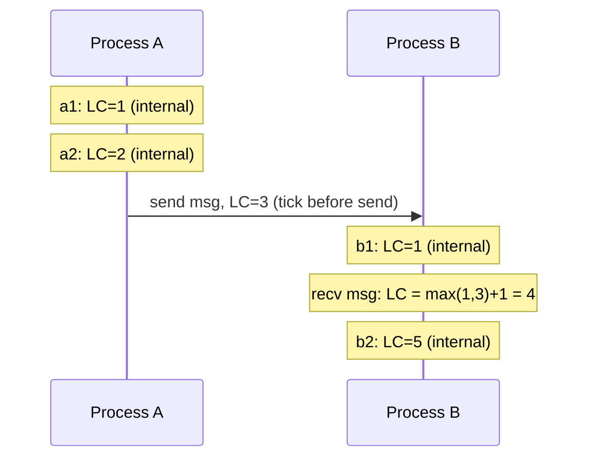

# Day 12: Lamport Clocks

## 1. The Happened-Before Relation

Leslie Lamport (1978) introduced a way to order events without a physical clock — using only the causal relationships between events.

The **happened-before** relation (`→`) is defined as:

1. If `a` and `b` are events in the same process and `a` comes before `b`, then `a → b`.
2. If `a` is the sending of a message and `b` is the receipt of that same message, then `a → b`.
3. If `a → b` and `b → c`, then `a → c` (transitivity).
4. If neither `a → b` nor `b → a`, then `a` and `b` are **concurrent** (`a ∥ b`).

## 2. The Three Rules

Each process maintains a single integer counter — its Lamport timestamp (LC):



**Rule 1 — Internal event:** `LC = LC + 1`

**Rule 2 — Send:** `LC = LC + 1`, include `LC` in the message.

**Rule 3 — Receive:** `LC = max(local_LC, msg_LC) + 1`

**Guarantee:** if `a → b` then `LC(a) < LC(b)`.

The converse is **not** guaranteed: a lower timestamp does not imply happened-before. Two events can have close or equal timestamps and still be concurrent. This is why we need vector clocks for full concurrency detection (Day 13).

---

## Hands-on Assignment (Go)

### Step 1: Set up the project

```bash
mkdir dist-sys-day12
cd dist-sys-day12
go mod init day12
```

### Step 2: Create `lamport.go`

```go
package main

import (
	"fmt"
	"sync"
	"time"
)

type LamportClock struct {
	mu    sync.Mutex
	value uint64
}

func (lc *LamportClock) Tick() uint64 {
	lc.mu.Lock()
	defer lc.mu.Unlock()
	lc.value++
	return lc.value
}

func (lc *LamportClock) Send() uint64 {
	return lc.Tick()
}

func (lc *LamportClock) Receive(msgTS uint64) uint64 {
	lc.mu.Lock()
	defer lc.mu.Unlock()
	if msgTS > lc.value {
		lc.value = msgTS
	}
	lc.value++
	return lc.value
}

func (lc *LamportClock) Value() uint64 {
	lc.mu.Lock()
	defer lc.mu.Unlock()
	return lc.value
}

type Message struct {
	from    string
	body    string
	lamport uint64
}

func main() {
	clockA := &LamportClock{}
	clockB := &LamportClock{}
	clockC := &LamportClock{}

	ch_AB := make(chan Message, 10)
	ch_BC := make(chan Message, 10)
	ch_AC := make(chan Message, 10)

	var wg sync.WaitGroup
	wg.Add(3)

	// Process A
	go func() {
		defer wg.Done()
		clockA.Tick()
		fmt.Printf("A: internal event  LC=%d\n", clockA.Value())

		ts := clockA.Send()
		ch_AB <- Message{from: "A", body: "hello B", lamport: ts}
		fmt.Printf("A: sent to B       LC=%d\n", ts)

		time.Sleep(50 * time.Millisecond)
		ts = clockA.Send()
		ch_AC <- Message{from: "A", body: "hello C", lamport: ts}
		fmt.Printf("A: sent to C       LC=%d\n", ts)
	}()

	// Process B
	go func() {
		defer wg.Done()
		msg := <-ch_AB
		ts := clockB.Receive(msg.lamport)
		fmt.Printf("B: recv from A     LC=%d  (msg was LC=%d)\n", ts, msg.lamport)

		clockB.Tick()
		fmt.Printf("B: internal event  LC=%d\n", clockB.Value())

		ts = clockB.Send()
		ch_BC <- Message{from: "B", body: "hello C", lamport: ts}
		fmt.Printf("B: sent to C       LC=%d\n", ts)
	}()

	// Process C
	go func() {
		defer wg.Done()
		msgB := <-ch_BC
		ts := clockC.Receive(msgB.lamport)
		fmt.Printf("C: recv from B     LC=%d  (msg was LC=%d)\n", ts, msgB.lamport)

		msgA := <-ch_AC
		ts = clockC.Receive(msgA.lamport)
		fmt.Printf("C: recv from A     LC=%d  (msg was LC=%d)\n", ts, msgA.lamport)
	}()

	wg.Wait()
}
```

### Step 3: Run it

```bash
go run lamport.go
```

Trace the output. Verify:
- B's receive timestamp is always `> A's send timestamp` for the same message.
- C's timestamps after receiving from B are always higher than B's send timestamp.

---

## Review

1. Process A has LC=5. Process B receives a message from A with LC=3. What does B's clock become after the receive? (Use the rule: `max(local, msg) + 1`.)

2. Two events have Lamport timestamps LC=10 and LC=10 on different processes. What can you conclude about their causal relationship?
