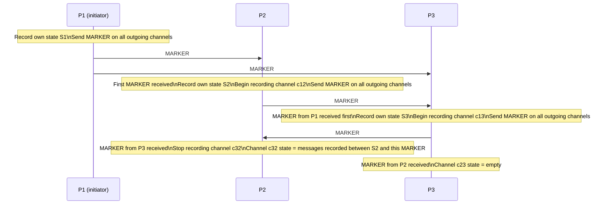

# Day 14: Global State & The Chandy-Lamport Snapshot

## 1. The Problem

You want to take a "snapshot" of your entire distributed system — the state of every node and every message in-flight — at one consistent logical moment. But:

- There is no global clock.
- Stopping the system to take a snapshot is unacceptable in production.
- Messages are in-flight and may not have been received yet.

The **Chandy-Lamport snapshot algorithm** (1985) solves this without pausing the system.

## 2. The Algorithm

The key tool is a **MARKER** message — a special control message with no data payload.



**Rules:**

1. The **initiator** records its own state and immediately sends a MARKER on every outgoing channel.
2. A process receiving a **MARKER for the first time** on channel `c`:
   - Records its own state.
   - Starts recording all messages arriving on channels that have not yet sent a MARKER.
   - Sends a MARKER on all its outgoing channels.
3. A process receiving a **MARKER on channel `c` (not first time)**:
   - Stops recording messages on `c`.
   - The recorded messages are the **state of channel `c`** in the snapshot.

**Guarantee:** the resulting global state is **consistent** — it corresponds to a state the system could have been in at some logical moment, even if no physical moment existed when every process was in that state simultaneously.

---

## Hands-on Assignment (Go)

We simulate a 3-process pipeline A → B → C communicating over Go channels, and run a snapshot initiated from A.

### Step 1: Create `snapshot.go`

```go
package main

import (
	"fmt"
	"time"
)

type Msg struct {
	isMarker bool
	body     string
	from     string
}

type Process struct {
	name         string
	state        string
	in           chan Msg
	out          chan Msg
	recording    bool
	channelState []string
}

func (p *Process) run(done <-chan struct{}) {
	for {
		select {
		case <-done:
			return
		case msg := <-p.in:
			if msg.isMarker {
				if !p.recording {
					// First marker: record own state, start recording channel
					fmt.Printf("[%s] Received MARKER from %s. Recording state: %q\n",
						p.name, msg.from, p.state)
					p.recording = true
					// Forward marker downstream
					if p.out != nil {
						p.out <- Msg{isMarker: true, from: p.name}
					}
				} else {
					// Second+ marker: channel state is complete
					fmt.Printf("[%s] Received MARKER from %s again. Channel state: %v\n",
						p.name, msg.from, p.channelState)
					p.recording = false
				}
			} else {
				if p.recording {
					p.channelState = append(p.channelState, msg.body)
					fmt.Printf("[%s] Recording in-flight msg: %q\n", p.name, msg.body)
				}
				// "Process" the message
				p.state = "processed:" + msg.body
				fmt.Printf("[%s] Processed %q, new state: %q\n", p.name, msg.body, p.state)
				// Forward downstream
				if p.out != nil {
					p.out <- Msg{body: "fwd:" + msg.body, from: p.name}
				}
			}
		}
	}
}

func main() {
	ab := make(chan Msg, 5)
	bc := make(chan Msg, 5)

	pA := &Process{name: "A", state: "idle", in: make(chan Msg, 5), out: ab}
	pB := &Process{name: "B", state: "idle", in: ab, out: bc}
	pC := &Process{name: "C", state: "idle", in: bc, out: nil}

	done := make(chan struct{})
	go pA.run(done)
	go pB.run(done)
	go pC.run(done)

	// Send some application messages before the snapshot
	pA.in <- Msg{body: "msg1", from: "client"}
	time.Sleep(20 * time.Millisecond)
	pA.in <- Msg{body: "msg2", from: "client"}
	time.Sleep(20 * time.Millisecond)

	// Initiate snapshot from A
	fmt.Println("\n=== SNAPSHOT INITIATED BY A ===")
	pA.state = "snapshot-point"
	fmt.Printf("[A] Recording own state: %q\n", pA.state)
	// A sends MARKER downstream
	ab <- Msg{isMarker: true, from: "A"}

	// Send one more message AFTER the marker (should be recorded as in-flight)
	time.Sleep(5 * time.Millisecond)
	ab <- Msg{body: "msg3-in-flight", from: "A"}

	time.Sleep(200 * time.Millisecond)
	close(done)
	fmt.Println("\n=== Snapshot complete ===")
}
```

### Step 2: Run and trace

```bash
go run snapshot.go
```

Observe:
- A records its own state before sending the MARKER.
- B records its state when it first receives the MARKER.
- Any message sent after the MARKER but received by B before B's own MARKER — `msg3-in-flight` — is captured in the channel state.

---

## Review

1. Why must the MARKER message be sent on **all outgoing channels**, not just the one where the snapshot was initiated?

2. The Chandy-Lamport algorithm assumes **FIFO channels** (messages arrive in the order sent). What would break if channels could reorder messages?
