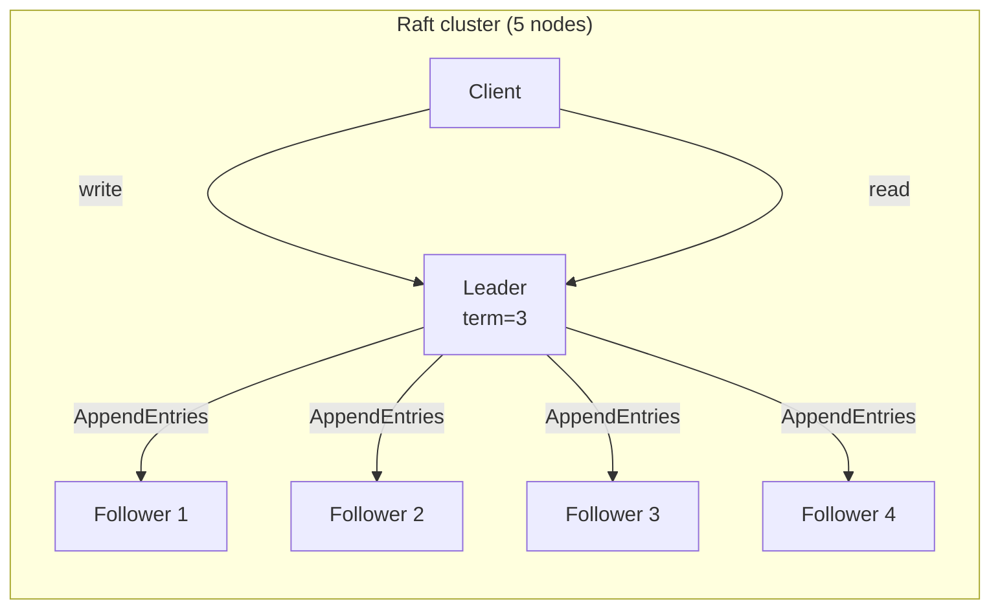
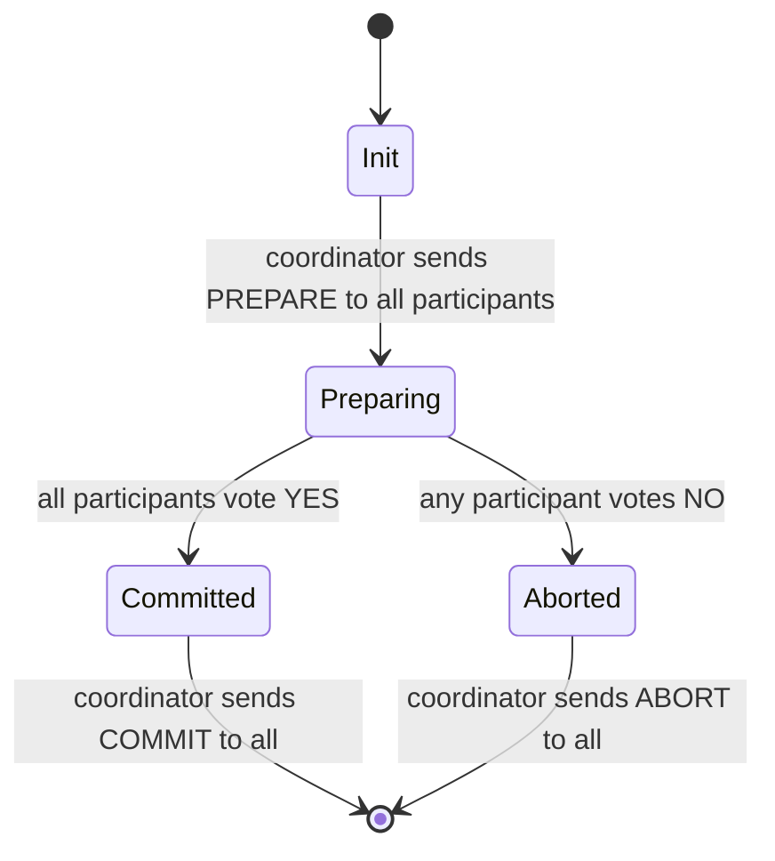
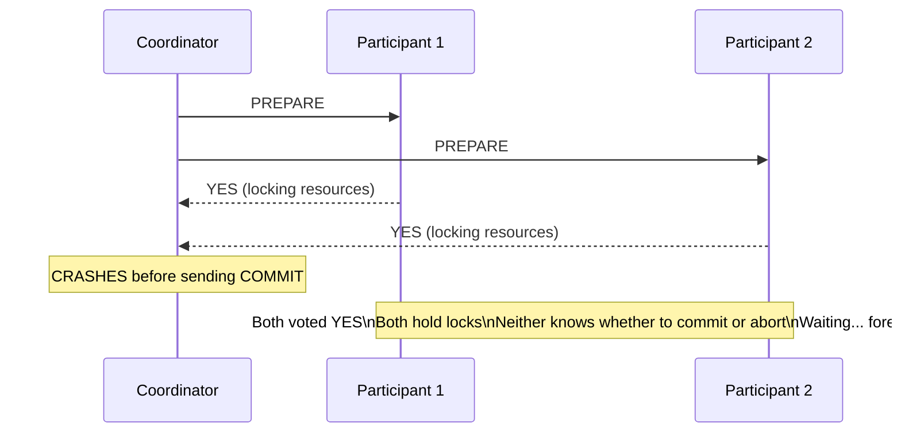
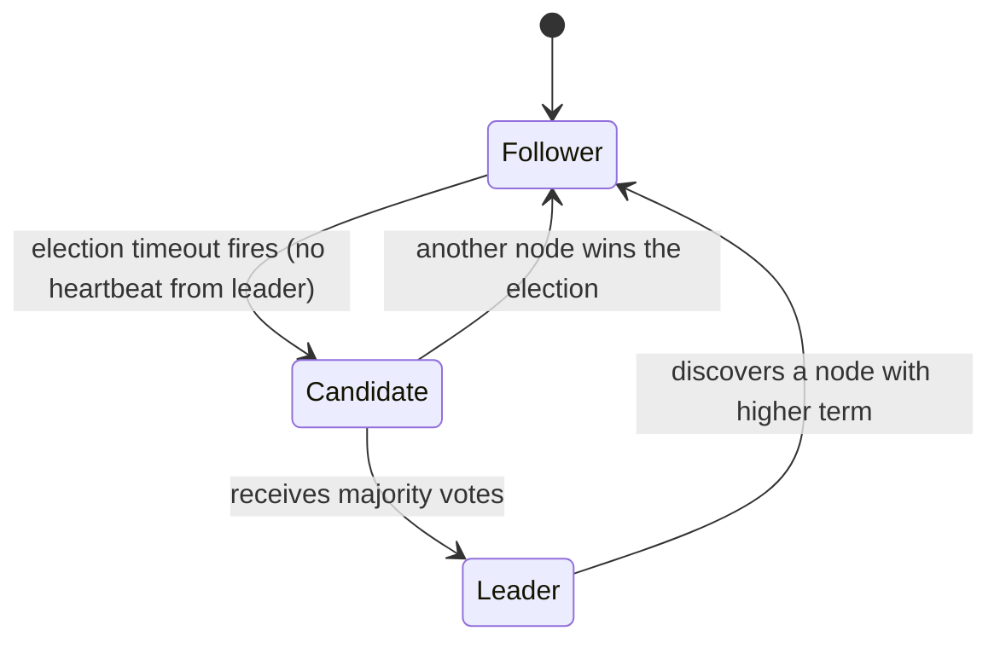
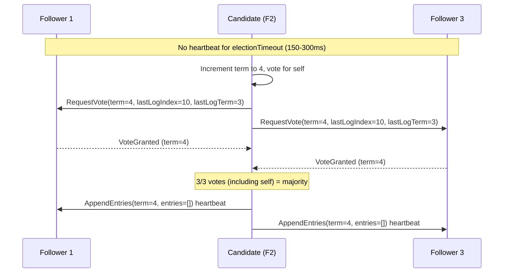
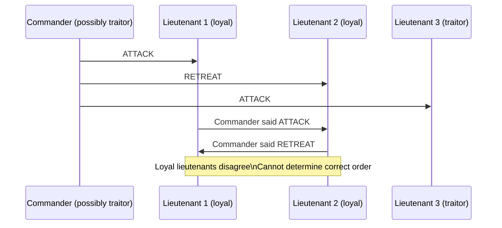

# Week 4 — Consensus, Deep Intro

[Back to top README](../../README.md)

## TL;DR

- **What you learn:** how a cluster of nodes agrees on a single value — who is the leader, what the next log entry is, whether a transaction committed — even when nodes crash and messages are lost.
- **Tools:** Go — implement a heartbeat-based leader election from scratch; read the Raft paper or the "Secret Lives of Data" visualization.
- **Mental model:** consensus is expensive. Use it only where you need a single source of truth (leader election, config, distributed locks). Everywhere else, use replication with weaker guarantees and merge conflicts.

---

## Architecture at a glance



The leader is the single writer. All writes go through it; it replicates to a majority; then it acknowledges the client. Reads also go through the leader for linearizability. Followers are hot standbys — any one can become leader if the current leader crashes.

---

## The Consensus Problem

**Formal definition:** a consensus algorithm must satisfy:

- **Termination:** every non-faulty node eventually decides a value.
- **Validity:** the decided value was proposed by some node.
- **Agreement:** no two non-faulty nodes decide different values.

**Why it is hard (FLP):** in an asynchronous model (unbounded delays), consensus is impossible with even one crash. Real protocols escape FLP by assuming partial synchrony — using timeouts to bound when a leader is "dead."

**Where consensus is required:**
- Electing a single leader.
- Committing a distributed transaction (deciding "commit" vs "abort").
- Distributing a global configuration change.
- Linearizable key-value operations in etcd or Zookeeper.

---

## Two-Phase Commit (2PC)

The simplest distributed commit protocol. Used in database distributed transactions.

### State machine



### The blocking problem



**The blocking problem:** after voting YES, a participant has locked its resources and cannot unilaterally abort (that would violate agreement). It must wait for the coordinator to recover. This is a **blocking protocol** — participant availability depends on coordinator availability.

**Fix:** Three-Phase Commit (3PC) adds a `PRE-COMMIT` phase to allow recovery, but introduces complexity and still blocks under network partitions. The real fix is Raft/Paxos — use consensus to elect a coordinator that can recover its own state.

### When to use 2PC

2PC is still widely used inside a single datacenter for RDBMS distributed transactions (MySQL XA, PostgreSQL two-phase transactions) where coordinator crashes are rare and the blocking window is short. It is not suitable for cross-datacenter or microservice boundaries.

---

## Raft Consensus Algorithm

Diego Ongaro and John Ousterhout (2014). Designed to be understandable — it decomposes consensus into three relatively independent sub-problems.

### Node states



### Leader election



**Vote grant conditions:**
1. Candidate's term >= my current term.
2. I have not already voted in this term.
3. Candidate's log is at least as up-to-date as mine (prevents electing a node missing committed entries).

**Term:** a monotonically increasing integer. If any node sees a message with a higher term, it immediately converts to Follower and updates its term. Terms prevent stale leaders from accepting writes.

### Log replication

```mermaid
sequenceDiagram
    participant Client
    participant Leader
    participant F1 as Follower 1
    participant F2 as Follower 2
    Client->>Leader: Set x=5
    Note over Leader: Append to local log: [(term=4, idx=11, x=5)]
    Leader->>F1: AppendEntries(entries=[(4,11,x=5)], commitIndex=10)
    Leader->>F2: AppendEntries(entries=[(4,11,x=5)], commitIndex=10)
    F1-->>Leader: Success
    Note over Leader: Majority (2/2 followers + self) have entry 11\nMark as committed; commitIndex=11
    Leader-->>Client: OK
    Leader->>F1: AppendEntries(commitIndex=11) next heartbeat
    Leader->>F2: AppendEntries(commitIndex=11) next heartbeat
```

**Safety guarantee:** a leader never commits an entry from a previous term by counting replicas alone. It only commits when a quorum has the current-term entry. This prevents the "deposed leader reappears with stale entries" scenario.

### Key Raft properties

| Property | Guarantee |
|----------|-----------|
| Election Safety | at most one leader per term |
| Log Matching | if two logs have the same index and term, all preceding entries are identical |
| Leader Completeness | if an entry is committed in term T, it appears in all leaders with term > T |
| State Machine Safety | if a server applies log entry N, no other server applies a different entry at N |

### Raft vs Paxos

| | Paxos | Raft |
|--|-------|------|
| Origin | Lamport 1989 | Ongaro 2014 |
| Understandability | notoriously hard | designed to be teachable |
| Single-decree vs multi | single-decree Paxos is well-defined; multi-Paxos is underspecified | multi-Raft is the core design |
| Used in | Chubby, Google Spanner | etcd, CockroachDB, TiKV, Consul |

---

## Byzantine Fault Tolerance (BFT)

Used when nodes may lie, not just crash. Required in blockchains and multi-party systems where you do not trust all participants.

### The Byzantine Generals Problem



**Result:** with `f` Byzantine nodes, you need at least `3f + 1` total nodes to reach consensus. With `f=1` traitor, you need `4` nodes minimum.

**PBFT (Practical Byzantine Fault Tolerance):** 3-phase protocol (pre-prepare, prepare, commit) with O(n²) message complexity. Used in Hyperledger Fabric.

**Tendermint / HotStuff:** modern BFT algorithms with linear message complexity, used in blockchains (Cosmos, Facebook's Diem).

**When do you need BFT?**
- Blockchain / DeFi: validators are untrusted third parties.
- Multi-party computation: participants from different organizations.
- In-house clusters: almost never — trust your own hardware. Crash-recovery consensus (Raft) is sufficient.

---

## Mental models

### Consensus vs. replication

| | Consensus | Replication |
|--|-----------|------------|
| Goal | all nodes agree on a single value | all nodes have a copy of the data |
| Strength | linearizable, single truth | eventual or causal consistency |
| Cost | quorum round-trip on every write | async or semi-sync replication |
| Use for | leader election, config, locks | databases, file stores, caches |

### Quorum sizing

For `N` nodes, a write quorum of `W = N/2 + 1` tolerates `F = N/2` failures:

| N | W (majority) | F (tolerated failures) |
|---|-------------|----------------------|
| 3 | 2 | 1 |
| 5 | 3 | 2 |
| 7 | 4 | 3 |

Odd numbers are preferred: they give you one extra vote before reaching the failure threshold.

### Heartbeat interval vs election timeout

Raft requires `heartbeat interval << election timeout`. Typical values:

| Parameter | Typical range |
|-----------|--------------|
| Heartbeat interval | 50–150 ms |
| Election timeout | 150–300 ms (randomized) |
| Network RTT budget | < 50 ms for LAN |

Randomization prevents split votes: if all followers time out at exactly the same moment, they all start elections simultaneously and all get 0 votes. Random timeouts ensure one candidate usually wins before others start.

---

## Failure modes

- **Split brain:** two leaders in different terms. Prevented by term checks — a node that discovers a higher term steps down immediately.
- **Log divergence:** a leader crashes after sending `AppendEntries` to some but not all followers. The new leader may have a different log. Raft's `log matching` property forces followers to overwrite divergent entries.
- **Liveness loss:** if `f >= N/2` nodes crash, no quorum is possible. The cluster stops accepting writes (CP behavior). Recovery requires manual intervention to adjust the cluster membership.
- **Spurious election:** a follower on a slow machine or under GC pressure times out and starts an election even though the leader is healthy. Mitigated by pre-vote optimization (ask peers if they would vote before starting a real election).
- **Coordinator crash in 2PC after PREPARE:** participants block indefinitely. Recovery: on coordinator restart, read the prepared-but-not-committed transactions from its WAL and re-send COMMIT or ABORT.

---

## Day-by-day links

- [Day 16 — The Consensus Problem: FLP impossibility, why consensus is hard](day16_consensus-problem.md)
- [Day 17 — Two-Phase Commit: Prepare/Commit phases and the blocking problem](day17_2pc.md)
- [Day 18 — Raft Part 1: Leader Election, terms, RequestVote RPC](day18_raft-leader-election.md)
- [Day 19 — Raft Part 2: Log Replication, AppendEntries, safety guarantees](day19_raft-log-replication.md)
- [Day 20 — Byzantine Generals + Weekend Project: heartbeat-based Leader Election in Go](day20_byzantine-and-leader-election.md)
