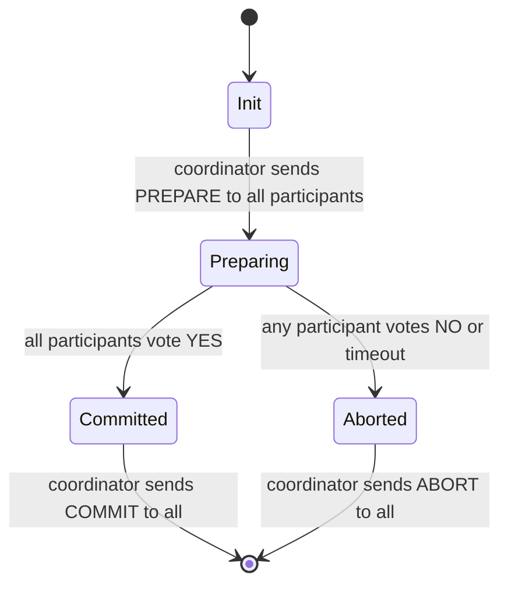

# Day 17: Two-Phase Commit (2PC)

## 1. The Distributed Transaction Problem

Imagine transferring $100 from Account A (on Node 1) to Account B (on Node 2). Both debit and credit must happen — or neither must happen. This is **atomicity across nodes**.

On a single database, `BEGIN / COMMIT / ROLLBACK` handles this. Across multiple nodes, you need a protocol that coordinates them.

**Two-Phase Commit (2PC)** is the classic solution.

## 2. The Protocol



**Phase 1 — Prepare:**
- Coordinator sends `PREPARE` to all participants.
- Each participant checks if it can commit (do I have the data? are constraints satisfied?). If yes, it writes the transaction to its WAL and replies `YES`. If no, it replies `NO`.

**Phase 2 — Commit or Abort:**
- If **all** participants voted YES, coordinator sends `COMMIT`.
- If **any** participant voted NO, coordinator sends `ABORT`.

## 3. The Blocking Problem

This is 2PC's fatal flaw:

1. Coordinator sends `PREPARE` to P1 and P2.
2. Both vote `YES` and lock their resources.
3. Coordinator **crashes** before sending `COMMIT` or `ABORT`.
4. P1 and P2 are stuck: they voted YES so they cannot unilaterally abort (that would violate agreement). They must wait for the coordinator to recover.
5. Resources stay locked. Availability is zero until the coordinator comes back.

**2PC is a blocking protocol.** Participant availability depends on coordinator availability.

---

## Hands-on Assignment (Go)

### Step 1: Set up the project

```bash
mkdir dist-sys-day17
cd dist-sys-day17
go mod init day17
```

### Step 2: Create `main.go`

```go
package main

import (
	"fmt"
	"time"
)

type Vote string

const (
	VoteYes Vote = "YES"
	VoteNo  Vote = "NO"
)

type Participant struct {
	id       int
	canVote  bool // set to false to simulate a NO vote
	voteCh   chan Vote
	commitCh chan bool
}

func (p *Participant) run() {
	// Phase 1: receive PREPARE, send vote
	fmt.Printf("P%d: received PREPARE\n", p.id)
	time.Sleep(50 * time.Millisecond) // simulate work

	if p.canVote {
		fmt.Printf("P%d: voting YES (locked resources)\n", p.id)
		p.voteCh <- VoteYes
	} else {
		fmt.Printf("P%d: voting NO\n", p.id)
		p.voteCh <- VoteNo
		return
	}

	// Phase 2: wait for COMMIT or ABORT
	commit := <-p.commitCh
	if commit {
		fmt.Printf("P%d: received COMMIT — applying transaction\n", p.id)
	} else {
		fmt.Printf("P%d: received ABORT — rolling back\n", p.id)
	}
}

func coordinator(participants []*Participant, simulateCrash bool) {
	fmt.Println("Coordinator: sending PREPARE to all participants")

	// Trigger all participants
	for _, p := range participants {
		go p.run()
	}

	// Collect votes
	allYes := true
	for _, p := range participants {
		vote := <-p.voteCh
		fmt.Printf("Coordinator: received %s from P%d\n", vote, p.id)
		if vote == VoteNo {
			allYes = false
		}
	}

	if simulateCrash {
		fmt.Println("\nCoordinator: CRASHED before sending commit decision!")
		fmt.Println("Participants are now BLOCKED — they voted YES and cannot proceed.")
		fmt.Println("This is the 2PC blocking problem. Participants hold locks indefinitely.")
		return
	}

	// Phase 2: send decision
	for _, p := range participants {
		if p.canVote { // only send to participants that voted YES
			p.commitCh <- allYes
		}
	}

	if allYes {
		fmt.Println("Coordinator: all participants committed")
	} else {
		fmt.Println("Coordinator: all participants aborted")
	}
}

func main() {
	fmt.Println("=== Scenario 1: Normal commit ===")
	p1 := []*Participant{
		{id: 1, canVote: true, voteCh: make(chan Vote, 1), commitCh: make(chan bool, 1)},
		{id: 2, canVote: true, voteCh: make(chan Vote, 1), commitCh: make(chan bool, 1)},
	}
	coordinator(p1, false)

	fmt.Println("\n=== Scenario 2: One participant votes NO ===")
	p2 := []*Participant{
		{id: 1, canVote: true, voteCh: make(chan Vote, 1), commitCh: make(chan bool, 1)},
		{id: 2, canVote: false, voteCh: make(chan Vote, 1), commitCh: make(chan bool, 1)},
	}
	coordinator(p2, false)

	fmt.Println("\n=== Scenario 3: Coordinator crashes after PREPARE ===")
	p3 := []*Participant{
		{id: 1, canVote: true, voteCh: make(chan Vote, 1), commitCh: make(chan bool, 1)},
		{id: 2, canVote: true, voteCh: make(chan Vote, 1), commitCh: make(chan bool, 1)},
	}
	coordinator(p3, true)

	time.Sleep(100 * time.Millisecond) // let goroutines print
}
```

### Step 3: Run it

```bash
go run main.go
```

Observe Scenario 3: the participants report they are waiting for a decision that never comes.

---

## Review

1. In Scenario 3, the participants voted YES and are now blocked. What happens to any database locks they are holding while waiting? What is the real-world impact of this?

2. Three-Phase Commit (3PC) adds a `PRE-COMMIT` phase to allow non-blocking recovery. What new problem does 3PC introduce that makes it impractical in real systems?
