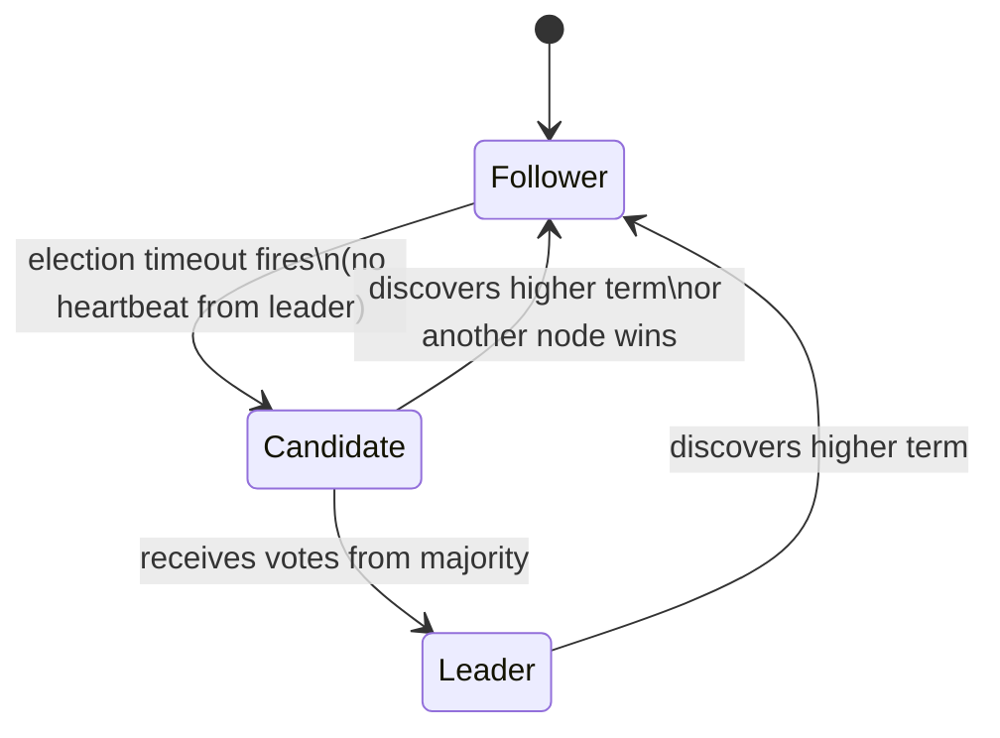

# Day 18: Raft — Leader Election

## 1. Raft's Core Idea

Raft (Ongaro & Ousterhout, 2014) was designed to be understandable. It decomposes consensus into three independent sub-problems:

1. **Leader election** (today)
2. **Log replication** (Day 19)
3. **Safety** (Day 19, part 2)

Every Raft cluster has exactly one leader at a time. All writes go through the leader. Followers are passive replicas.

## 2. Node States and Terms



**Term:** a monotonically increasing integer. Every election starts a new term. If any node sees a message from a higher term, it immediately reverts to Follower and updates its term. Terms prevent stale leaders from causing split-brain.

## 3. The Election Process

1. A Follower's election timeout fires (150–300ms, randomized).
2. It increments its term, votes for itself, becomes Candidate.
3. It sends `RequestVote(term, lastLogIndex, lastLogTerm)` to all peers.
4. Peers grant a vote if: the candidate's term ≥ their current term, they haven't voted yet this term, and the candidate's log is at least as up-to-date as theirs.
5. If the Candidate receives votes from a majority (including itself), it becomes Leader and immediately sends heartbeat `AppendEntries` to all followers to assert authority.

**Why randomized timeouts?** If all followers have the same timeout, they all start elections simultaneously, all vote for themselves, and no one gets a majority. Randomization ensures one candidate usually wins before others start.

---

## Hands-on Assignment (Go)

We implement a single Raft node's state machine.

### Step 1: Set up the project

```bash
mkdir dist-sys-day18
cd dist-sys-day18
go mod init day18
```

### Step 2: Create `raft.go`

```go
package main

import (
	"fmt"
	"math/rand"
	"sync"
	"time"
)

type State int

const (
	Follower  State = iota
	Candidate State = iota
	Leader    State = iota
)

func (s State) String() string {
	return [...]string{"Follower", "Candidate", "Leader"}[s]
}

type RaftNode struct {
	mu          sync.Mutex
	id          int
	state       State
	currentTerm int
	votedFor    int // -1 = not voted
	peers       []*RaftNode
	heartbeat   chan struct{}
}

func NewNode(id int) *RaftNode {
	return &RaftNode{
		id:       id,
		state:    Follower,
		votedFor: -1,
		heartbeat: make(chan struct{}, 5),
	}
}

func (n *RaftNode) electionTimeout() time.Duration {
	return time.Duration(150+rand.Intn(150)) * time.Millisecond
}

func (n *RaftNode) RequestVote(candidateID, candidateTerm int) bool {
	n.mu.Lock()
	defer n.mu.Unlock()

	if candidateTerm < n.currentTerm {
		return false
	}
	if candidateTerm > n.currentTerm {
		n.currentTerm = candidateTerm
		n.state = Follower
		n.votedFor = -1
	}
	if n.votedFor == -1 || n.votedFor == candidateID {
		n.votedFor = candidateID
		fmt.Printf("Node %d votes for Node %d in term %d\n", n.id, candidateID, candidateTerm)
		return true
	}
	return false
}

func (n *RaftNode) AppendEntries(leaderTerm, leaderID int) {
	n.mu.Lock()
	defer n.mu.Unlock()
	if leaderTerm >= n.currentTerm {
		n.currentTerm = leaderTerm
		n.state = Follower
		n.votedFor = -1
		select {
		case n.heartbeat <- struct{}{}:
		default:
		}
	}
}

func (n *RaftNode) Run() {
	for {
		n.mu.Lock()
		state := n.state
		n.mu.Unlock()

		switch state {
		case Follower:
			select {
			case <-n.heartbeat:
				// reset timeout
			case <-time.After(n.electionTimeout()):
				n.startElection()
			}

		case Candidate:
			// Already started election in startElection, loop back
			time.Sleep(10 * time.Millisecond)

		case Leader:
			n.sendHeartbeats()
			time.Sleep(100 * time.Millisecond)
		}
	}
}

func (n *RaftNode) startElection() {
	n.mu.Lock()
	n.state = Candidate
	n.currentTerm++
	n.votedFor = n.id
	term := n.currentTerm
	n.mu.Unlock()

	fmt.Printf("Node %d starting election for term %d\n", n.id, term)

	votes := 1 // vote for self
	for _, peer := range n.peers {
		if peer.RequestVote(n.id, term) {
			votes++
		}
	}

	majority := (len(n.peers)+1)/2 + 1
	n.mu.Lock()
	if votes >= majority && n.currentTerm == term {
		n.state = Leader
		fmt.Printf("✅ Node %d became LEADER for term %d (votes: %d/%d)\n",
			n.id, term, votes, len(n.peers)+1)
	} else {
		n.state = Follower
		fmt.Printf("Node %d lost election (votes: %d/%d)\n", n.id, votes, len(n.peers)+1)
	}
	n.mu.Unlock()
}

func (n *RaftNode) sendHeartbeats() {
	n.mu.Lock()
	term := n.currentTerm
	n.mu.Unlock()
	for _, peer := range n.peers {
		go peer.AppendEntries(term, n.id)
	}
}

func main() {
	nodes := []*RaftNode{
		NewNode(0),
		NewNode(1),
		NewNode(2),
	}

	// Wire peers (each node knows all others except itself)
	for i, n := range nodes {
		for j, p := range nodes {
			if i != j {
				n.peers = append(n.peers, p)
			}
		}
	}

	for _, n := range nodes {
		go n.Run()
	}

	time.Sleep(2 * time.Second)
	fmt.Println("\n=== Final states ===")
	for _, n := range nodes {
		n.mu.Lock()
		fmt.Printf("Node %d: %s, term=%d\n", n.id, n.state, n.currentTerm)
		n.mu.Unlock()
	}
}
```

### Step 3: Run it

```bash
go run raft.go
```

Observe: one node wins an election, becomes Leader, and the others settle as Followers. The random timeouts ensure the elections resolve quickly.

---

## Review

1. A Follower receives a `RequestVote` from a Candidate with term=5. The Follower is currently on term=7. Should it grant the vote? Why?

2. What prevents two nodes from both declaring themselves Leader in the same term?
