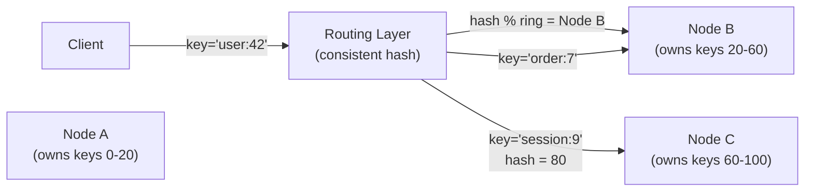
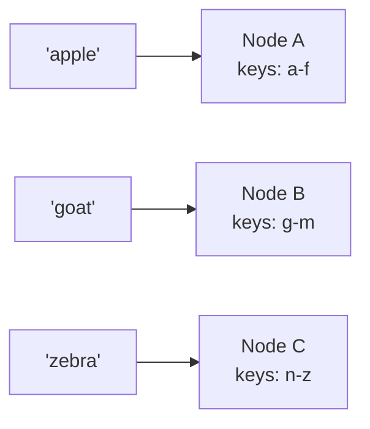
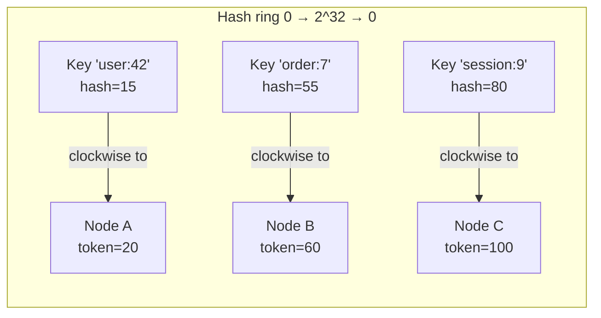
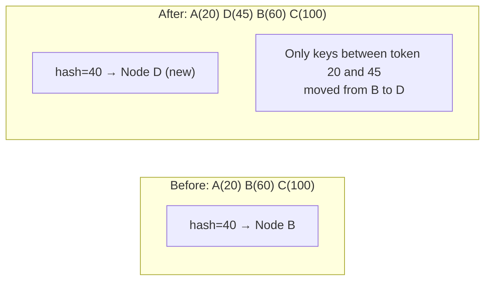
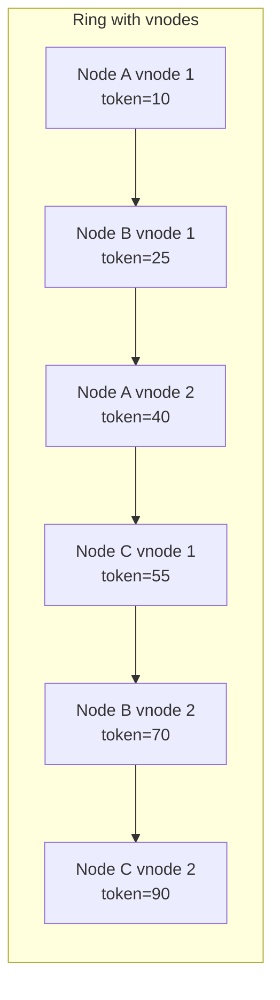

# Week 5 — Partitioning & Sharding, Deep Intro

[Back to top README](../../README.md)

## TL;DR

- **What you learn:** how to split a dataset across many nodes so no single machine holds all of it — key-range partitioning, hash partitioning, and consistent hashing with virtual nodes (the algorithm behind Cassandra, DynamoDB, and Riak).
- **Tools:** Go — implement a consistent hashing ring that maps any string key to a node.
- **Mental model:** partitioning solves the single-node capacity limit. Consistent hashing minimizes data movement when nodes join or leave. Virtual nodes distribute load uniformly without requiring physical nodes to have identical capacity.

---

## Architecture at a glance



The routing layer is stateless. It recomputes which node owns a key on every request by hashing the key and walking the ring. No central registry needed.

---

## Why partition?

### The single-node ceiling

A single machine has hard limits:

| Resource | Typical ceiling | Why it matters |
|----------|----------------|---------------|
| RAM | 1–4 TB | in-memory cache / indexes |
| Disk IOPS | 100K–1M (NVMe) | random reads under load |
| Network bandwidth | 10–100 Gbps | read/write throughput |
| CPU cores | 64–256 | query processing |

When your dataset outgrows one machine you have two choices:

- **Vertical scaling (scale up):** buy a bigger machine. Expensive, hardware ceiling, single point of failure.
- **Horizontal scaling (scale out):** add more machines, partition the data. Cheaper at scale, no single ceiling, fault-tolerant with replication.

### Partitioning vs sharding

These terms are used interchangeably. "Shard" typically refers to a single partition. "Sharding" means the act of splitting data into shards. MongoDB uses "shard"; Cassandra uses "partition"; Kafka uses "partition"; Elasticsearch uses "shard."

---

## Partitioning strategies

### Key-range partitioning

Assign each node a contiguous range of keys. Nodes keep keys sorted, enabling efficient range queries.



**Advantage:** range scans are fast (all keys `user:2024-01-*` are on one node).

**Disadvantage:** hot spots. If all writes go to the same key prefix (e.g., time-series data written to `YYYY-MM-DD-*`), one node absorbs all traffic while others are idle.

**Used by:** HBase, Google BigTable, Apache Cassandra (with `ORDER BY` clustering keys).

### Hash partitioning

Hash the key to a bucket number; assign buckets to nodes. Distributes load uniformly but destroys sort order.

```text
node = hash(key) % N
```

**Advantage:** uniform distribution — no hot spots from sequential keys.

**Disadvantage:** range queries require scanning all nodes. Rebalancing when `N` changes reassigns almost all keys (`hash(key) % N` vs `hash(key) % (N+1)`).

**Used by:** Redis Cluster (hash slots 0–16383), Elasticsearch.

---

## Consistent Hashing

Karger et al. (1997). Solves the rebalancing problem of naive hash partitioning.

### The ring

Place both nodes and keys on a circular hash ring of size `0..2^32`.



**Assignment rule:** a key is assigned to the first node clockwise whose token ≥ the key's hash.

### Adding a node



**Key insight:** only the keys between the new node's token and its predecessor's token need to move. All other keys are unaffected. With naive `% N` hashing, adding one node reshuffles nearly all keys.

### Removing a node

When Node B (token=60) leaves, its keys move to Node C (the next clockwise node). Only `1/N` of the total keys are affected.

### Virtual nodes (vnodes)

A single physical server is represented by multiple tokens on the ring — typically 100–1000 vnodes per physical node.



**Benefits of vnodes:**
1. **Uniform load distribution:** random token assignment means each physical node owns a similar number of key ranges.
2. **Proportional capacity:** a node with 2x the RAM can be assigned 2x as many vnodes.
3. **Faster rebalancing:** when a node leaves, its vnodes are distributed across all remaining nodes (not just one neighbor), parallelizing data movement.

**Used by:** Apache Cassandra (256 vnodes per node by default), Amazon DynamoDB, Riak.

### Consistent hashing ring in Go

```go
type Ring struct {
    mu       sync.RWMutex
    vnodes   int
    ring     map[uint32]string // token -> node name
    sorted   []uint32          // sorted tokens
}

func (r *Ring) AddNode(node string) {
    r.mu.Lock()
    defer r.mu.Unlock()
    for i := 0; i < r.vnodes; i++ {
        key := fmt.Sprintf("%s-%d", node, i)
        token := crc32.ChecksumIEEE([]byte(key))
        r.ring[token] = node
        r.sorted = append(r.sorted, token)
    }
    sort.Slice(r.sorted, func(i, j int) bool { return r.sorted[i] < r.sorted[j] })
}

func (r *Ring) GetNode(key string) string {
    r.mu.RLock()
    defer r.mu.RUnlock()
    hash := crc32.ChecksumIEEE([]byte(key))
    // Binary search: first token >= hash
    idx := sort.Search(len(r.sorted), func(i int) bool { return r.sorted[i] >= hash })
    if idx == len(r.sorted) {
        idx = 0 // wrap around
    }
    return r.ring[r.sorted[idx]]
}
```

---

## Rebalancing

### When rebalancing happens

- A node joins the cluster.
- A node leaves (gracefully or via failure).
- A node's disk fills up (manual trigger to redistribute).

### Rebalancing strategies

| Strategy | How | Data moved | Used by |
|----------|-----|-----------|---------|
| Fixed partitions | pre-create 1000 partitions; reassign whole partitions | 1/N of data | Elasticsearch, Redis Cluster |
| Dynamic partitions | split a partition when it exceeds a size threshold | split half | HBase, RocksDB |
| Consistent hashing | vnode redistribution | 1/N of data | Cassandra, Dynamo |

### Hot spots and skew

Even with consistent hashing, hot spots occur when:

- A celebrity key is read/written millions of times per second (e.g., a viral tweet).
- A workload is naturally skewed to a small subset of keys.

**Mitigations:**
- Add a random suffix to the hot key: `user:celebrity:1`, `user:celebrity:2`, ..., `user:celebrity:100`. Reads must query all 100 and merge.
- Cache hot keys in an in-process LRU cache before hitting the hash ring.
- Rate-limit reads per key at the routing layer.

---

## Mental models

### Partition = unit of replication

A single partition (shard) is replicated across multiple nodes for fault tolerance. Partitioning and replication are orthogonal concerns — partitioning decides *which node owns* a key; replication decides *how many copies* exist. Week 6 covers replication in depth.

### The routing layer must know the ring

Every node in a Cassandra cluster gossips its token ranges to every other node. Any node can act as a coordinator: it knows which node owns the key being written and forwards the request. No separate routing service needed — the ring state is distributed via gossip (Week 7).

---

## Failure modes

- **Rebalancing storm:** when a node fails, its vnodes redistribute across all remaining nodes. If those nodes are already near capacity, the extra load can cause a cascade failure. Mitigate with backpressure on rebalancing throughput (Cassandra's `stream_throughput_outbound_megabits_per_sec`).
- **Hash collision:** two different keys hash to the same token. Consistent hashing uses 32-bit or 64-bit hashes — collision probability is negligible but handle gracefully by chaining entries in the ring slot.
- **Skewed ring:** if vnode tokens are not uniformly distributed (poor hash function choice), some nodes own disproportionately large key ranges. Verify distribution with histograms after cluster changes.
- **Routing with stale ring state:** a node that has not received a gossip update assigns a key to a decommissioned node. The target node returns `NOT_MY_KEY`; the coordinator must re-route. Always implement retry on `NOT_MY_KEY` responses.

---

## Day-by-day links

- [Day 21 — Why Partition? Vertical vs. horizontal scaling limits](day21_why-partition.md)
- [Day 22 — Partitioning Strategies: key-range vs. hash partitioning](day22_partitioning-strategies.md)
- [Day 23 — Consistent Hashing: the virtual node ring](day23_consistent-hashing.md)
- [Day 24 — Implement a Consistent Hashing Ring in Go](day24_consistent-hashing-impl.md)
- [Day 25 — Rebalancing: hot spots, skew, node join/leave](day25_rebalancing.md)
