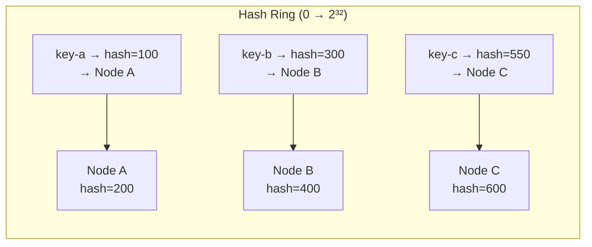

# Day 23: Consistent Hashing

## 1. The Problem with `hash(key) % N`

When you add or remove a node, nearly every key must move to a new node. For a cluster of 100 nodes storing 10 million keys, adding one node requires moving ~9.9 million keys. This causes:

- Massive network traffic while rebalancing.
- Temporary unavailability of data being moved.
- Thundering herd on the new node.

**Consistent hashing** limits key movement to `K/N` keys (where K = total keys, N = number of nodes) on any add or remove.

## 2. The Ring Concept

The algorithm:

1. Hash all node names (or IDs) onto a circle ranging from 0 to 2³².
2. Hash each key onto the same circle.
3. Walk clockwise from the key's position until you hit a node. That is the responsible node.

**Adding a node:** the new node sits between two existing nodes. Only keys in that new arc between the new node and its predecessor need to move — roughly `K/N` keys.

**Removing a node:** only the keys it owned move to the next node clockwise — again roughly `K/N` keys.

## 3. Virtual Nodes

If you have 3 physical nodes with equal hashes, they divide the ring into exactly 3 equal arcs. But if you then add a 4th node, the load becomes unequal depending on where that hash lands.

**Virtual nodes (vnodes):** instead of placing each node once, place it `V` times (e.g., V=150) using different hash inputs (`nodeA-0`, `nodeA-1`, ... `nodeA-149`). Each physical node owns V arcs, which are naturally spread around the ring. Adding a new node with V vnodes automatically takes roughly equal load from all existing nodes.

This is what Cassandra and DynamoDB use.

---

## Hands-on Assignment (Go) — Paper Exercise

Today's exercise is **on paper** to build intuition before coding it tomorrow.

### Step 1: Draw the ring

Draw a circle. Label the top 0 and go clockwise to 100.

Place three nodes at these positions:
- Node A at position 20
- Node B at position 55
- Node C at position 80

### Step 2: Route 6 keys

For each key below, find its hash position and walk clockwise to find its node. Write your answers.

| Key | Hash position | Responsible node |
|-----|--------------|-----------------|
| key-1 | 10 | ? |
| key-2 | 30 | ? |
| key-3 | 60 | ? |
| key-4 | 75 | ? |
| key-5 | 85 | ? |
| key-6 | 95 | ? |

### Step 3: Add Node D at position 70

Draw Node D on your ring. Which keys must now move to Node D? Which keys stay where they are?

_Answer: only key-4 (at 75) moves from Node C to Node D. All other keys still route to the same nodes as before. This is the `1/N` movement property._

### Step 4: Count the movement

With 4 nodes (A=20, B=55, C=80, D=70), calculate what fraction of keys moved when you added Node D. Compare to naive `hash(key) % N` which would have moved ~75% of keys.

---

## Review

1. Your consistent hash ring has 3 nodes. Node B crashes. Which keys are now orphaned (temporarily unreachable)? Where will they be routed after the ring updates?

2. With virtual nodes V=150 per physical node and 4 physical nodes, how many positions are on the ring? Why does a larger V reduce variance in load distribution?
