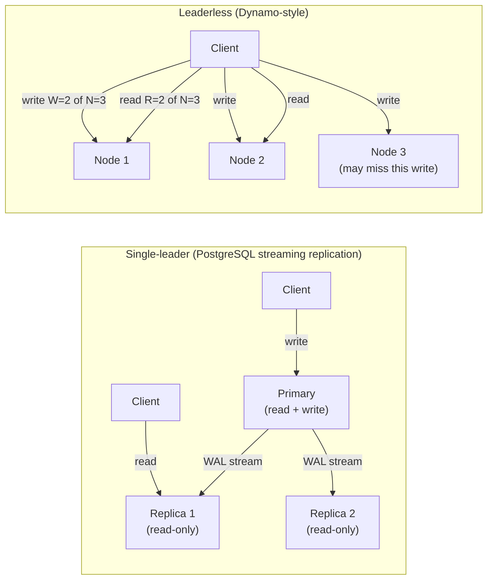
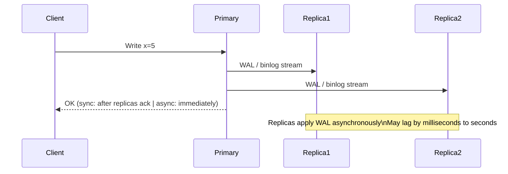
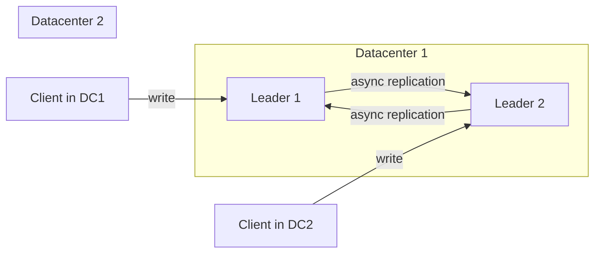
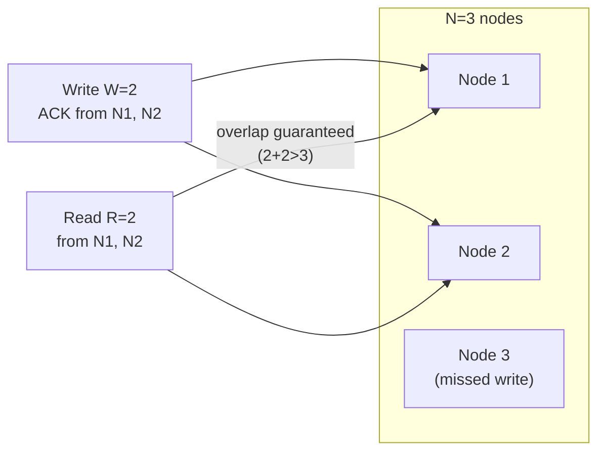
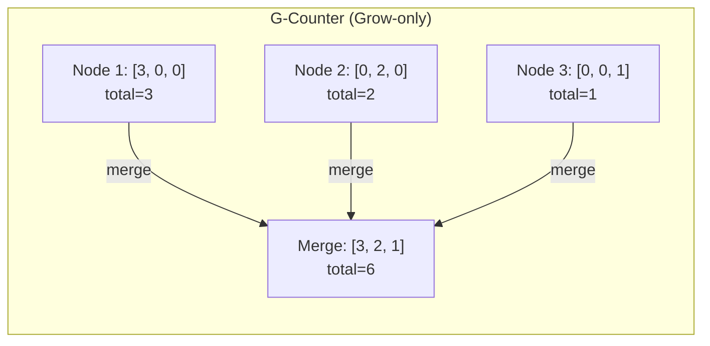
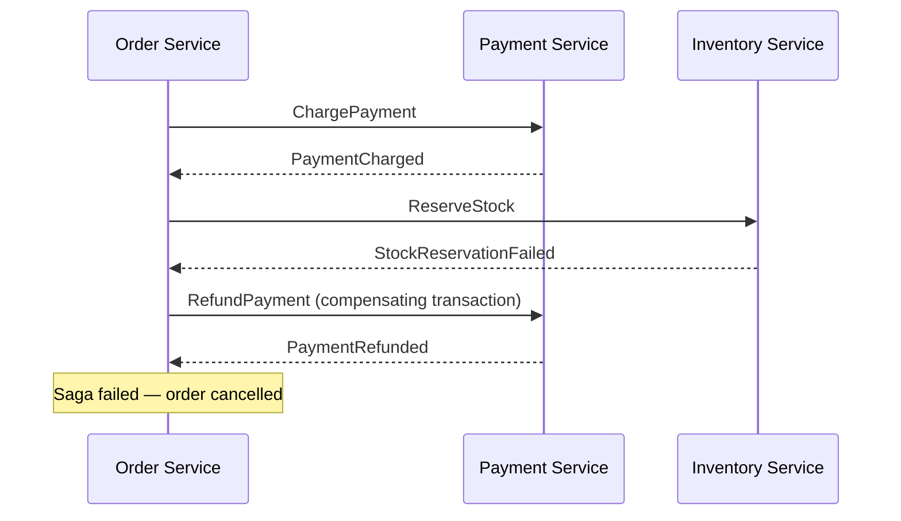
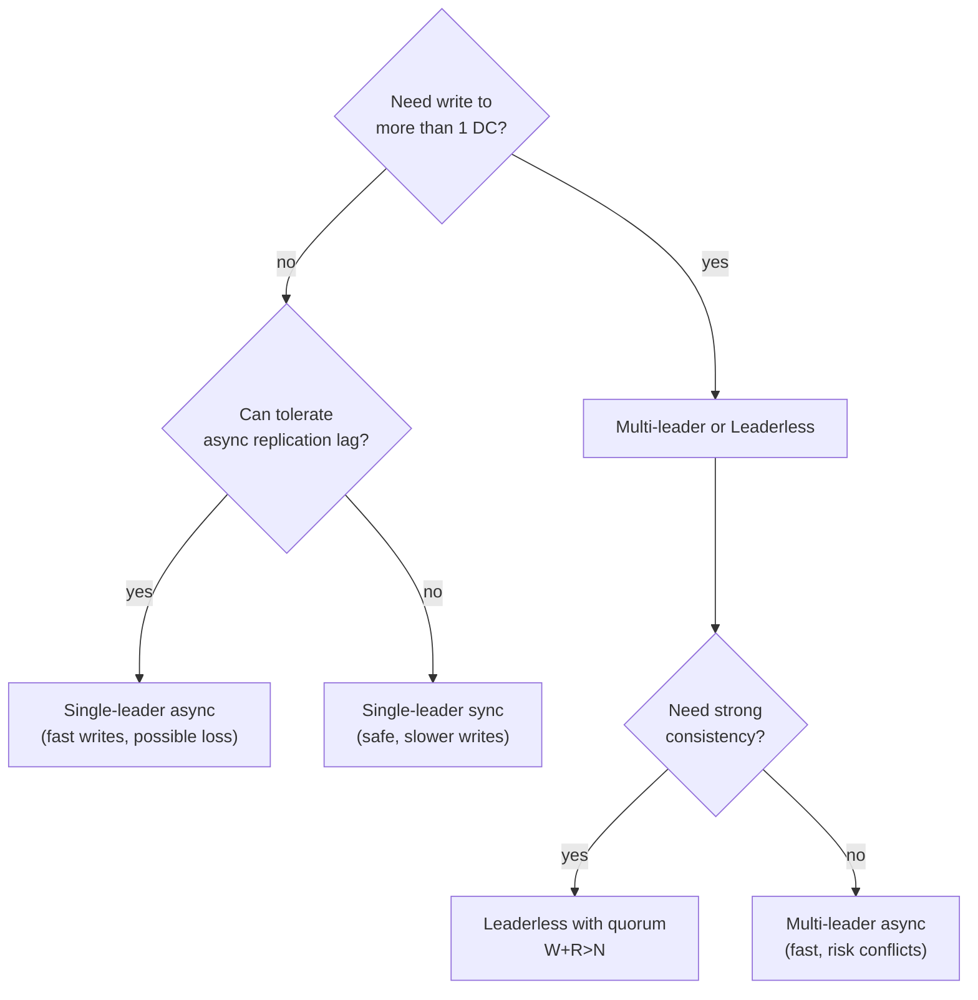

# Week 6 — Replication & Consistency, Deep Intro

[Back to top README](../../README.md)

## TL;DR

- **What you learn:** how to keep multiple copies of data in sync — three replication topologies, the quorum formula `R + W > N`, how conflict resolution works (Last Write Wins vs CRDTs), and how distributed transactions span multiple partitions.
- **Tools:** Go — design a key-value store with N=3 replication on paper; implement a basic quorum write/read.
- **Mental model:** replication trades consistency for availability and fault tolerance. The more nodes you require to agree on a write (higher W), the slower your writes but the safer your data. Every consistency level is a trade-off you must consciously choose.

---

## Architecture at a glance



---

## Replication models

### Single-leader (master-slave, primary-replica)



**Synchronous replication:** Primary waits for at least one replica to confirm before acknowledging the client. Guarantees no data loss on primary failure; costs extra write latency.

**Asynchronous replication:** Primary acknowledges immediately; replicas catch up later. Fast writes; risk of data loss if primary crashes before replicas sync.

**Failover:** when the primary fails, one replica is promoted. Complications:
- The new primary may not have the latest writes (async lag). Those writes are lost or create conflicts.
- Two nodes may believe they are primary (split-brain). Fix: fencing tokens, STONITH.
- Clients must be redirected to the new primary.

**Used by:** PostgreSQL streaming replication, MySQL binlog replication, MongoDB replica sets, Redis Sentinel.

### Multi-leader (active-active, multi-master)

Multiple nodes accept writes. Each leader replicates to all other leaders.



**Advantage:** writes accepted locally — low write latency, offline operation.

**Disadvantage:** write conflicts. If two clients write to the same key on different leaders simultaneously, both writes succeed, and the system must detect and resolve the conflict.

**Used by:** Google Docs (real-time collaborative editing), CouchDB, Cassandra with multiple data centers.

### Leaderless (Dynamo-style)

No designated primary. The client (or a coordinator proxy) writes to multiple nodes simultaneously and reads from multiple nodes simultaneously.

**Write path:**
```
client sends write to all N nodes
wait for W ACKs, then consider write complete
```

**Read path:**
```
client sends read to all N nodes
wait for R responses
pick the response with the highest version number (or merge conflicts)
```

**Used by:** Amazon DynamoDB, Apache Cassandra, Riak, Voldemort.

---

## Quorums — R + W > N

For N replicas, choose W (write quorum) and R (read quorum) such that `R + W > N`.



The overlap `R + W - N >= 1` guarantees at least one node in every read set has the latest write.

### Quorum configurations

| N | W | R | Effect |
|---|---|---|--------|
| 3 | 2 | 2 | balanced: tolerate 1 failure on reads and writes |
| 3 | 3 | 1 | write-strong: all nodes must ack write; any node serves read |
| 3 | 1 | 3 | read-strong: fast writes; all nodes must respond on read |
| 5 | 3 | 3 | majority on both; tolerate 2 simultaneous failures |

### Sloppy quorums and hinted handoff

In a Dynamo-style system under a partition, the cluster may not have `W` live replicas for a key's range. A **sloppy quorum** allows the write to be accepted by a node outside the key's home set, with a hint that the data should be forwarded to the correct node when it recovers. This increases availability at the cost of potentially serving stale reads.

---

## Replication lag

Even in a single-leader system with async replication, followers can lag behind the primary by milliseconds to seconds under load.

### Read-after-write consistency

A user writes their profile name, then immediately reads it back. If the read goes to a lagging replica, they see their old name.

**Fix:** route writes and the immediately-following reads to the primary. After a timeout (e.g., 1 second), allow reads from replicas.

### Monotonic reads

A user reads a message, then refreshes. The second read goes to a more-lagged replica and the message disappears.

**Fix:** route all reads from the same user session to the same replica (sticky routing). If that replica is down, fall back to primary.

### Causal consistency

If event A causally precedes event B, every reader must see A before B.

**Fix:** use version vectors or Lamport timestamps to track causality. A replica must not serve B until it has applied A.

---

## Conflict resolution

### Last Write Wins (LWW)

Each write carries a timestamp. On conflict, keep the higher timestamp.

**Problem:** if clocks are not perfectly synchronized, a causally later write may have a lower physical timestamp and be discarded. LWW loses data silently.

**Used with caution in:** Cassandra (default), Redis CRDT (with logical clocks, not physical).

### Multi-version concurrency control (MVCC)

Store all versions of a key. Surface conflicts to the application to resolve. CouchDB and Riak use this — the application receives all conflicting versions and must merge them.

### CRDTs (Conflict-free Replicated Data Types)

Data structures that can be merged from any two replicas in any order and always produce the same result.



Each node keeps its own counter slot. Merge = take the max of each slot. Total = sum all slots. Increment = increment your own slot only. This is conflict-free because you never decrement or overwrite another node's slot.

**Common CRDTs:**
| CRDT | What it models | Operations |
|------|---------------|-----------|
| G-Counter | growing counter | increment |
| PN-Counter | bidirectional counter | increment + decrement |
| G-Set | grow-only set | add (no remove) |
| 2P-Set | set with removals | add + remove (once per element) |
| OR-Set (observed-remove) | set with re-add after remove | add + remove |
| LWW-Register | last-write-wins single value | set |
| RGA | ordered sequence (collaborative text editing) | insert + delete at position |

**Used by:** Redis (CRDT enterprise), Riak, Automerge (collaborative documents), Figma.

---

## Distributed transactions and Sagas

### ACID in distributed systems

A transaction spanning multiple partitions or services cannot use a single-node ACID guarantee. Options:

| Approach | Atomicity | Isolation | Notes |
|----------|-----------|-----------|-------|
| 2PC (two-phase commit) | yes | yes | blocks on coordinator failure |
| Saga (choreography) | compensating transactions | none (interleaving possible) | no rollback guarantee |
| Saga (orchestration) | compensating transactions | none | central orchestrator |
| Serializable distributed TX | yes | yes | expensive (Spanner, CockroachDB) |

### Saga pattern

A saga is a sequence of local transactions. Each step publishes an event. If a step fails, previously completed steps are undone by compensating transactions.



**Limitation:** there is no isolation between sagas. Another saga can read partially-completed state. This is acceptable for business processes (order checkout) but not for financial ledger consistency.

---

## Mental models

### Replication topology decision tree



### The cost of strong consistency

Every increment of consistency strength costs latency:

| Consistency level | Requires | Extra latency |
|-------------------|----------|--------------|
| Eventual | async replication | 0 extra RTTs |
| Read-your-writes | sticky primary reads | +1 RTT on reads after write |
| Monotonic reads | sticky replica | 0 (routing overhead only) |
| Causal | version vector check | +1 message per read |
| Linearizable | quorum + leader | +1 RTT min |

---

## Failure modes

- **Replication lag spike under load:** a sudden write burst causes replica WAL queue to fall behind. Reads from replicas return stale data for seconds or minutes. Monitor `replica_lag_bytes` / `seconds_behind_master`.
- **Divergent replicas:** a replica applies a write that the primary later rolls back (crash during partial WAL flush). Fix: use semi-synchronous replication; always verify replica checksums after failover.
- **Split-brain in single-leader:** two nodes both believe they are primary after a network partition. Both accept writes; data diverges. Fix: STONITH (Shoot The Other Node In The Head), fencing tokens, distributed locks.
- **CRDT merge missing a replica:** if a merge step skips a replica's state, the result is incorrect. CRDTs require merging with the state from every replica that has ever received an update.
- **Saga lost compensating transaction:** the compensating transaction fails (payment service down). Manual intervention required. Always implement idempotent compensating transactions with retry.

---

## Day-by-day links

- [Day 26 — Replication Models: single-leader, multi-leader, leaderless](day26_replication-models.md)
- [Day 27 — Replication Lag: read-after-write consistency, monotonic reads](day27_replication-lag.md)
- [Day 28 — Quorums: R+W>N, sloppy quorums, hinted handoff](day28_quorums.md)
- [Day 29 — Conflict Resolution: Last Write Wins vs. CRDTs](day29_conflict-resolution.md)
- [Day 30 — Distributed Transactions: ACID in distributed systems, Sagas](day30_transactions.md)
