# Week 7 — Patterns & Messaging, Deep Intro

[Back to top README](../../README.md)

## TL;DR

- **What you learn:** the architectural glue of large distributed systems — how services communicate asynchronously through message queues and log brokers, why idempotency is essential, how circuit breakers prevent cascading failures, how gossip propagates cluster state, and how bloom filters answer "have I seen this before?" in O(1).
- **Tools:** Go + Redis Pub/Sub for the weekend project; Docker to run RabbitMQ/Kafka locally.
- **Mental model:** synchronous calls couple caller and callee in time. Async messaging decouples them. The trade-off is complexity: you gain resilience and scale, you lose simplicity and immediate feedback.

---

## Architecture at a glance

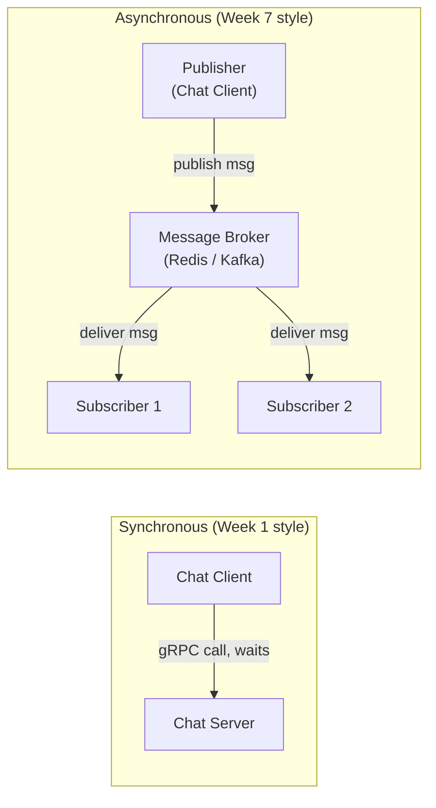

With async messaging, the publisher does not wait for subscribers. It fires a message and continues. Subscribers consume at their own pace. The broker absorbs load spikes and decouples failure domains.

---

## Message queues vs. log-based brokers

The two fundamental messaging architectures:

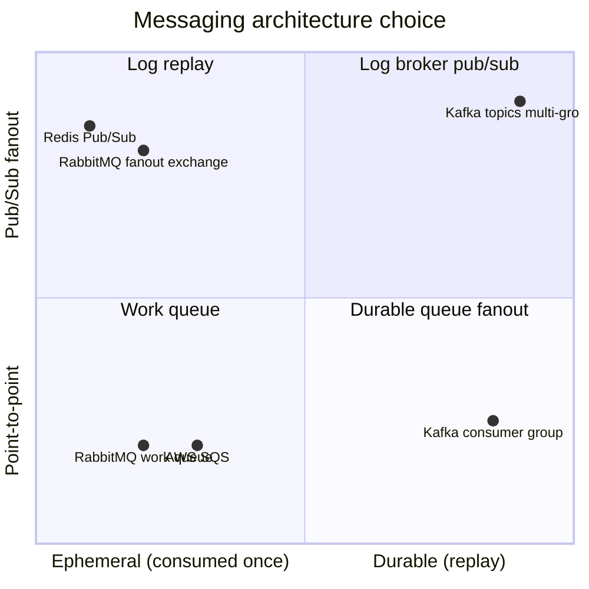

### Message queue (RabbitMQ, SQS)

- A message is delivered to **one** consumer and then deleted.
- If the consumer crashes without ACKing, the message is redelivered to another consumer.
- No replay — once consumed, the message is gone.
- Use for: work queues (image processing jobs, email sending), task distribution.

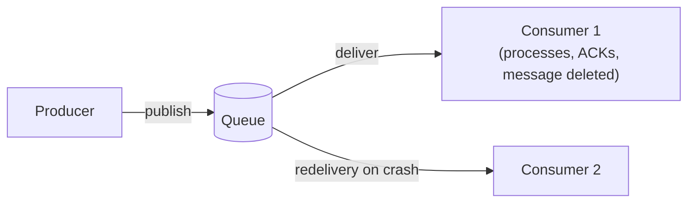

### Log-based broker (Kafka)

- Messages are appended to a **log** (sequential file). They are not deleted after consumption.
- Multiple consumer groups can each read the full log independently, at different offsets.
- Consumers commit their offset — on crash, they resume from the last committed offset.
- Use for: event streaming, audit logs, CQRS event store, replay for new consumers.

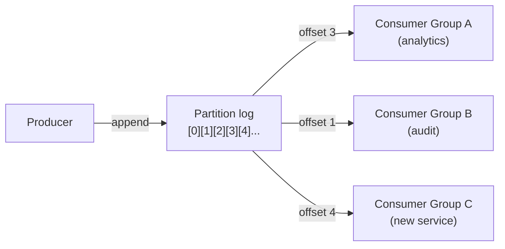

### Kafka internals

- **Topic:** a named log, divided into **partitions**.
- **Partition:** an append-only, ordered, immutable sequence of records. Records have an offset.
- **Consumer group:** a set of consumers that together consume all partitions of a topic. Each partition is assigned to exactly one consumer in the group at a time.
- **Offset:** the position in the partition. Consumers commit offsets to Kafka (or their own store) to track progress.
- **Retention:** Kafka keeps records for a configurable time (default: 7 days) or until a size limit. Records are not deleted on consumption.

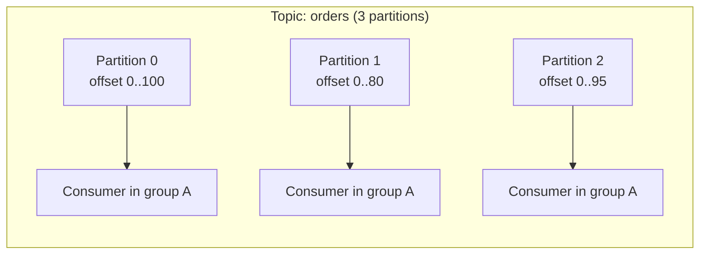

**Ordering guarantee:** Kafka preserves order within a partition. To guarantee that all events for a given entity (e.g., all writes to `user:42`) are processed in order, use the entity ID as the partition key.

---

## Idempotency

A request is idempotent if applying it N times has the same effect as applying it once.

### Why it matters

With at-least-once delivery (the default for any retry-enabled system), the same message may be delivered more than once:

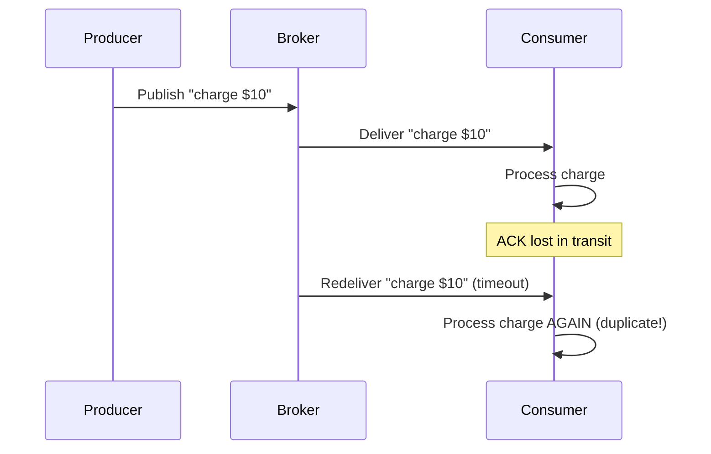

### Idempotency key pattern

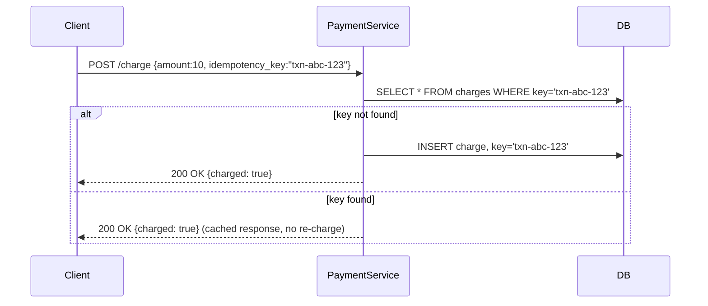

Store the idempotency key in the same transaction as the business operation. If the key exists, return the original response. This turns at-least-once delivery into effectively-once processing.

**Idempotent HTTP methods:** GET, HEAD, PUT, DELETE are idempotent by definition. POST is not.

---

## Circuit breaker pattern

Prevents a slow or failing dependency from causing your entire service to fail.

### State machine

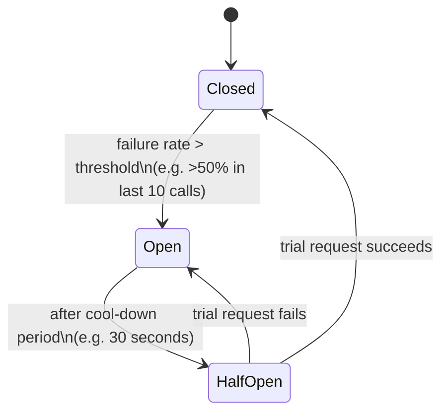

**Closed:** requests pass through normally. Failures are counted in a rolling window.

**Open:** requests fail immediately without reaching the dependency. Callers get a fast error instead of a slow timeout. This sheds load from the failing dependency and prevents goroutine/thread pool exhaustion.

**Half-Open:** after the cool-down, one trial request is allowed. If it succeeds, the breaker closes; if it fails, it opens again.

### Why circuit breakers prevent cascading failure

Without a circuit breaker: a slow database causes HTTP handler goroutines to pile up waiting for DB responses. Goroutines exhaust memory; the entire service crashes, taking down other services that depend on it.

With a circuit breaker: once the failure threshold is hit, all subsequent DB calls fail fast. Goroutines are freed immediately. The service stays alive and can serve requests that do not touch the DB.

**Used by:** Netflix Hystrix (retired), resilience4j (Java), `sony/gobreaker` (Go), Istio/Envoy sidecar proxy (Week 7 extra).

---

## Service discovery

In a static world, services have fixed IPs. In Kubernetes or Docker, containers restart with new IPs constantly.

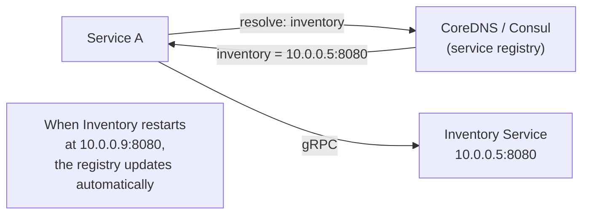

**Client-side discovery:** the caller queries the registry and picks an instance (with load balancing). Used by Netflix Eureka, Consul.

**Server-side discovery:** the caller sends to a load balancer; the load balancer queries the registry. Used by AWS ELB, Kubernetes `Service`.

---

## Bloom filters

A space-efficient probabilistic data structure that answers "is this element in the set?" in O(1) time and O(1) space — with a tunable false positive rate.

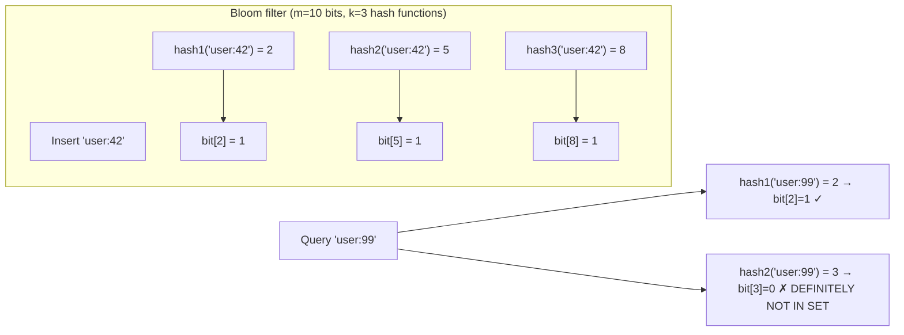

- **No false negatives:** if the filter says "not in set," it is definitely not in the set.
- **Possible false positives:** if the filter says "in set," it might be wrong (the bits were set by other elements). The false positive rate is tunable by increasing `m` (bits) or `k` (hash functions).

**Real-world uses:**
- **Cassandra:** avoids reading from SSTables that cannot contain a key.
- **Web crawlers:** skip URLs already crawled.
- **Databases:** check if a row exists before a slow disk read.
- **CDNs:** determine if a URL is "popular enough" to cache.

---

## Gossip protocols

How cluster members propagate information (node health, ring state, configuration) without a central authority.

### The epidemic model

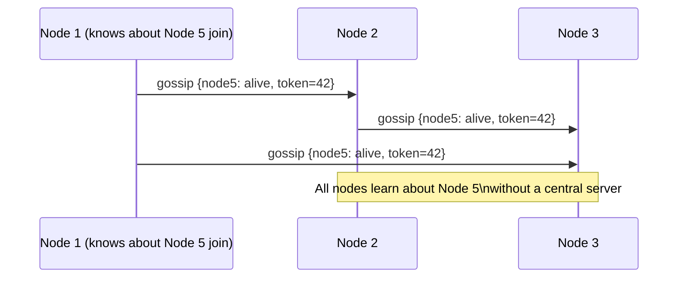

Every node periodically picks a random set of neighbors and exchanges its full state. Infected nodes spread the news. Within `O(log N)` rounds, the entire cluster knows.

### SWIM (Scalable Weakly-consistent Infection-style Membership)

Used by Cassandra, Consul, Serf.

1. Each node sends a periodic PING to a random member.
2. If no ACK is received within a timeout, the node sends an `indirect PING` through K random intermediaries.
3. If still no ACK, the member is marked `suspected`.
4. If suspected for too long, it is marked `dead` and the information is gossiped.

This is probabilistic — a slow node may be falsely declared dead. But the false positive rate decreases with the indirect-ping mechanism.

---

## Mental models

### Async messaging trade-offs

| Property | Sync call | Message queue | Log broker |
|----------|-----------|--------------|------------|
| Coupling | tight (caller waits) | loose (consumer at own pace) | very loose (replay possible) |
| Ordering | in request order | FIFO per queue | per-partition |
| Durability | none (in-memory) | configurable | durable by default |
| Replay | impossible | no | yes |
| Use for | user-facing hot path | background jobs | event sourcing, audit, stream processing |

### Bulkhead pattern

Isolate different workloads into separate thread/goroutine pools. A slow database should not exhaust the goroutine pool serving HTTP requests.

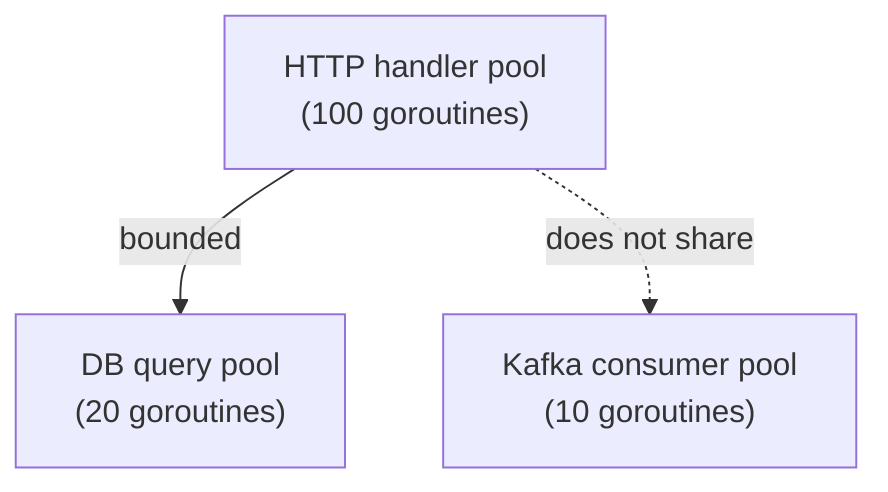

If `DB` pool is exhausted, only DB-dependent requests fail. `Kafka` consumer continues independently.

---

## Failure modes

- **Message loss in Redis Pub/Sub:** Redis Pub/Sub is fire-and-forget. If the subscriber is disconnected when a message is published, it is lost. For durability, use Redis Streams or Kafka.
- **Consumer lag spike:** if consumers are slow and producers are fast, the Kafka lag grows. Monitor `consumer_lag` per partition. If it grows unboundedly, add consumer instances (up to the number of partitions).
- **Poison pill message:** a malformed message that causes the consumer to crash on every retry, preventing forward progress. Fix: dead-letter queue (DLQ) — after N retries, move the message to a separate queue for manual inspection.
- **Circuit breaker open storm:** all services open their circuit breakers simultaneously (e.g., database restarts). Implement staggered half-open retries with jitter to avoid thundering herd on recovery.
- **Gossip convergence under churn:** if nodes join and leave faster than gossip converges, the cluster state is always stale. Bound the churn rate in production (Cassandra recommends not adding more than 1 node per hour).

---

## Day-by-day links

- [Day 31 — Async Messaging: RabbitMQ work queues vs. Kafka log brokers](day31_async-messaging.md)
- [Day 32 — Idempotency: exactly-once semantics, idempotency key pattern](day32_idempotency.md)
- [Day 33 — Microservice Patterns: Service Discovery, Circuit Breakers, Bulkheads](day33_microservice-patterns.md)
- [Day 34 — Bloom Filters: probabilistic membership at massive scale](day34_bloom-filters.md)
- [Day 35 — Gossip Protocols: SWIM, epidemic algorithms, cluster membership](day35_gossip-protocols.md)
