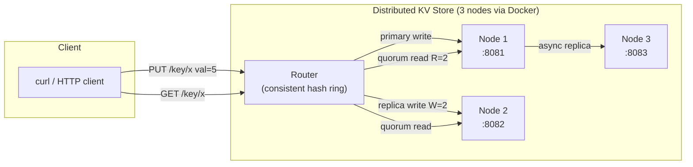
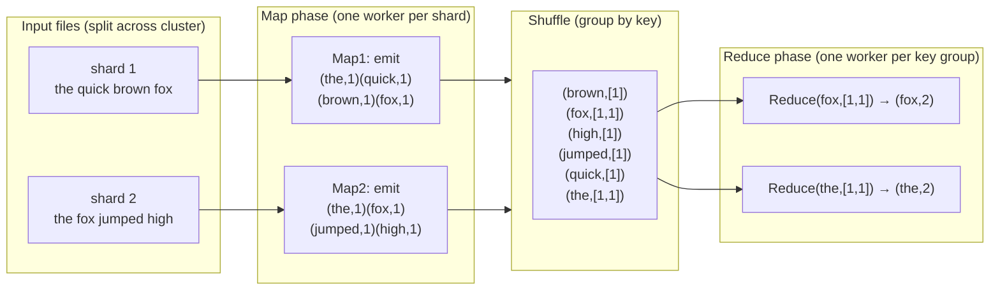
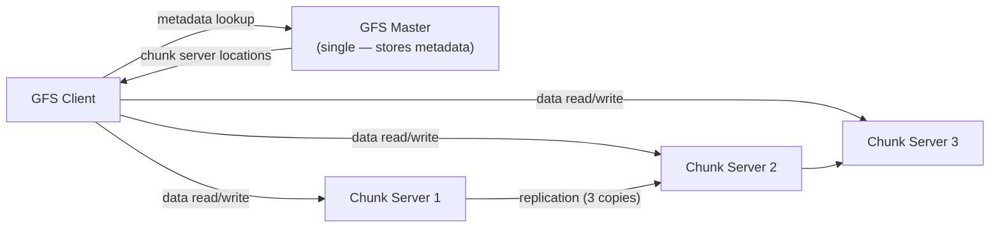
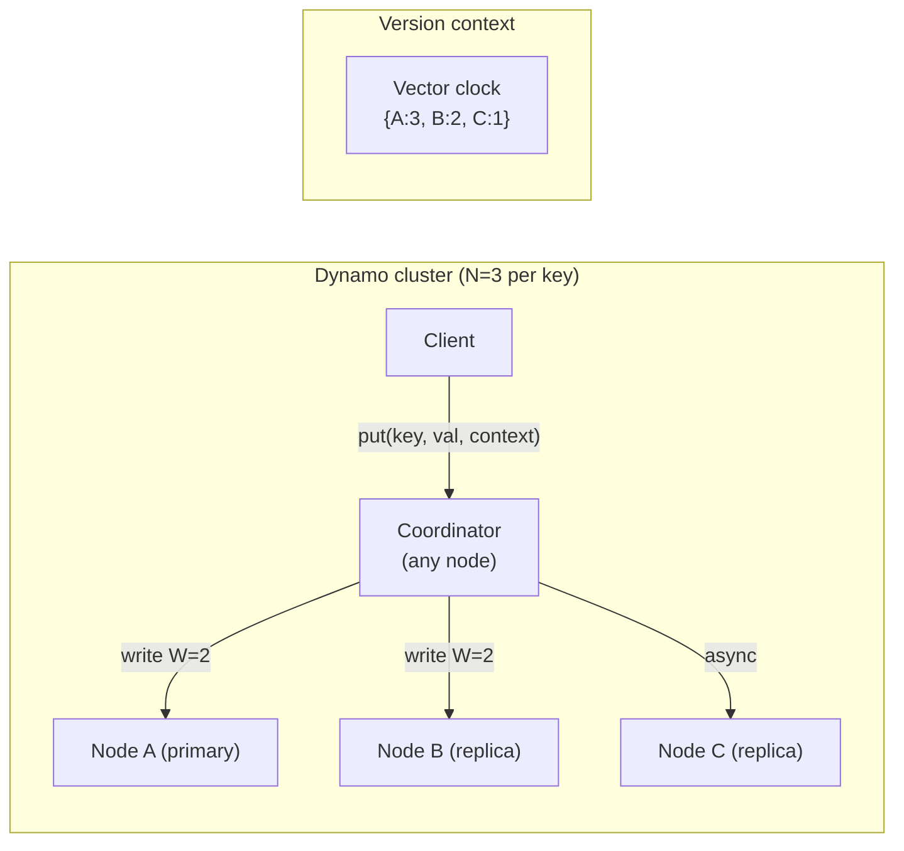
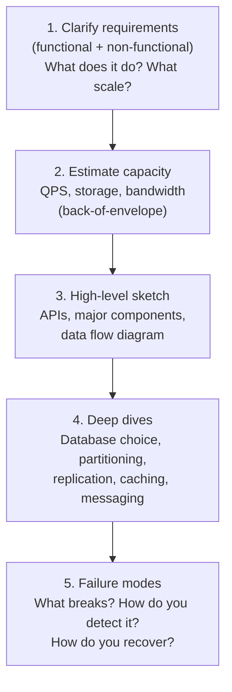
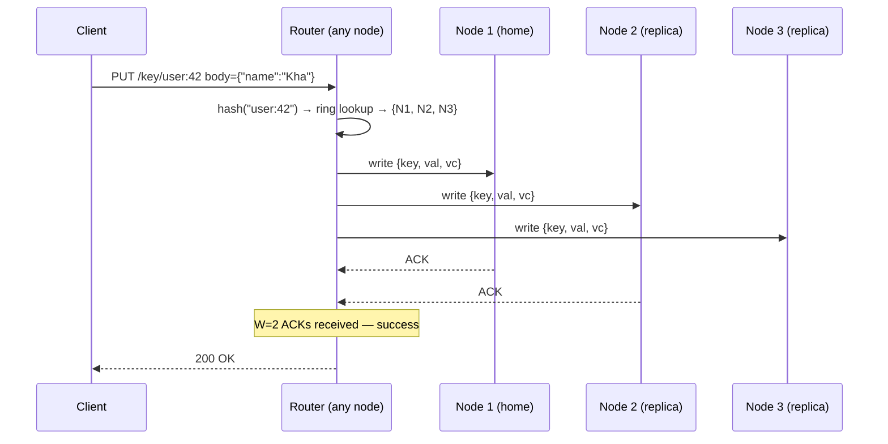
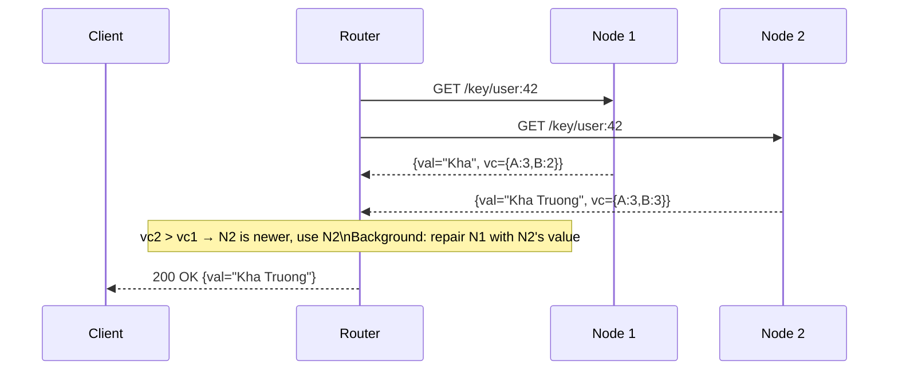
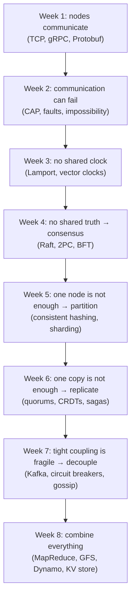

# Week 8 — The Grand Finale, Deep Intro

[Back to top README](../../README.md)

## TL;DR

- **What you learn:** how all 7 weeks combine into real production architectures. MapReduce moves computation to data. GFS and Dynamo are the canonical papers showing how Google and Amazon implemented the concepts you have studied. System design interviews are the test. The final KV store build is the proof.
- **Tools:** Go — build a distributed key-value store with an HTTP API, consistent hashing, and N=3 replication. Docker Compose — run multiple node containers on your laptop.
- **Mental model:** you now have a vocabulary and a toolkit. System design is about applying the right primitive (partitioning, replication, consensus, async messaging) to the right constraint (latency, consistency, throughput, fault tolerance). The framework below is your decision tree.

---

## Architecture at a glance — the final KV store



This is Dynamo in miniature: consistent hashing for partitioning, leaderless replication with quorums, vector clocks for conflict detection.

---

## MapReduce

Jeffrey Dean and Sanjay Ghemawat (Google, 2004). A programming model for processing petabytes of data across thousands of machines.

### The core idea

Move the computation to the data. Sending a 1 GB program binary to 1000 machines is cheaper than sending 1 PB of data to one machine.



### Map phase

Each mapper reads one input shard and emits key-value pairs. Mappers run in parallel — no communication between them.

### Shuffle phase

The framework groups all values for the same key together and sends them to the same reducer. This is the network-intensive phase.

### Reduce phase

Each reducer receives all values for a set of keys and emits a final output. Reducers run in parallel.

### Fault tolerance in MapReduce

- **Worker failure:** the master re-schedules the task on another worker. Map tasks that were in-progress are re-run. Reduce tasks whose output was not yet written are re-run.
- **Master failure:** the job is restarted from scratch (in the original Google implementation). Modern systems (Hadoop YARN) use HA masters.
- **Stragglers:** the last 1% of tasks take 10x longer than average. The master starts speculative execution — runs a second copy of the slow task on a different worker and uses whichever finishes first.

### MapReduce vs. stream processing

| | MapReduce | Kafka Streams / Flink |
|--|-----------|----------------------|
| Processing model | batch (all data at once) | stream (data as it arrives) |
| Latency | minutes to hours | milliseconds to seconds |
| Fault tolerance | recompute from files | checkpoint + replay |
| Use for | nightly aggregations, ETL | real-time dashboards, fraud detection |

---

## Google File System (GFS) — key design choices

Sanjay Ghemawat et al. (Google, 2003). The paper that made "scale-out distributed storage" mainstream.

### Architecture



### Key design choices and why

| Decision | Rationale |
|----------|-----------|
| Large chunk size (64 MB) | reduces metadata overhead; GFS files are huge (multi-GB) |
| Single master | simplifies design; master is not in the data path; metadata fits in RAM |
| Relaxed consistency | concurrent writes to the same region can interleave; GFS applications tolerate this |
| Append-only preferred | MapReduce output is appended, never overwritten — enables atomic record append |
| No client-side cache | GFS files are too large to cache; caching metadata only |

### Lessons for your KV store

- A single metadata node works at large scale if it is not in the hot data path.
- Large sequential I/O beats small random I/O — design your storage layout accordingly.
- Relaxed consistency is acceptable for write-once, read-many analytics workloads.

---

## Amazon Dynamo — key design choices

Giuseppe DeCandia et al. (Amazon, 2007). The paper that popularized eventual consistency and leaderless replication.

### Architecture



### Key design choices and why

| Decision | Rationale |
|----------|-----------|
| Consistent hashing with vnodes | add/remove nodes without full reshuffling |
| Leaderless replication | high availability — any node can serve reads and writes |
| Sloppy quorums + hinted handoff | writes succeed even when home nodes are down |
| Vector clocks for conflict detection | detect concurrent writes; surface conflicts to application |
| Read repair | on read, if replicas disagree, correct the stale replica |
| Eventual consistency (AP) | prioritize availability for shopping cart use case |
| Gossip for membership | no central registry; scales to hundreds of nodes |

### The shopping cart insight

Amazon chose AP because "it is better to show a customer a potentially stale cart than to show them an error page." This is the key business driver behind every consistency trade-off.

---

## System design interview framework

Apply this 5-step method to every "Design X" problem.



### Step 2: back-of-envelope cheat sheet

| Metric | Value |
|--------|-------|
| 1 million requests/day | ~12 QPS |
| 1 billion requests/day | ~12,000 QPS |
| 1 byte stored per request/day, 10 years | ~3.6 TB |
| Average tweet size | ~300 bytes |
| Average photo size | ~300 KB |
| Average video size | ~50 MB |
| Read:write ratio for social media | ~100:1 |

### Which primitive to reach for

| Requirement | Reach for |
|-------------|-----------|
| Need to scale writes | partition / shard (Week 5) |
| Need fault tolerance | replicate (Week 6) |
| Need exactly one thing to happen | consensus / leader election (Week 4) |
| Need to order events causally | logical clocks (Week 3) |
| Need to decouple services | message queue / log broker (Week 7) |
| Need eventual consistency with merge | CRDTs (Week 6) |
| Need fast membership lookup | bloom filter (Week 7) |
| Need cluster gossip | SWIM / gossip protocol (Week 7) |

---

## Final build specification: Distributed KV Store

### Requirements

| | Spec |
|--|------|
| API | HTTP: `PUT /key/{k}` body=value, `GET /key/{k}`, `DELETE /key/{k}` |
| Nodes | 3 nodes, each a Go HTTP server in a Docker container |
| Partitioning | consistent hashing ring, 150 vnodes per node |
| Replication | N=3, W=2, R=2 (leaderless, quorum-based) |
| Conflict resolution | vector clocks; on conflict, return all versions to client |
| Node failure | if a node is unreachable, write succeeds with W=2 (sloppy quorum + hinted handoff) |

### Data flow: write



### Data flow: read with conflict



### Docker Compose layout

```yaml
services:
  node1:
    build: .
    environment:
      NODE_ID: "node1"
      PEERS: "node2:8080,node3:8080"
    ports: ["8081:8080"]
  node2:
    build: .
    environment:
      NODE_ID: "node2"
      PEERS: "node1:8080,node3:8080"
    ports: ["8082:8080"]
  node3:
    build: .
    environment:
      NODE_ID: "node3"
      PEERS: "node1:8080,node2:8080"
    ports: ["8083:8080"]
```

---

## Mental models — putting it all together

### The 8-week stack in one diagram



### The three hard problems of distributed systems

1. **Partial failure:** some nodes work, some do not. You cannot tell which.
2. **No global clock:** you cannot determine the true order of events without logical clocks.
3. **Unreliable network:** messages can be lost, duplicated, reordered, or delayed arbitrarily.

Every algorithm in this course is a response to one or more of these three problems.

---

## Failure modes to handle in the final build

- **Node unreachable during write:** use sloppy quorum — write to a healthy neighbor with a hint. When the target recovers, the neighbor forwards the data (hinted handoff).
- **Read returns conflicting vector clocks:** surface all versions to the client. Implement a merge function (or defer to Last Write Wins for simplicity in the first version).
- **Ring state inconsistency:** two nodes have different views of which node owns a key range (e.g., one missed a gossip update). Implement a "wrong node" response that redirects the client to the correct node.
- **Docker network partition simulation:** use `docker network disconnect` to isolate a node. Verify that writes still succeed with W=2 and reads return stale data from the healthy pair.

---

## Day-by-day links

- [Day 36 — MapReduce: map phase, shuffle, reduce phase, fault tolerance](day36_mapreduce.md)
- [Day 37 — Batch Processing: GFS internals, distributed file system design](day37_batch-processing.md)
- [Day 38 — Paper Case Studies: annotate the Dynamo or GFS paper](day38_paper-case-studies.md)
- [Day 39 — System Design Practice: URL shortener, Twitter feed — apply the 5-step framework](day39_system-design-practice.md)
- [Day 40 — Final Build: design the KV store — consistent hashing + quorum spec](day40_kv-store-design.md)
- [Day 41 — Final Build: implement the KV store core in Go](day41_kv-store-impl.md)
- [Day 42 — Final Build: node failure handling, read repair, Docker integration test](day42_kv-store-failure-modes.md)
