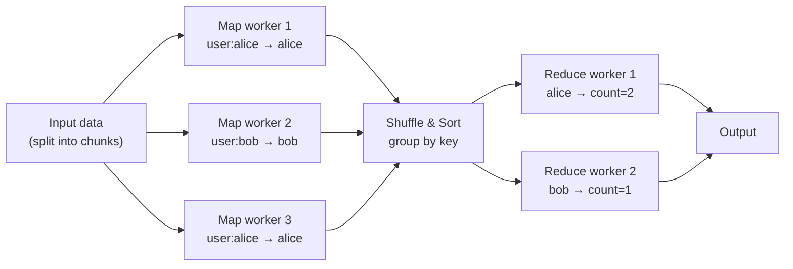

# Day 36: MapReduce & Batch Processing

## 1. Moving Computation to the Data

In a traditional system, you move data to the computation: you query a database and process the result in your application. When data is petabytes, this is impractical — moving data is expensive. **MapReduce** (Dean & Ghemawat, 2004) inverts this: you send the computation to where the data lives.



## 2. The Three Phases

### Map

Each worker reads its chunk of input and emits zero or more `(key, value)` pairs. The workers run in parallel — one per chunk.

_Example: for a word-count job, each worker reads a line and emits `(word, 1)` for every word._

### Shuffle and Sort

The framework collects all `(key, value)` pairs emitted by all Map workers and groups them by key, sorting within each group. This is the expensive network transfer phase.

### Reduce

Each Reduce worker receives all values for one key and combines them into a final result.

_Example: for word-count, it sums all the `1`s for each word._

## 3. Fault Tolerance

If a Map worker fails, the framework re-executes its chunk on another worker. This is safe because Map workers are stateless and deterministic — running the same chunk twice gives the same result.

**Speculative execution:** if a worker is a straggler (running unusually slowly), the framework launches a duplicate of the same task on a different worker and uses whichever finishes first.

---

## Hands-on Assignment (Go)

We implement a word-count MapReduce using goroutines as workers.

### Step 1: Set up the project

```bash
mkdir dist-sys-day36
cd dist-sys-day36
go mod init day36
```

### Step 2: Create `mapreduce.go`

```go
package main

import (
	"fmt"
	"sort"
	"strings"
	"sync"
)

type KV struct {
	Key   string
	Value int
}

// map phase: split input into chunks and emit (word, 1) pairs
func mapPhase(chunks []string, workers int) []KV {
	chunkCh := make(chan string, len(chunks))
	for _, c := range chunks {
		chunkCh <- c
	}
	close(chunkCh)

	resultCh := make(chan KV, 10000)
	var wg sync.WaitGroup

	for w := 0; w < workers; w++ {
		wg.Add(1)
		go func() {
			defer wg.Done()
			for chunk := range chunkCh {
				words := strings.Fields(strings.ToLower(chunk))
				for _, word := range words {
					// Strip punctuation
					word = strings.Trim(word, ".,!?;:\"'()")
					if word != "" {
						resultCh <- KV{Key: word, Value: 1}
					}
				}
			}
		}()
	}

	go func() {
		wg.Wait()
		close(resultCh)
	}()

	var pairs []KV
	for kv := range resultCh {
		pairs = append(pairs, kv)
	}
	return pairs
}

// shuffle phase: group by key
func shufflePhase(pairs []KV) map[string][]int {
	grouped := make(map[string][]int)
	for _, kv := range pairs {
		grouped[kv.Key] = append(grouped[kv.Key], kv.Value)
	}
	return grouped
}

// reduce phase: sum counts per key
func reducePhase(grouped map[string][]int, workers int) []KV {
	type workItem struct {
		key    string
		values []int
	}

	workCh := make(chan workItem, len(grouped))
	for k, v := range grouped {
		workCh <- workItem{k, v}
	}
	close(workCh)

	resultCh := make(chan KV, len(grouped))
	var wg sync.WaitGroup

	for w := 0; w < workers; w++ {
		wg.Add(1)
		go func() {
			defer wg.Done()
			for item := range workCh {
				sum := 0
				for _, v := range item.values {
					sum += v
				}
				resultCh <- KV{Key: item.key, Value: sum}
			}
		}()
	}

	go func() {
		wg.Wait()
		close(resultCh)
	}()

	var results []KV
	for kv := range resultCh {
		results = append(results, kv)
	}
	return results
}

func main() {
	// Input corpus (simulates file chunks)
	input := `the quick brown fox jumps over the lazy dog
	the dog barked at the fox the fox ran away
	distributed systems are hard but rewarding
	the network is not reliable the network is slow
	consensus is the hardest problem in distributed systems
	the fox the fox the fox loves distributed systems`

	// Split into chunks (simulates GFS file chunks)
	lines := strings.Split(input, "\n")
	chunks := make([]string, 0, len(lines))
	for _, l := range lines {
		if strings.TrimSpace(l) != "" {
			chunks = append(chunks, l)
		}
	}

	fmt.Printf("Input: %d chunks, %d map workers, %d reduce workers\n",
		len(chunks), 3, 2)

	pairs := mapPhase(chunks, 3)
	grouped := shufflePhase(pairs)
	results := reducePhase(grouped, 2)

	// Sort by count descending to get top-10
	sort.Slice(results, func(i, j int) bool {
		return results[i].Value > results[j].Value
	})

	fmt.Println("\nTop-10 words:")
	for i, kv := range results {
		if i >= 10 { break }
		fmt.Printf("  %3d  %-20s %d\n", i+1, kv.Key, kv.Value)
	}
}
```

### Step 3: Run it

```bash
go run mapreduce.go
```

---

## Review

1. In the real Google MapReduce, the Shuffle phase moves data over the network between Map workers and Reduce workers. Why is this the most expensive phase? What optimization does MapReduce use to reduce this traffic? (Hint: look up "Combiner".)

2. MapReduce processes a static snapshot of data (batch processing). Name two things it cannot do well that a stream processor (like Kafka Streams or Flink) can.
