# Learn Distributed Systems

An 8-week sprint covering how distributed systems work under the hood — from how computers talk to each other, to how they agree on truth, store petabytes, and stay alive when things go wrong. Each week pairs hands-on Go code with a deep, low-level intro README so you understand what is actually happening on the wire, inside the algorithms, and in the failure modes.

Primary reference: *Designing Data-Intensive Applications* (DDIA) by Martin Kleppmann.

---

## How this repo is organized

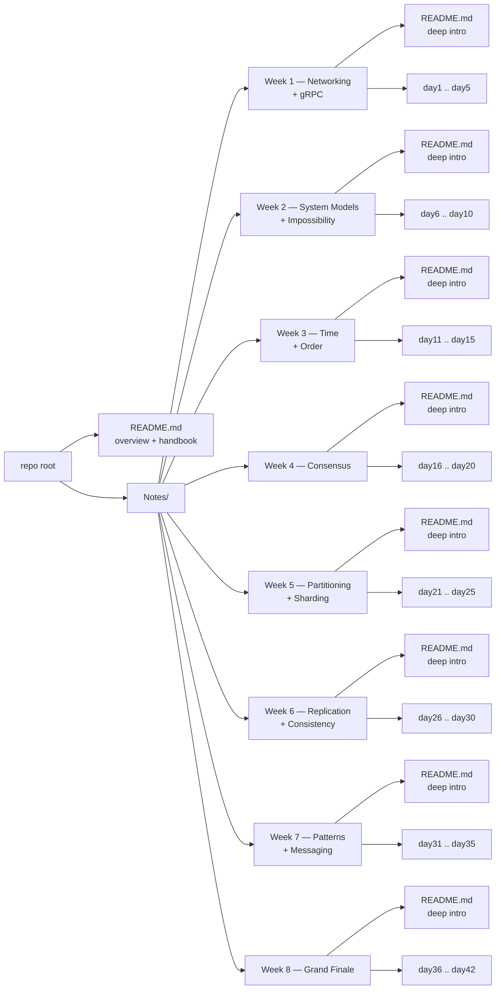

Every folder under `Notes/` has the same shape: one **deep-intro `README.md`** plus the daily lesson files. Read the intro first — it gives you the protocol internals, mental models, and failure modes. Then the day notes drill into specifics with hands-on Go code.

| Folder | Deep intro covers |
|--------|-------------------|
| [Week 1 — Networking](Notes/Week1-Foundations_and_Networking/README.md) | TCP/UDP, HTTP/1.1 vs HTTP/2 framing, gRPC, Protobuf wire format |
| [Week 2 — System Models](Notes/Week2-System_Models_and_Impossibility/README.md) | CAP, PACELC, crash-stop vs Byzantine faults, FLP impossibility |
| [Week 3 — Time & Order](Notes/Week3-Time_and_Order/README.md) | Clock drift, Lamport timestamps, vector clocks, Chandy-Lamport snapshot |
| [Week 4 — Consensus](Notes/Week4-Consensus/README.md) | 2PC blocking problem, Raft leader election + log replication, BFT basics |
| [Week 5 — Partitioning](Notes/Week5-Partitioning_and_Sharding/README.md) | Key-range vs hash partitioning, consistent hashing ring, rebalancing hot spots |
| [Week 6 — Replication](Notes/Week6-Replication_and_Consistency/README.md) | Single/multi/leaderless replication, R+W>N quorums, LWW vs CRDTs, sagas |
| [Week 7 — Patterns](Notes/Week7-Patterns_and_Messaging/README.md) | Kafka vs RabbitMQ internals, idempotency, circuit breakers, gossip, bloom filters |
| [Week 8 — Grand Finale](Notes/Week8-Grand_Finale/README.md) | MapReduce, GFS + Dynamo paper internals, system design framework, KV store build |

---

## Stack

- **Language:** Go (Golang)
- **Infrastructure:** Docker (simulating multiple nodes on one laptop)
- **Databases:** Redis, PostgreSQL (for experimentation)
- **Protocols:** raw TCP, gRPC + Protobuf, HTTP/2
- **Patterns:** Consistent Hashing, Raft, Gossip, Outbox, CRDT, MapReduce

---

## The distributed systems problem stack, layer by layer

Every hard problem in distributed systems comes from one of three fundamental gaps: nodes don't share memory, nodes don't share a clock, and the network between them is unreliable.

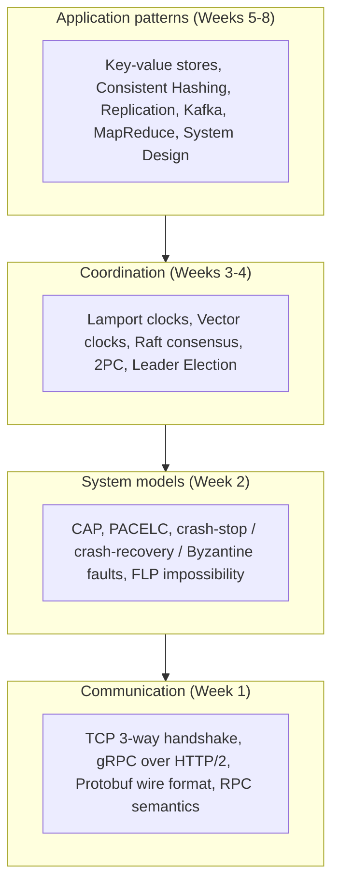

---

## Two axes of every design choice

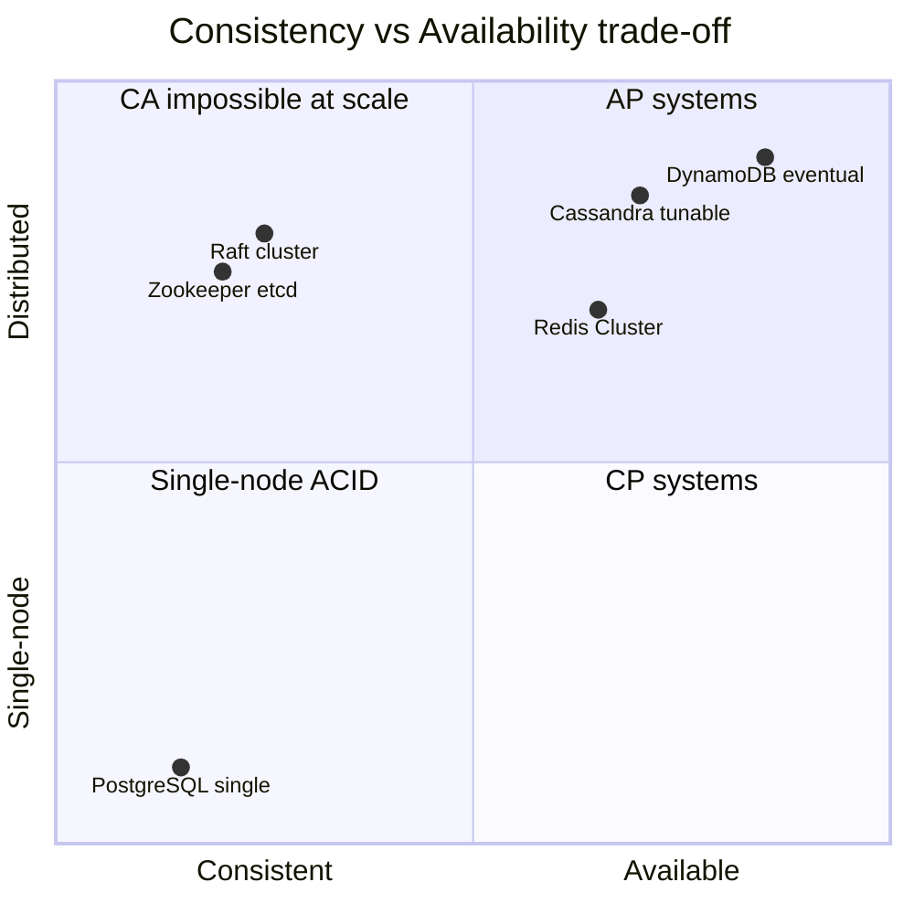

- **CP (Consistent + Partition-tolerant):** refuse writes rather than risk inconsistency. Use for leader election, distributed locks, config stores.
- **AP (Available + Partition-tolerant):** return possibly stale data rather than error. Use for shopping carts, DNS, social feeds.
- **CA (Consistent + Available):** only possible on a single node — the moment you have a network, you have partitions.

---

## 8-week curriculum map

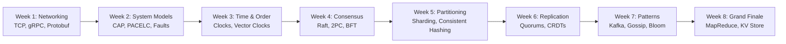

Each week strictly builds on the last. Week 2 names the failure modes that Week 1's network creates. Week 3 gives you the clocks you need to reason about ordering before Week 4 uses ordering for consensus. Weeks 5-6 apply consensus to data storage. Weeks 7-8 assemble all of it into real architectures.

---

## Phase 1 — Foundations & Communication (Weeks 1–2)

_How computers talk to each other and why it is difficult._

### Week 1 — Networking & Communication

_From raw TCP sockets to structured gRPC calls._

[Week 1 deep intro README](Notes/Week1-Foundations_and_Networking/README.md)

| Day | Topic |
|-----|-------|
| [Day 1](Notes/Week1-Foundations_and_Networking/day1_concept.md) | What is a Distributed System? The 8 Fallacies of Distributed Computing |
| [Day 2](Notes/Week1-Foundations_and_Networking/day2_networking.md) | TCP vs. UDP — latency, bandwidth, the 3-way handshake |
| [Day 3](Notes/Week1-Foundations_and_Networking/day3_rpc-and-grpc.md) | RPC & gRPC — Protobuf contracts, HTTP/2, code generation |
| [Day 4](Notes/Week1-Foundations_and_Networking/day4_serialization.md) | Serialization — JSON vs. Protobuf size and speed; forward/backward compatibility |
| [Day 5](Notes/Week1-Foundations_and_Networking/day5_weekend-chat-app.md) | Weekend Project: gRPC Chat Server — multiple clients, one central server |

### Week 2 — System Models & Impossibility

_Naming the enemy: what exactly can go wrong, and what is provably impossible._

[Week 2 deep intro README](Notes/Week2-System_Models_and_Impossibility/README.md)

| Day | Topic |
|-----|-------|
| [Day 6](Notes/Week2-System_Models_and_Impossibility/day6_cap-theorem.md) | CAP Theorem — Consistency, Availability, Partition Tolerance |
| [Day 7](Notes/Week2-System_Models_and_Impossibility/day7_cap-deep-dive.md) | Why Partition Tolerance is not optional over a WAN |
| [Day 8](Notes/Week2-System_Models_and_Impossibility/day8_pacelc.md) | PACELC — Latency vs. Consistency when there is no partition |
| [Day 9](Notes/Week2-System_Models_and_Impossibility/day9_failure-models.md) | Failure Models — crash-stop, crash-recovery, Byzantine faults |
| [Day 10](Notes/Week2-System_Models_and_Impossibility/day10_review-and-chaos.md) | Review + Chaos: introduce artificial latency into your chat app |

---

## Phase 2 — Coordination & Consensus (Weeks 3–4)

_How do nodes agree on truth when they don't share a clock or memory?_

### Week 3 — Time and Order

_Ordering events in a world with no global clock._

[Week 3 deep intro README](Notes/Week3-Time_and_Order/README.md)

| Day | Topic |
|-----|-------|
| [Day 11](Notes/Week3-Time_and_Order/day11_physical-clocks.md) | Physical Clocks — quartz drift, NTP, why wall-clock time is unreliable |
| [Day 12](Notes/Week3-Time_and_Order/day12_lamport-clocks.md) | Lamport Clocks — happened-before relation, logical timestamps |
| [Day 13](Notes/Week3-Time_and_Order/day13_vector-clocks.md) | Vector Clocks — detecting concurrent events and conflicts |
| [Day 14](Notes/Week3-Time_and_Order/day14_global-state.md) | Global State — Chandy-Lamport snapshot algorithm |
| [Day 15](Notes/Week3-Time_and_Order/day15_lamport-in-chat.md) | Weekend Project: add Lamport clocks to chat; order out-of-order messages |

### Week 4 — Consensus

_Getting all nodes to agree on a single value — even when some crash._

[Week 4 deep intro README](Notes/Week4-Consensus/README.md)

| Day | Topic |
|-----|-------|
| [Day 16](Notes/Week4-Consensus/day16_consensus-problem.md) | The Consensus Problem — FLP impossibility, why it is so hard |
| [Day 17](Notes/Week4-Consensus/day17_2pc.md) | Two-Phase Commit (2PC) — the Prepare/Commit phases and the blocking problem |
| [Day 18](Notes/Week4-Consensus/day18_raft-leader-election.md) | Raft — Leader Election and terms |
| [Day 19](Notes/Week4-Consensus/day19_raft-log-replication.md) | Raft — Log Replication and safety guarantees |
| [Day 20](Notes/Week4-Consensus/day20_byzantine-and-leader-election.md) | Byzantine Generals + Weekend Project: heartbeat-based Leader Election |

---

## Phase 3 — Data Storage & Scalability (Weeks 5–6)

_Handling massive data by splitting it up and replicating it._

### Week 5 — Partitioning & Sharding

_Splitting data across nodes so no single machine holds it all._

[Week 5 deep intro README](Notes/Week5-Partitioning_and_Sharding/README.md)

| Day | Topic |
|-----|-------|
| [Day 21](Notes/Week5-Partitioning_and_Sharding/day21_why-partition.md) | Why Partition? — vertical vs. horizontal scaling limits |
| [Day 22](Notes/Week5-Partitioning_and_Sharding/day22_partitioning-strategies.md) | Partitioning Strategies — key range vs. hash partitioning |
| [Day 23](Notes/Week5-Partitioning_and_Sharding/day23_consistent-hashing.md) | Consistent Hashing — the virtual node ring (Cassandra, Dynamo) |
| [Day 24](Notes/Week5-Partitioning_and_Sharding/day24_consistent-hashing-impl.md) | Implement a Consistent Hashing Ring in Go |
| [Day 25](Notes/Week5-Partitioning_and_Sharding/day25_rebalancing.md) | Rebalancing — hot spots, skew, what happens when a node joins |

### Week 6 — Replication & Consistency

_Keeping multiple copies of data in sync — and deciding what "in sync" means._

[Week 6 deep intro README](Notes/Week6-Replication_and_Consistency/README.md)

| Day | Topic |
|-----|-------|
| [Day 26](Notes/Week6-Replication_and_Consistency/day26_replication-models.md) | Replication Models — single-leader, multi-leader, leaderless (Dynamo-style) |
| [Day 27](Notes/Week6-Replication_and_Consistency/day27_replication-lag.md) | Replication Lag — read-after-write consistency, monotonic reads |
| [Day 28](Notes/Week6-Replication_and_Consistency/day28_quorums.md) | Quorums — R + W > N; tuning consistency vs. availability |
| [Day 29](Notes/Week6-Replication_and_Consistency/day29_conflict-resolution.md) | Merging Conflicts — Last Write Wins vs. CRDTs |
| [Day 30](Notes/Week6-Replication_and_Consistency/day30_transactions.md) | Distributed Transactions — ACID in distributed systems, Sagas |

---

## Phase 4 — Architecture & Real-World (Weeks 7–8)

_Putting it all together into modern architectures._

### Week 7 — Patterns & Messaging

_The glue that holds large distributed systems together._

[Week 7 deep intro README](Notes/Week7-Patterns_and_Messaging/README.md)

| Day | Topic |
|-----|-------|
| [Day 31](Notes/Week7-Patterns_and_Messaging/day31_async-messaging.md) | Async Messaging — RabbitMQ (message queue) vs. Kafka (log-based broker) |
| [Day 32](Notes/Week7-Patterns_and_Messaging/day32_idempotency.md) | Idempotency — exactly-once semantics, duplicate payment prevention |
| [Day 33](Notes/Week7-Patterns_and_Messaging/day33_microservice-patterns.md) | Microservice Patterns — Service Discovery, Circuit Breakers, Bulkheads |
| [Day 34](Notes/Week7-Patterns_and_Messaging/day34_bloom-filters.md) | Bloom Filters — probabilistic membership checks at massive scale |
| [Day 35](Notes/Week7-Patterns_and_Messaging/day35_gossip-protocols.md) | Gossip Protocols — epidemic algorithms for cluster membership |

**Weekend Project:** decouple your chat app components with Redis Pub/Sub.

### Week 8 — The Grand Finale

_From theory to production-grade system design._

[Week 8 deep intro README](Notes/Week8-Grand_Finale/README.md)

| Day | Topic |
|-----|-------|
| [Day 36](Notes/Week8-Grand_Finale/day36_mapreduce.md) | MapReduce — moving computation to the data; map and reduce phases |
| [Day 37](Notes/Week8-Grand_Finale/day37_batch-processing.md) | Batch Processing — GFS internals, distributed file system design |
| [Day 38](Notes/Week8-Grand_Finale/day38_paper-case-studies.md) | Paper Case Studies — read the Dynamo or GFS paper; annotate key design choices |
| [Day 39](Notes/Week8-Grand_Finale/day39_system-design-practice.md) | System Design Practice — URL shortener, Twitter feed: apply CAP + partitioning + caching |
| [Day 40](Notes/Week8-Grand_Finale/day40_kv-store-design.md) | Final Build — design the distributed KV store (HTTP API, consistent hashing, N=3 replication) |
| [Day 41](Notes/Week8-Grand_Finale/day41_kv-store-impl.md) | Final Build — implement the KV store core in Go |
| [Day 42](Notes/Week8-Grand_Finale/day42_kv-store-failure-modes.md) | Final Build — handle node failure, replication repair, end-to-end test with Docker |

---

## Core mental models — cheatsheet

Memorize these. The code is lookable — the mental models are what you carry forever.

### The 8 Fallacies of Distributed Computing (Peter Deutsch, 1994)

All 8 are false. Build your code as if none of them are true.

1. The network is reliable.
2. Latency is zero.
3. Bandwidth is infinite.
4. The network is secure.
5. Topology doesn't change.
6. There is one administrator.
7. Transport cost is zero.
8. The network is homogeneous.

### CAP Theorem

Under a network **P**artition you must choose between **C**onsistency (every read returns the latest write or an error) and **A**vailability (every request receives a response, even if stale). You cannot have both.

| Choice | Behavior under partition | Examples |
|--------|-------------------------|---------|
| CP | refuse requests rather than serve stale data | Zookeeper, etcd, HBase |
| AP | serve stale data rather than return an error | Cassandra, DynamoDB, CouchDB |
| CA | impossible when partitions exist | single-node Postgres |

### PACELC

Even when the network is healthy (Else), you still choose between **L**atency (fast, possibly stale) and **C**onsistency (correct, possibly slow).

| System | Partition behavior | Else behavior |
|--------|--------------------|--------------|
| DynamoDB default | AP | EL |
| etcd / Raft | CP | EC |
| Cassandra (W=QUORUM) | CP | EC |
| Cassandra (W=ONE) | AP | EL |

### Failure models (weakest to strongest)

| Model | What can fail | Example |
|-------|--------------|---------|
| Crash-stop | node stops and never returns | process killed by OOM |
| Crash-recovery | node stops but may restart with state | server reboot |
| Byzantine | node lies, sends arbitrary or malicious messages | Blockchain validators |

### Clock ordering

| Method | What it guarantees | Cost |
|--------|-------------------|------|
| Physical clock (NTP) | wall-clock time, ±100ms drift | free but unreliable for ordering |
| Lamport timestamp | partial order (causal events ordered) | 1 integer per message |
| Vector clock | full causal history, detects concurrency | N integers per message (N = nodes) |
| Hybrid Logical Clock (HLC) | physical time + logical counter | 1 integer, used by CockroachDB |

### Quorum formula

For N replicas, a write quorum W and a read quorum R:

> **R + W > N** guarantees at least one node in the read set has the latest write.

Common configurations:

| N | W | R | Effect |
|---|---|---|--------|
| 3 | 2 | 2 | balanced: tolerate 1 failure for reads and writes |
| 3 | 3 | 1 | write-heavy: fast reads, slow writes |
| 3 | 1 | 3 | read-heavy: fast writes, slow reads |

### Delivery guarantees

| Guarantee | Sender behavior | Receiver behavior | In practice |
|-----------|----------------|-------------------|-------------|
| At-most-once | fire and forget | no retries | message may be lost |
| At-least-once | retry until ack | may receive duplicates | default for Kafka, RabbitMQ |
| Exactly-once | not achievable in general | idempotent consumer required | "effectively-once" via dedup key |

---

## Handbook appendix — diagram-first deep dives

### A1. TCP 3-way handshake

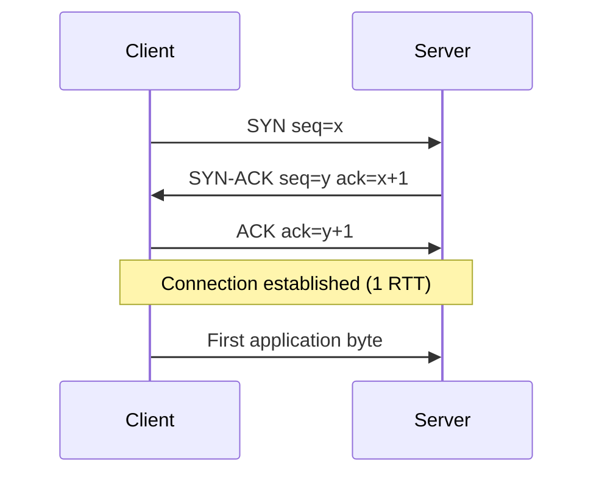

Every distributed system call starts here. Cross-datacenter latency of 30-80 ms is wasted before a single byte of your payload moves. This is why connection pooling, gRPC long-lived connections, and HTTP/2 multiplexing matter.

### A2. gRPC over HTTP/2

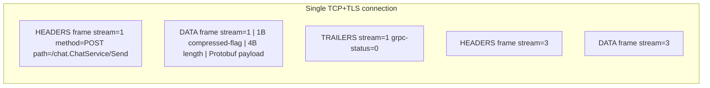

Multiple RPCs multiplex over one socket. No head-of-line blocking between streams. The gRPC frame body is: `| 1 byte: compressed flag | 4 bytes: big-endian length | N bytes: Protobuf |`.

### A3. Protobuf wire format

Field on the wire = `(field_number << 3) | wire_type`.

| wire_type | encoding | Go types |
|-----------|----------|----------|
| 0 | varint | int32, int64, bool, enum |
| 1 | 64-bit fixed | fixed64, double |
| 2 | length-delimited | string, bytes, sub-message |
| 5 | 32-bit fixed | fixed32, float |

Unknown fields are skipped — never reuse a field number. This gives forward and backward compatibility for free.

### A4. CAP partition scenario

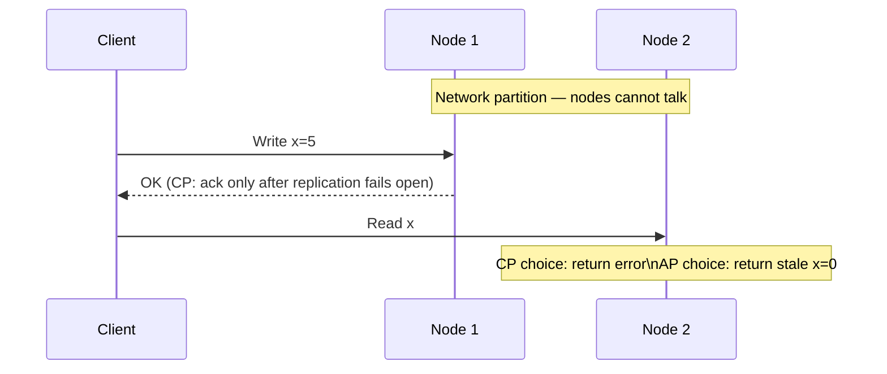

### A5. Lamport clock rules

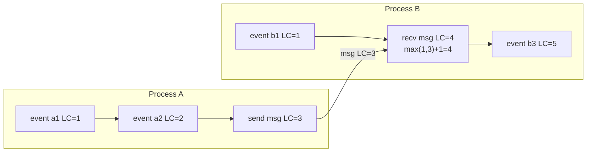

Rule: on **send**, include your clock. On **receive**, set `clock = max(local, received) + 1`. On any other event, increment by 1.

### A6. Vector clock — detecting concurrency

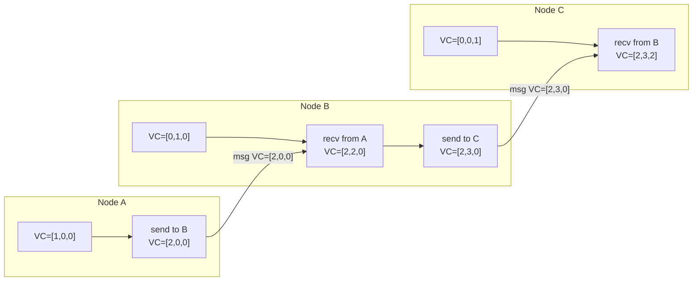

Two events are concurrent if neither vector dominates the other (neither `VC_a <= VC_b` nor `VC_b <= VC_a`).

### A7. Raft leader election

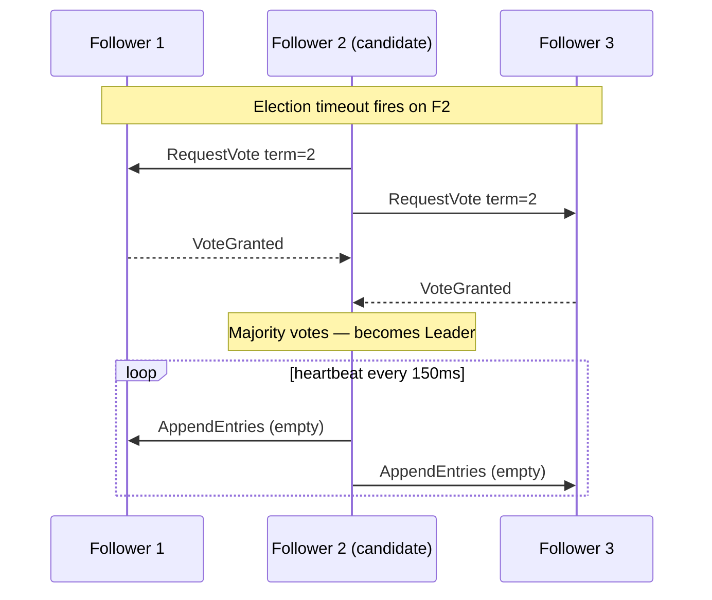

### A8. Two-Phase Commit state machine

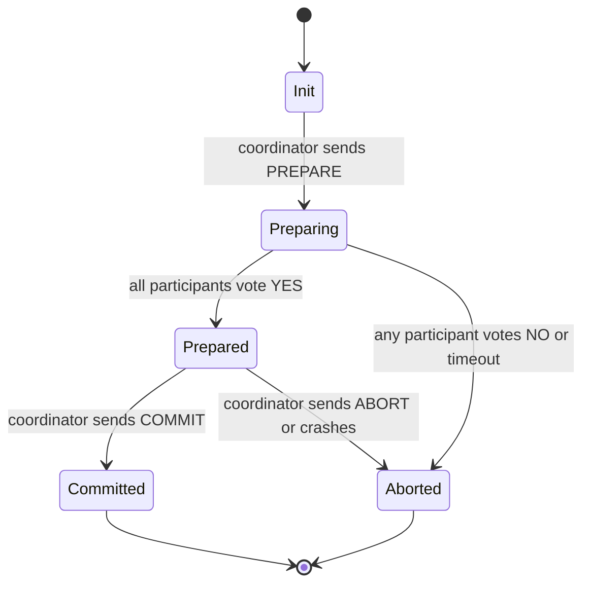

The **blocking problem**: if the coordinator crashes after `Prepared` but before sending `COMMIT`, participants are stuck holding locks indefinitely. Raft and Paxos solve this; 2PC does not.

### A9. Consistent hashing ring

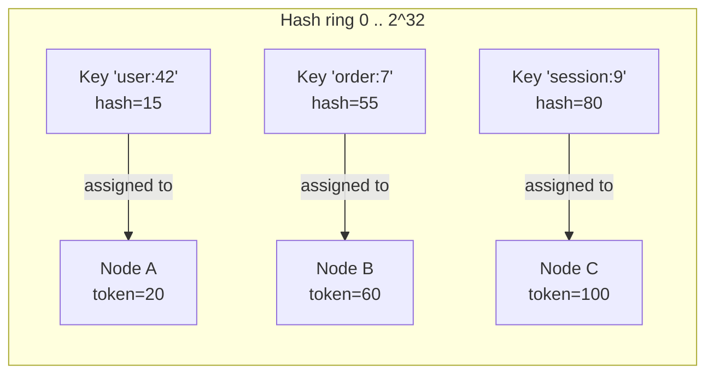

A key is assigned to the first node clockwise on the ring whose token >= key's hash. Adding node D between A and B moves only the keys between A's token and D's token — not all keys. Virtual nodes (vnodes) give each physical machine multiple positions on the ring for uniform load distribution.

### A10. Dynamo-style W+R>N quorum

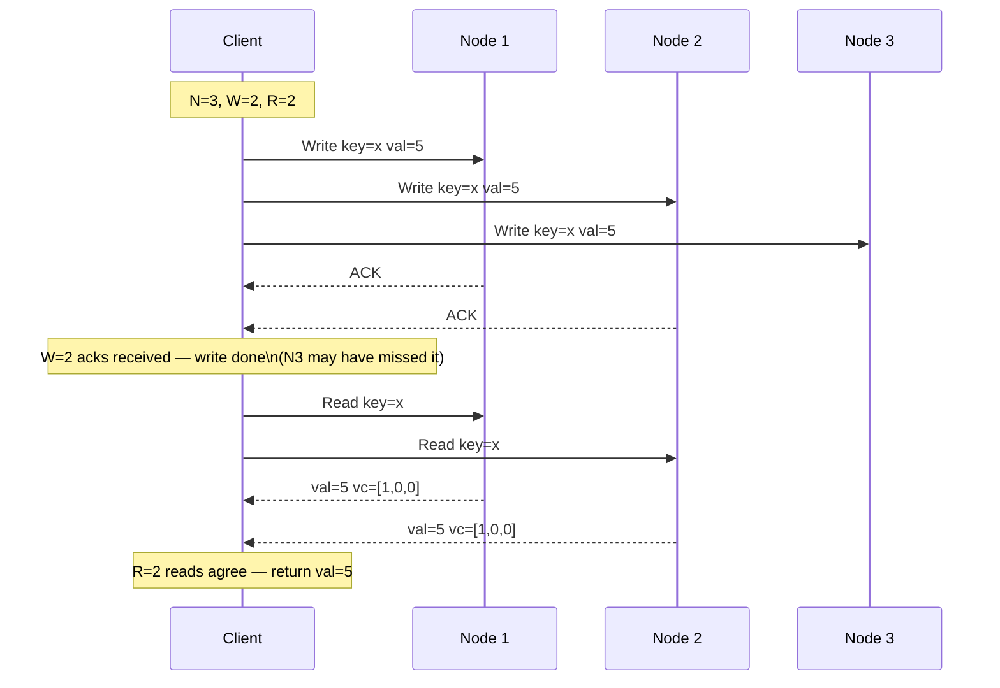

---

## How to read this repo

1. Skim this README's stack diagram, two-axes quadrant, and curriculum map.
2. For each week, read its **deep intro README** first.
3. Then go day-by-day. The day notes assume you have the mental models from the intro.
4. Use the handbook appendix as a quick reference when you forget how a protocol or algorithm works.
5. Every weekend project builds something you will use in the next week — do not skip them.

---

Focus on the **why** behind each algorithm. The code is lookable — the mental models are what matter in production and in system design interviews.
